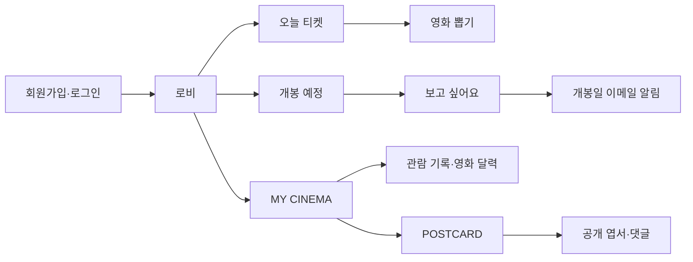

# CINEMO 문서 지도

문서 기준: 현재 코드·현재 Prisma schema·적용 migration.

문서는 주제에 따라 다음처럼 나눈다.

```txt
api/       NestJS API·OpenAPI·서버 실행 기준
web/       React·Next.js·브라우저 동작 기준
search/    API와 Web에 걸친 검색 규칙
library/   특정 라이브러리의 사용법·선택·현재 적용 목록
common/    여러 기능에서 공유하는 UI·디자인 규칙
기능 폴더  해당 기능의 API·데이터·화면·진행 상태
```

## 현재 제품 흐름



## 먼저 읽을 문서


| 목적                | 문서                                                 |
| ----------------- | -------------------------------------------------- |
| 전체 구조             | [architecture.md](./architecture.md)               |
| 인증·세션·Guard·토큰 전략 | [auth/README.md](./auth/README.md)              |
| 공개 엽서·댓글       | [prisma/movie-user-content/postcard.md](./prisma/movie-user-content/postcard.md) |
| 현재 DB와 migration  | [prisma/README.md](./prisma/README.md)             |
| CRUD·upsert·트랜잭션 기준 | [prisma/crud-and-transactions.md](./prisma/crud-and-transactions.md) |
| API/Web 공통 코드     | [shared.md](./shared.md)                           |
| 공통 UI·폰트 기준 | [common/typography.md](./common/typography.md) |
| React Hook 사용 기준 | [web/react-hooks.md](./web/react-hooks.md) |
| Web 폼 라이브러리 사용 기준 | [library/form-validation.md](./library/form-validation.md) |
| 날짜·시간·영화 달력 기준 | [date/README.md](./date/README.md) |
| API 계약·생성 타입     | [api/api-contract.md](./api/api-contract.md) |
| Swagger API 확인·배포 백필 | [api/swagger.md](./api/swagger.md) |
| 로비 가이드            | [guide.md](./guide.md)                         |
| 로비 전광판·개봉 예정  | [lobby/README.md](./lobby/README.md)           |
| 외부 API·메일         | [external-api/README.md](./external-api/README.md) |
| AI Provider           | [ai/README.md](./ai/README.md)                 |
| 소셜 로그인            | [social/README.md](./social/README.md)         |
| 배포·Railway·Vercel | [deploy/README.md](./deploy/README.md)             |
| 로컬 Docker·FCM 개념  | [docker.md](./docker.md)                           |
| Web·API 문서 지도       | [web/README.md](./web/README.md), [api/README.md](./api/README.md) |
| 사용 라이브러리 목록·선택 기준 | [library/README.md](./library/README.md) |
| 제품 생각·아이디어 기록 | [notes/README.md](./notes/README.md) |
| NestJS 환경 설정·`registerAs` | [api/nest-config.md](./api/nest-config.md) |
| NestJS graceful shutdown | [api/graceful-shutdown.md](./api/graceful-shutdown.md) |


## 문서 폴더 구조

```txt
docs/
├── lobby/
│   ├── README.md
│   ├── board.md
│   ├── moviechart.md
│   └── upcoming.md
├── external-api/
├── ai/
│   ├── README.md
│   ├── claude.md
│   └── openai.md
├── api/
│   ├── README.md
│   ├── api-contract.md
│   ├── openapi-codegen.md
│   ├── swagger.md
│   ├── nest-config.md
│   ├── exception-filter.md
│   └── graceful-shutdown.md
├── web/
│   ├── README.md
│   ├── aria.md
│   ├── react-hooks.md
│   └── url-search-params.md
├── search/
│   ├── README.md
│   └── search-query.md
├── library/
│   ├── README.md
│   ├── chart-library.md
│   ├── form-validation.md
│   ├── nivo.md
│   ├── radix-dialog.md
│   ├── radix-tabs.md
│   ├── zod.md
│   └── zustand.md
├── notes/
│   └── README.md
├── date/
│   ├── README.md
│   ├── date-kst.md
│   └── movie-calendar.md
├── social/
├── prisma/
└── deploy/
```

## 현재 구현 기준

```txt
Web      apps/web        Next.js · React · TypeScript
API      apps/api        NestJS · Prisma · PostgreSQL
Shared   packages/shared API/Web 순수 공통 타입·상수·유틸
Web      http://localhost:3051
API      http://localhost:3050
Swagger  http://localhost:3050/api
```

### API 설정 관리

NestJS 환경 설정은 원시 환경변수를 기능 코드에서 직접 읽지 않고, `registerAs`로 도메인별 namespace를 구성한 뒤 `ConfigService`로 조회한다.

```txt
Railway Variables 또는 .env
  → env.keys.ts에서 이름 관리
  → env.validation.ts에서 Joi 검증
  → config/*.config.ts에서 도메인별 그룹화
  → ConfigService에서 namespace로 조회
```

```txt
apps/api/src/config/
├─ app.config.ts
├─ database.config.ts
├─ auth.config.ts
├─ tmdb.config.ts
├─ ai.config.ts
├─ oauth.config.ts
├─ mail.config.ts
└─ demo.config.ts
```

예를 들어 `OPENAI_KEY`는 서비스에서 직접 읽지 않고 `ai.config.ts`에 등록한 뒤 `ai.openaiKey`로 조회한다. 상세 규칙은 [NestJS 환경 설정 문서](./api/nest-config.md)를 참고한다.

공유 코드의 위치는 실행 여부가 아니라 의존성으로 판단한다.

```txt
제품 공통 개념·순수 타입·상수·유틸
  → packages/shared

HTTP 요청·응답 계약
  → packages/api-contract

fetch·axios·React Query 등 실제 통신
  → packages/api-client 또는 앱 내부
```

`MOVIE CHART` 응답 타입은 `api-contract`의 OpenAPI 생성 타입을 사용한다. 제품 공통 개념 타입과 기존 기능 타입은 사용처에 따라 `shared`에 유지한다.

- 인증: 이메일·Google·Naver 로그인
- 보류: Kakao 이메일 권한 문제, Apple Developer Program 비용·설정
- 비밀번호 재설정: Resend + SHA-256 해시 일회용 토큰
- 개봉일 알림: `MovieReleaseNotification` + GitHub Actions + React Email + Resend
- 캘린더: 서버 iCalendar(`.ics`) 응답. 브라우저에서 Apple Calendar를 강제로 바로 여는 기능은 제공하지 않는다
- 이미지: 포스터 원본을 저장하지 않고 TMDB 경로와 `tmdbId`를 사용
- 문서: `docs/`에 현재 구조·기능·운영 기준을 기록하고 Git으로 함께 관리한다


## Prisma 문서 구조

```txt
docs/prisma/
├── README.md
├── user.md
├── auth/
│   ├── social-account.md
│   ├── oauth-login-code.md
│   └── password-reset-token.md
├── movie/
│   ├── user-movie.md
│   ├── ticket.md
│   ├── movie-pool.md
│   └── movie-release-notification.md
├── lobby-visit.md
└── admin/
    ├── admin-login-log.md
    ├── admin-daily-stat.md
    ├── admin-hourly-stat.md
    ├── movie-provider-override.md
    ├── lobby-guide.md
    ├── movie-pool-seed-run.md
```


## 운영상 중요한 규칙

- DB 변경: `apps/api/prisma/schema.prisma` 수정 후 migration 생성. Railway Pre-deploy Command에서 `prisma migrate deploy` 실행
- Railway migration: 앱 Start Command가 아닌 Pre-deploy 단계에서 실행
- Prisma Client: API build에서 생성
- 환경 설정: `env.keys.ts`는 이름, `env.validation.ts`는 Joi 검증, `*.config.ts`는 도메인별 그룹화 담당
- API 서버·포트: 개발자가 직접 실행 중인 상태 우선 사용. 작업 중 임의 종료 금지
- `CRON_SECRET`: 필수 길이 32자 이상. GitHub Actions의 `CINEMO_CRON_SECRET`과 같은 값 사용
- `RESEND_FROM`: URL이 아닌 발신 이메일 주소
- 개봉일 당일 영화도 KST 기준 당일까지 개봉 예정 목록에 표시
- 공개 엽서: 작성자, 원문·번역 문구, 공개 여부, 보관, 이모지 반응, 댓글·대댓글 지원
- 공개 엽서 목록: 로그인하지 않아도 조회 가능하며, 보관·반응·댓글 작성은 로그인 필요


## 문서 원칙

- 코드에 없는 기능: `예정` 또는 `보류`로 표시
- 과거 migration 파일: 이력 보존을 위해 수정하지 않는다
- 새 기능 추가 시 기능 문서와 [prisma/README.md](./prisma/README.md)를 함께 갱신
