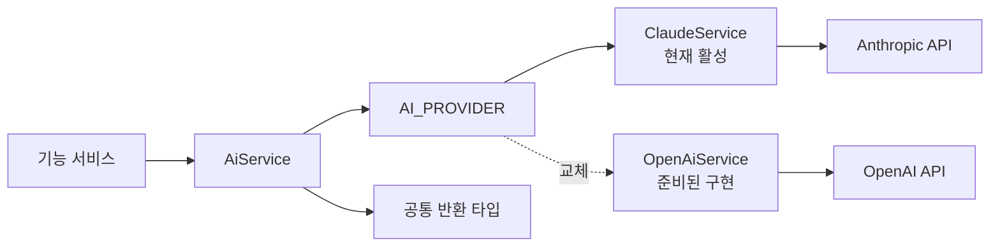
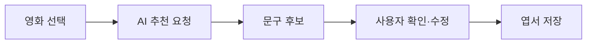

# CINEMO AI

CINEMO의 AI 연동 구조와 Provider별 사용 기준 정리.

현재 활성 Provider는 Claude이며, OpenAI Provider는 교체 가능한 구현으로 준비되어 있음.

## 문서 구성

- [Claude](./claude.md): 현재 활성 Provider, 영화 정보 보완·엽서 문구 추천
- [OpenAI](./openai.md): 준비된 Provider, Responses API와 Structured Outputs

## 전체 구조



## 현재 사용처

| 기능 | 사용 목적 | 반환 형태 |
| --- | --- | --- |
| 줄거리 번역 | TMDB 영어 줄거리를 한국어로 보완 | `string \| null` |
| 한국어 영화 제목 | 한국 개봉 제목 또는 통용 표기 보완 | `string \| null` |
| 감독 이름 표기 | 감독 이름의 한국어 표기 보완 | `string \| null` |
| 엽서 문구 추천 | 영화 대사 후보 생성 | `MovieQuoteSuggestion[]` |

호출 경로:

```txt
Web
  → API
    → AiService
      → AI_PROVIDER
        → ClaudeService 또는 OpenAiService
```

기능 서비스는 특정 SDK를 직접 호출하지 않고 `AiService`만 사용함. Provider를 바꿔도 기능 서비스의 호출 코드는 유지하는 구조.

## Provider 선택 위치

경로: `apps/api/src/ai/ai.module.ts`

```ts
{ provide: AI_PROVIDER, useClass: ClaudeService }
// { provide: AI_PROVIDER, useClass: OpenAiService }
```

한 번에 하나의 Provider만 활성화함. Provider를 바꿀 때는 주입 대상뿐 아니라 환경 변수, SDK 응답 형식, JSON 파싱, 오류 처리를 함께 확인함.

## AI 사용 주의사항

### 1. AI 응답을 사실 데이터로 취급하지 않음

AI가 반환한 영화 대사·인기 여부·출처는 자동으로 사실 확정하지 않음. 영화 제목을 잘못 연결하거나 다른 작품의 대사를 반환할 수 있음.

- 다른 영화의 대사를 현재 영화의 대사로 저장하지 않음
- 확신할 수 없는 후보는 사용자 선택 전까지만 표시
- 사용자가 직접 수정·삭제할 수 있게 함
- `isPopular`를 AI 응답만으로 확정하지 않음
- 출처가 없으면 `source: null` 허용

### 2. 프롬프트와 응답 검증을 분리함

프롬프트에 JSON을 요청해도 모델이 설명, Markdown fence, 사과 문구를 붙일 수 있음. Provider 내부에서 다음 순서로 처리함.

```txt
AI 응답
  → 텍스트 block 추출
  → JSON fence·앞뒤 설명 정리
  → JSON decoding
  → 필수 필드 확인·기본값 보완
  → 공통 타입 반환
```

JSON 파싱 실패가 API 전체 예외로 번지지 않도록 Provider에서 빈 배열 또는 `null`로 처리함.

### 3. API 키는 Web에 두지 않음

- AI API 호출은 NestJS API에서만 수행
- `CLAUDE_KEY`, `OPENAI_KEY`를 `NEXT_PUBLIC_*`로 만들지 않음
- `.env`와 실제 Secret은 Git에 커밋하지 않음
- 사용하지 않는 Provider의 키도 불필요하게 노출하지 않음

### 4. 사용자가 결과를 선택하는 구조

AI 추천은 자동 저장이 아니라 후보 제공 방식.



추천 결과가 없으면 사용자가 직접 원문과 한국어 문구를 입력할 수 있음. 원문은 선택 필드이며, 직접 작성한 엽서는 `null` 허용.

## 환경 변수

```env
# 현재 활성 Provider
CLAUDE_KEY=
CLAUDE_MODEL=

# OpenAI Provider로 교체할 때
OPENAI_KEY=
OPENAI_MODEL=
```

등록 위치:

- 로컬: `apps/api/.env`
- 배포: Railway API Variables
- 키 이름: `apps/api/src/config/env.keys.ts`
- 검증: `apps/api/src/config/env.validation.ts`

## 관련 문서

- [Claude Provider](./claude.md)
- [OpenAI Provider](./openai.md)
- [외부 API 전체 구조](../external-api/README.md)
- [애플리케이션 아키텍처](../architecture.md)
