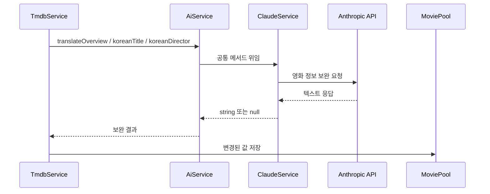
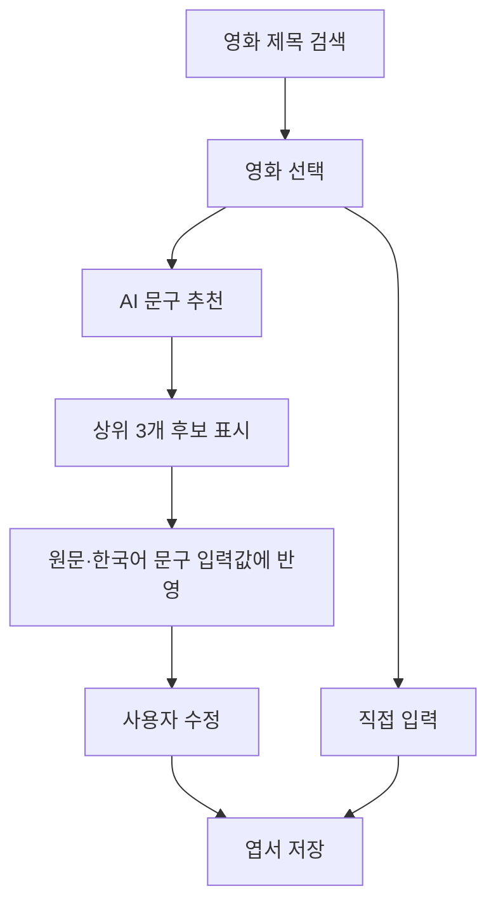

# Claude Provider

현재 CINEMO에서 활성화된 AI Provider.

## 기본 정보

| 항목 | 내용 |
| --- | --- |
| 구현체 | `ClaudeService` |
| SDK | `@anthropic-ai/sdk` |
| 호출 방식 | `claudeClient.messages.create()` |
| 환경 변수 | `CLAUDE_KEY`, `CLAUDE_MODEL` |
| 등록 위치 | `apps/api/src/ai/ai.module.ts` |

현재 기본 모델은 `CLAUDE_MODEL`이 없을 때 `claude-haiku-4-5`를 사용함.

## 코드 위치

```txt
apps/api/src/ai/
├── ai.interface.ts       공통 타입·AI_PROVIDER 토큰
├── ai.service.ts         Provider 공통 파사드
├── ai.module.ts          ClaudeService 주입
├── ai.controller.ts      인증된 AI HTTP API
├── claude.service.ts     Anthropic API 호출·응답 파싱
└── dto/
    └── recommend-movie-quotes.dto.ts
```

## 영화 정보 보완

TMDB 한국어 영화 정보가 비어 있거나 부족할 때 Claude를 사용함.



줄거리 보완 기준:

- 한국어 줄거리가 비어 있음
- 줄거리 길이가 80자 미만
- 문장 수가 2개 미만

번역은 원문 정보를 유지하고, 없는 사건이나 인물을 새로 만들지 않는 방향.

## 엽서 문구 추천

API 경로: `POST /v1/ai/quote-suggestions`

인증:

```txt
Authorization: Bearer <CINEMO JWT>
```

입력:

```ts
type RecommendMovieQuotesInput = {
  title: string;
  originalTitle: string | null;
  originalLanguage: string | null;
  releaseYear: number | null;
  overview: string | null;
};
```

출력:

```ts
type MovieQuoteSuggestion = {
  originalText: string;
  koreanText: string;
  originalLanguage: string;
  isPopular: boolean;
  source: string | null;
};
```

추천 결과는 엽서 저장 전에 사용자에게 후보로 보여줌. 사용자가 선택한 뒤 원문과 한국어 문구를 다시 수정할 수 있음.

선택한 영화의 TMDB ID·제목·원제·원문 언어·개봉 연도·줄거리를 함께 전달함. 한 번의 요청에서 90자 이내의 짧은 후보를 최대 6개 생성하고, 영화와의 연결성·문장 완결성·엽서 적합성 순으로 정렬함. Web에서는 정렬된 상위 3개만 표시해 사용자가 여러 번 다시 요청하지 않아도 선택할 수 있게 함.

### PostcardCreateModal 연결 흐름

구현 위치: `apps/web/components/postcard/PostcardCreateModal.tsx`



- 영화 검색과 선택은 TMDB 검색 API에서 처리함
- 선택된 영화의 `original_language`가 `ko`이면 입력 라벨은 `영화 원문`, 그 외에는 `외국어 원문`으로 표시함
- AI 추천 버튼은 영화가 선택되고 로그인 토큰이 있을 때만 활성화함
- 추천 중에는 버튼이 `추천 중...`으로 바뀌고 중복 요청을 막음
- 추천 결과를 선택하면 `originalText`는 원문 입력란에, `koreanText`는 한글 문구 입력란에 채움
- 입력값은 React Hook Form과 Zod로 다시 검증하며, 선택 결과를 자동 저장하지 않고 사용자가 최종 저장해야 함
- 원문은 선택 입력값이라 직접 작성하지 않으면 `null`로 저장 가능
- 수정 화면에서는 기존 영화를 유지하는 경우 기존 포스터와 영화 식별자를 보존함

API 호출 위치:

```txt
PostcardCreateModal
  → recommendMovieQuotesRequest()
  → POST /v1/ai/quote-suggestions
  → JwtAuthGuard
  → AiService
  → ClaudeService
  → MovieQuoteSuggestion[]
```

추천 후보가 없거나 AI 요청에 실패하면 모달 안에 오류 문구를 표시하고, 사용자가 직접 입력하거나 다시 추천할 수 있게 함.

## 응답 파싱 기준

Claude는 content block 배열로 응답하므로 `text` block을 먼저 추출함.

```txt
message.content
  → type이 text인 block 선택
  → JSON fence 제거
  → JSON 객체 영역 추출
  → quotes 배열 확인
  → originalText·koreanText 검증
  → 누락된 부가 필드 기본값 보완
```

부가 필드 기본값:

| 필드 | 기본값 |
| --- | --- |
| `originalLanguage` | `unknown` |
| `isPopular` | `false` |
| `source` | `null` |

`originalText` 또는 `koreanText`가 없으면 해당 후보는 제외함. 전체 응답이 잘못되어도 API 요청 자체가 예외로 터지지 않고 빈 배열 반환.

파싱 구현은 `claude.service.ts`의 `parseMovieQuoteResponse()`에 있으며, 런타임에서 다음을 확인함.

- `quotes`가 배열인지 확인
- 각 후보가 객체인지 확인
- `originalText`, `koreanText`가 비어 있지 않은 문자열인지 확인
- 문자열 필드는 `trim()` 후 반환
- `originalLanguage`가 없으면 `unknown` 사용
- `isPopular`는 `true`인 경우에만 `true`로 처리
- `source`가 문자열이 아니면 `null` 사용

## 명대사 추천 주의사항

- 요청한 영화의 대사만 추천하도록 프롬프트에 명시함
- TMDB의 `original_language`를 전달해 일본어·한국어·프랑스어 등 원문 언어 유지
- `originalText`를 영어로 통일하지 않고 영화의 실제 원문 언어로 작성
- 다른 영화의 유명 대사를 현재 영화에 연결하지 않도록 함
- 모델의 지식만으로 확인한 출처는 사실 확정하지 않음
- 출처가 불명확하면 `source: null`로 저장함
- AI가 대사를 창작하거나 영화 분위기를 요약한 문장을 만들지 않도록 함
- 긴 대사는 엽서에 넣을 수 있는 90자 이내의 짧은 완결 구절로 발췌함
- 한 번의 요청에서 후보를 여러 개 생성하고 품질 순으로 정렬한 뒤 상위 후보만 화면에 노출함
- 추천 결과가 없으면 사용자가 직접 문구를 입력할 수 있게 함

영화 대사의 실제 존재 여부는 AI만으로 완전 검증하기 어려움. 정확한 출처가 필요한 기능으로 확장할 때는 별도 검증 데이터 또는 운영자 확인 절차가 필요함.

## 실패 처리

| 상황 | 처리 |
| --- | --- |
| Anthropic API 오류 | 로그 기록 후 `null` 또는 `[]` 반환 |
| JSON이 아닌 응답 | JSON 영역 추출 시도 후 실패하면 `[]` 반환 |
| 필수 필드 누락 | 해당 후보 제외 |
| 대사 후보 없음 | `quotes: []` 처리 후 Web에서 재시도 안내 |

## Provider 교체 시 확인할 것

- `ai.module.ts`의 `AI_PROVIDER` 주입 대상
- `CLAUDE_KEY` 대신 사용할 Provider의 환경 변수
- SDK 응답 추출 방식
- JSON 구조와 런타임 검증
- 오류 시 `null`·빈 배열 반환 계약
