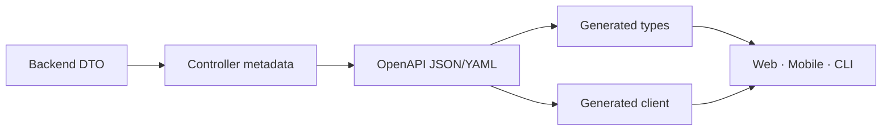
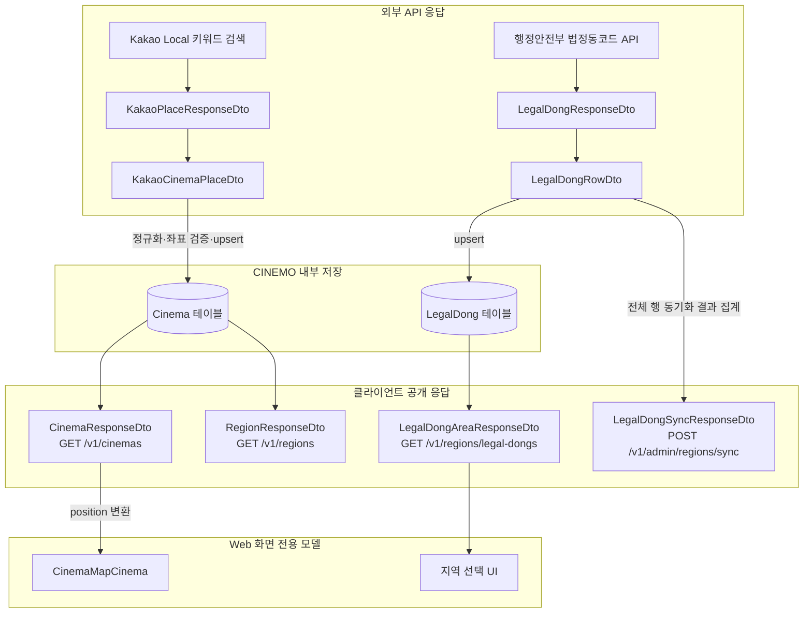
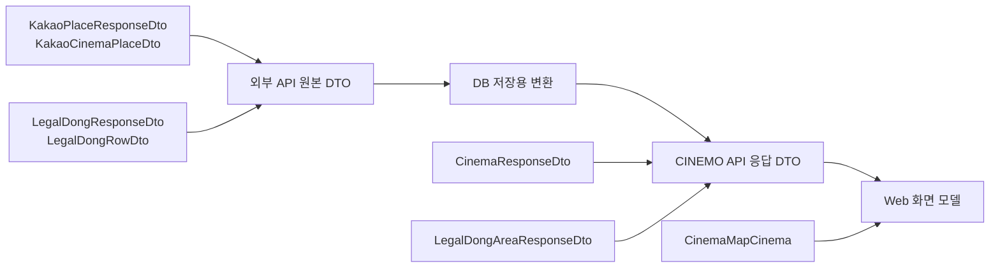

# API 계약과 OpenAPI codegen

여러 애플리케이션이 같은 HTTP API를 사용할 때 요청·응답 구조를 하나의 계약으로 관리하는 방법.

## 핵심 멘탈 모델

```txt
백엔드 DTO·Controller
        ↓
OpenAPI JSON/YAML
        ↓
codegen
        ↓
api-contract 또는 api-client 패키지
        ↓
Web · Mobile · CLI · 외부 Client
```

OpenAPI는 단순한 API 문서가 아니라 서버와 클라이언트가 합의한 계약임.

- 어떤 요청을 받는가
- 어떤 응답을 반환하는가
- 어떤 오류가 발생하는가
- 인증이 필요한가
- nullable·enum·pagination 구조가 무엇인가

## 현재 CINEMO 적용 범위

현재 `api-contract`는 새로 추가한 `MOVIE CHART` API에 먼저 적용함.

```txt
apps/api/src/lobby-board/dto/movie-chart.dto.ts
  → Swagger metadata
  → packages/api-contract/openapi.json
  → packages/api-contract/src/generated/api.d.ts
  → apps/web에서 MovieChart 타입 import
```

기존 `Postcard`, `User Movie`, `Lobby` 관련 타입은 이미 `packages/shared`에서 API와 Web이 함께 사용하고 있으므로 이번 단계에서 그대로 유지함. 이것은 기존 타입을 잊었거나 `api-contract`에 이미 모두 옮겼다는 뜻이 아님.

```txt
새 HTTP API 계약             → api-contract
기존 API/Web 공통 타입       → shared 유지
API와 무관한 순수 상수·유틸   → shared 유지
```

기존 타입을 옮길 때는 한 번에 삭제하지 않음. 먼저 OpenAPI DTO와 생성 타입을 만들고, Web·API 사용처를 교체한 뒤 중복 타입이 없는 것을 확인하고 `shared` 타입을 제거함.

### API 응답 타입 실제 예시

백엔드 DTO:

```ts
// apps/api/src/lobby-board/dto/movie-chart.dto.ts
export class MovieChartItemDto {
  kobisMovieCd!: string;
  rank!: number;
  title!: string;
  dailyAudienceCount!: number;
  audienceCount!: number;
  rankChange!: number | null;
  posterPath!: string | null;
}
```

Swagger 스키마에서 생성된 타입:

```ts
// API 계약 패키지를 사용하는 Web 코드
import type { components } from '@cinemo/api-contract';

type MovieChartItem =
  components['schemas']['MovieChartItemDto'];

type MovieChartResponse =
  components['schemas']['MovieChartResponseDto'];
```

응답 데이터는 다음 형태임.

```json
{
  "items": [
    {
      "kobisMovieCd": "20251234",
      "rank": 1,
      "title": "오디세이",
      "dailyAudienceCount": 65000,
      "audienceCount": 10333000,
      "rankChange": 1,
      "posterPath": "/poster-path.jpg"
    }
  ],
  "total": 1
}
```

Web에서 이 타입을 사용하는 현재 코드:

```ts
// apps/web/lib/lobby-board-api.ts
import type { components } from '@cinemo/api-contract';

export type MovieChartItem =
  components['schemas']['MovieChartItemDto'];

export type MovieChartResponse =
  components['schemas']['MovieChartResponseDto'];
```

여기서 `MovieChartResponse`를 `packages/shared`에 다시 작성하지 않는 이유는 HTTP 응답 계약이 이미 OpenAPI 생성 타입으로 관리되기 때문임.

### API 응답 타입과 Shared 타입 비교

```txt
UserMovieKind = 'wish' | 'watched'
  → 제품 전체에서 쓰는 도메인 값
  → shared

MovieChartResponseDto = { items: [...], total: number }
  → GET /v1/lobby/movie-chart가 반환하는 HTTP 응답 구조
  → api-contract
```

`PostcardItem`처럼 기존 `shared`에 있는 타입은 현재 migration 전 호환성을 위해 유지함. 새 API부터 이 기준을 적용하고, 기존 타입은 사용처를 교체한 뒤 이동함.

## `shared`와 `api-contract`를 나누는 기준

“실행 시 사용되는 타입인가?”가 기준이 아님. `shared`의 타입도 API와 Web 코드가 실행될 때 import될 수 있음.

| 기준 | `shared` | `api-contract` |
| --- | --- | --- |
| 의미 | 제품의 공통 개념 | HTTP API가 공개하는 데이터 계약 |
| 의존성 | HTTP·React·NestJS와 무관 | OpenAPI·Controller·DTO와 연결 |
| 예시 | 장르, 관람 상태, 로비 방 ID | `MovieChartResponseDto`의 생성 타입 |
| 생성 방식 | 직접 작성 가능 | OpenAPI에서 자동 생성 |
| 변경 기준 | 여러 앱에서 의미가 공유되는가 | 서버 endpoint의 요청·응답이 변경되는가 |

`PostcardItem`처럼 기존 `shared`에 있는 API 응답 타입은 잘못된 것으로 즉시 단정하지 않음. 이미 사용 중인 타입은 호환성을 위해 유지하고, 새 API부터 `api-contract`를 적용한 뒤 기능별로 단계적으로 이동함.

실제 네트워크 요청을 보내는 `fetch`·axios·React Query 코드는 계약 타입과도 별개의 책임임. 이런 코드는 `api-client` 패키지나 애플리케이션의 API 모듈에서 관리함.

## code-first와 spec-first

### code-first

NestJS DTO·Controller처럼 서버 코드를 먼저 작성하고 OpenAPI 스펙을 생성하는 방식.

```txt
서버 코드 → OpenAPI 스펙 생성 → TypeScript·Client codegen
```

### spec-first

OpenAPI YAML·JSON을 먼저 작성하고 서버·클라이언트를 구현하는 방식.

```txt
OpenAPI 스펙 → 서버·클라이언트 구현 또는 코드 생성
```

## 패키지 역할

```txt
packages/
├─ shared/
│  ├─ 공통 상수
│  ├─ 도메인 타입
│  └─ 순수 유틸
├─ api-contract/
│  ├─ openapi.json
│  └─ src/generated/api.d.ts
└─ api-client/
   └─ fetch·axios·React Query client
```

작은 프로젝트에서는 `api-contract`와 `api-client`를 하나로 합쳐도 됨.

### `shared`

HTTP API와 무관하게 여러 애플리케이션이 공유하는 코드.

### `api-contract`

OpenAPI에서 생성된 요청·응답 타입과 API 경로 계약.

### `api-client`

실제 HTTP 요청을 실행하는 fetch·axios·React Query 코드.

## 도구별 역할

| 도구 | 역할 |
| --- | --- |
| `openapi-typescript` | OpenAPI에서 TypeScript 타입만 생성 |
| `openapi-fetch` | 생성된 `paths` 타입 기반 fetch client |
| `Orval` | 타입·fetch·axios·React Query client 생성 |

`openapi-typescript`는 fetch 함수까지 생성하지 않음. 인증 토큰, 오류 처리, 재시도 정책이 복잡하면 직접 만든 API client와 조합할 수 있음.

## 권장 흐름



1. 백엔드 DTO에 요청·응답 구조를 정의함
2. Swagger decorator로 OpenAPI 메타데이터를 연결함
3. OpenAPI 스펙을 생성함
4. codegen으로 계약 패키지를 갱신함
5. 각 애플리케이션에서 계약 타입 또는 client를 import함
6. 타입 검사와 런타임 검증을 모두 수행함

## 설치 위치

codegen 도구는 생성 명령을 소유한 패키지에 설치함.

```txt
packages/api-contract/package.json
  devDependencies:
    openapi-typescript
```

`shared`에 API 생성 도구를 넣는 것은 필수가 아님. 도메인 공통 코드와 API 계약 코드를 분리하면 책임이 명확함.

## 생성 파일

다음 파일은 직접 수정하지 않음.

```txt
openapi.json
generated/api.d.ts
```

수정 순서:

```txt
백엔드 DTO·Controller 수정
  → OpenAPI 재생성
  → codegen 실행
  → 타입 검사
  → 테스트
```

생성 파일을 저장소에 커밋할지는 팀 정책으로 결정함. 커밋하지 않는다면 CI나 빌드에서 codegen을 실행해야 함.

## codegen과 런타임 검증의 차이

codegen만으로 실제 응답 데이터가 안전해지는 것은 아님.

```txt
codegen
→ 컴파일 시 타입 불일치 확인

ValidationPipe·Zod·JSON Schema
→ 실행 중 실제 데이터 검증
```

외부 API 응답이나 신뢰할 수 없는 입력은 별도의 런타임 검증이 필요함.

## CI 동기화 검사

서버 DTO는 바뀌었지만 generated 타입을 갱신하지 않는 문제를 막아야 함.

```txt
OpenAPI 생성
  → codegen 실행
  → working tree 변경사항 확인
  → 변경사항이 있으면 CI 실패
```

## nullable·enum·pagination

스펙에 다음 정보를 정확히 기록해야 함.

```ts
rankChange: number | null;
status: 'pending' | 'done';
items: Movie[];
page: number;
limit: number;
hasNext: boolean;
```

NestJS에서는 nullable 필드의 타입을 명시하지 않으면 codegen 결과가 부정확해질 수 있음.

```ts
@ApiProperty({
  type: Number,
  nullable: true,
})
rankChange!: number | null;
```

## 현재 CINEMO와의 관계

CINEMO도 이 범용 구조에 맞춰 `MOVIE CHART`부터 `packages/api-contract`에 적용함.

```txt
apps/api DTO
  → packages/api-contract/openapi.json
  → packages/api-contract/src/generated/api.d.ts
  → Web·Mobile에서 import
```

## 영화관·법정동 응답 타입 연결

이름이 비슷해도 각 DTO의 출처와 사용 위치가 다름.



### endpoint별 반환 타입

| endpoint | 반환 타입 | 데이터 출처 | 사용 위치 |
| --- | --- | --- | --- |
| `GET /v1/kakao/places/cinemas` | `KakaoCinemaPlaceDto[]` | Kakao Local 검색 응답 | 검색·검증용 영화관 결과 |
| `POST /v1/kakao/places/cinemas/sync` | `KakaoCinemaSyncResponseDto` | Kakao 검색 결과 저장 | 관리자·개발용 동기화 |
| `GET /v1/cinemas` | `CinemaResponseDto[]` | `Cinema` DB 조회 | 저장된 영화관 목록·지도 |
| `GET /v1/regions` | `RegionResponseDto[]` | `Region`·`District` DB 조회 | Region 선택 UI |
| `POST /v1/admin/regions/sync` | `LegalDongSyncResponseDto` | 법정동 데이터 동기화 결과 | 관리자 전용 |
| `POST /v1/admin/regions/sync-regions-and-districts` | `RegionSyncResponseDto` | `LegalDong` DB 기반 계층 생성 | 관리자 전용 |
| `GET /v1/regions/legal-dongs` | `LegalDongAreaResponseDto[]` | `LegalDong` DB 조회 | 지역 선택 UI |

### DTO별 역할



#### 혼동하면 안 되는 타입

```txt
KakaoCinemaPlaceDto
  → Kakao Local 검색 결과에서 영화관에 필요한 필드만 남긴 DTO

CinemaResponseDto
  → Cinema DB의 영화관 한 건을 CINEMO API가 반환하는 형태

LegalDongResponseDto
  → 행정안전부 API의 전체 원본 응답

LegalDongRowDto
  → LegalDongResponseDto 안에 포함된 외부 API row 한 건

LegalDongAreaResponseDto
  → LegalDong DB에서 지역 선택에 필요한 필드만 반환하는 형태

LegalDongSyncResponseDto
  → 관리자 동기화 작업의 결과인 syncedCount만 반환하는 형태

CinemaMapCinema
  → API 응답을 Leaflet 지도 표시용으로 바꾼 Web 내부 모델
```

`LegalDongRowDto`를 `LegalDongAreaResponseDto` 대신 사용하면 안 됨. 전자는 공공 API의 `snake_case` 원본 구조이고, 후자는 DB 조회 결과인 `camelCase` 공개 응답 구조임.

```txt
LegalDongRowDto
  region_cd, sido_cd, sgg_cd, umd_cd, ...

LegalDongAreaResponseDto
  regionCode, sidoCode, sigunguCode, lowestName, addressName
```

Web 코드는 생성 파일을 직접 import하지 않고 `packages/api-contract/src/index.ts`가 공개한 타입만 사용함.

```ts
import type { LegalDongArea } from '@cinemo/api-contract';
```
