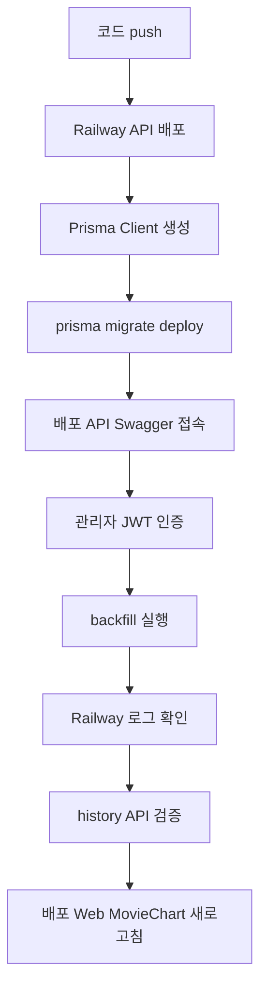

# Swagger 사용 가이드

Swagger UI는 NestJS API의 OpenAPI 문서를 브라우저에서 확인하고, 실제 요청을 직접 테스트하는 화면이다.

API 목록과 요청·응답 구조를 읽는 용도뿐 아니라 관리자 백필처럼 운영 API를 실행하는 용도로도 사용할 수 있다. 따라서 Swagger에서 `Execute`를 누르는 일은 단순한 화면 확인이 아니라 실제 서버와 DB에 영향을 줄 수 있는 요청이다.

## 접속 주소

NestJS API는 `/api` 경로에 Swagger UI를 제공한다. API 버전 prefix는 Swagger UI 경로와 별개다.

```txt
로컬 Swagger UI       http://localhost:3050/api
배포 Swagger UI       https://<배포된-api-domain>/api
실제 API 요청 prefix   https://<배포된-api-domain>/v1
```

예를 들어 Swagger UI에서 `GET /lobby/movie-chart`를 실행하면 실제 요청 주소는 다음과 같다.

```txt
https://<배포된-api-domain>/v1/lobby/movie-chart
```

`/api`를 API 요청 주소에 붙이지 않는다. `/api`는 Swagger 화면이고, `/v1`은 실제 HTTP API의 버전 prefix다.

## `NODE_ENV`와 `APP_ENV`

두 환경변수는 비슷해 보이지만 목적이 다르다.

### `NODE_ENV`

Node.js 생태계와 라이브러리가 실행 모드를 판단할 때 사용하는 관례적인 값이다.

```txt
development  → 개발 편의 기능과 자세한 오류 정보
test         → 테스트 실행 환경
production   → 최적화·운영 실행 환경
```

`NODE_ENV`는 보통 `development`, `test`, `production` 중 하나를 사용한다. `staging`을 `NODE_ENV`에 넣으면 일부 라이브러리가 `production`으로 인식하지 못할 수 있으므로, 스테이징도 실행 최적화 기준은 `production`으로 두는 편이 안전하다.

### `APP_ENV`

CINEMO 애플리케이션이 어느 배포 환경에서 실행 중인지 구분하기 위한 프로젝트 전용 값이다.

```txt
local        → 로컬 개발 환경
staging      → 팀 내부 검증 서버
production   → 실제 사용자 서비스
```

`APP_ENV`는 Node.js의 동작을 바꾸는 표준 변수가 아니다. Swagger 노출, 테스트 데이터 허용, 운영 전용 기능처럼 CINEMO의 배포 정책을 판단할 때 사용한다.

### 권장 조합

```env
# 로컬
NODE_ENV=development
APP_ENV=local

# 스테이징
NODE_ENV=production
APP_ENV=staging

# 프로덕션
NODE_ENV=production
APP_ENV=production
```

| 환경 | `NODE_ENV` | `APP_ENV` | Swagger |
| --- | --- | --- | --- |
| 로컬 | `development` | `local` | 활성 |
| 스테이징 | `production` | `staging` | 활성 |
| 프로덕션 | `production` | `production` | 비활성 |

이렇게 나누면 라이브러리에는 운영 최적화 모드를 전달하면서, 애플리케이션에는 스테이징과 프로덕션을 구별해 전달할 수 있다.

### Swagger 활성화 기준

현재 `apps/api/src/main.ts`는 `app.env`를 확인해 `local`·`staging`에서 Swagger를 활성화하고 `production`에서는 등록하지 않는다.

```ts
const appEnv = configService.get<string>('app.env') ?? 'local';
const document = SwaggerModule.createDocument(app, swagger);

if (appEnv !== 'production') {
  SwaggerModule.setup('api', app, document);
}
```

`APP_ENV`는 `registerAs('app', ...)` 설정에서 `app.env`로 변환하고 `ConfigService`로 읽는다. `APP_ENV`가 없으면 `NODE_ENV=production`일 때 `production`, 그 외에는 `local`로 판단한다. 운영 환경에서 Swagger를 켜더라도 문서 화면을 숨기는 것과 관리자 API의 권한 검사는 별개다. 백필 API는 계속 JWT와 `admin` 역할 검사를 유지해야 한다.

## Swagger가 생성되는 위치

```txt
apps/api/src/main.ts
  → DocumentBuilder
  → SwaggerModule.setup('api', app, document)
  → /api
```

컨트롤러의 DTO와 데코레이터가 OpenAPI 문서에 반영된다.

```ts
@ApiOkResponse({ type: MovieChartResponseDto })
@Get('movie-chart')
getMovieChart() {
  return this.lobbyBoardService.getMovieChart();
}
```

주요 데코레이터의 역할:

| 데코레이터 | 역할 |
| --- | --- |
| `@ApiTags()` | Swagger 화면에서 API 그룹을 나눔 |
| `@ApiOperation()` | endpoint 설명과 요약을 표시 |
| `@ApiBearerAuth()` | 해당 요청에 Bearer 인증이 필요하다는 정보를 표시 |
| `@ApiQuery()` | query parameter 구조를 표시 |
| `@ApiHeader()` | header 입력란과 설명을 표시 |
| `@ApiBody()` | request body 구조를 표시 |
| `@ApiOkResponse()` | `200` 응답 DTO를 표시 |
| `@ApiAcceptedResponse()` | `202` 응답 DTO를 표시 |
| `@ApiBadRequestResponse()` | `400` 응답을 표시 |
| `@ApiUnauthorizedResponse()` | `401` 응답을 표시 |
| `@ApiForbiddenResponse()` | `403` 응답을 표시 |

## 로컬에서 사용하는 순서

1. API를 실행한다.

```bash
pnpm dev:api
```

2. 브라우저에서 `http://localhost:3050/api`를 연다.
3. 원하는 tag와 endpoint를 펼친다.
4. `Try it out`을 누른다.
5. 필요한 query 또는 body를 입력한다.
6. `Execute`를 눌러 요청과 응답을 확인한다.

GET 요청은 대부분 읽기 작업이다. POST·PATCH·DELETE 요청은 DB 변경이나 외부 서비스 호출이 발생할 수 있으므로 대상과 body를 확인한 뒤 실행한다.

## 인증이 필요한 API 테스트

`@ApiBearerAuth()`가 붙은 API는 로그인으로 받은 Access Token이 필요하다.

1. 로그인 API에서 Access Token을 확인한다.
2. Swagger 화면 위쪽의 `Authorize`를 누른다.
3. Bearer 인증 입력란에 Access Token을 입력한다.
4. `Authorize`를 완료한다.
5. 요청의 `curl` 또는 Request URL에 `Authorization` 헤더가 포함되는지 확인한다.

```http
Authorization: Bearer <access-token>
```

Swagger의 인증 상태는 현재 브라우저에 저장될 수 있다. 테스트가 끝났거나 다른 계정으로 바꿔야 한다면 `Authorize`에서 로그아웃한다.

### 현재 Lobby API 인증 기준

| API | 인증 | 용도 |
| --- | --- | --- |
| `GET /v1/lobby/board` | 공개 | 로비 전광판 조회 |
| `GET /v1/lobby/movie-chart` | 공개 | 현재 영화 순위 조회 |
| `GET /v1/lobby/movie-chart/history` | 공개 | 저장된 날짜별 차트 조회 |
| `GET /v1/lobby/movie-chart/stats` | 공개 | 기간별 차트 집계 조회 |
| `POST /v1/lobby/visit` | 로그인 필요 | 로비 방문 기록 |
| `POST /v1/lobby/movie-chart/backfill` | 관리자 필요 | 과거 차트 수집·DB 저장 |
| `POST /v1/lobby/movie-chart/cron` | `x-cron-secret` 필요 | GitHub Actions 일일 수집 |
| `POST /v1/release-notifications/cron` | `x-cron-secret` 필요 | GitHub Actions 개봉일 알림 |

`backfill`은 `@Roles('admin')`이 적용되어 있으므로 일반 사용자 Access Token으로 실행하면 `403 Forbidden`이 반환된다.

## MovieChart 백필 실행

배포된 MovieChart에 순위 흐름이 비어 있다면, 배포 DB에 `MovieChartSnapshot` 데이터가 없는 상태일 수 있다. 로컬 Swagger에서 실행하면 로컬 DB에 저장되므로 반드시 배포 API의 Swagger에서 실행해야 한다.

### 실행 전 확인

- 최신 API 코드가 Railway에 배포되어 있는지 확인한다.
- `movie_chart_snapshots` 테이블 migration이 배포 DB에 적용되어 있는지 확인한다.
- Railway Variables에 `DATABASE_URL`과 `KOBIS_API_KEY`가 등록되어 있는지 확인한다.
- 관리자 Access Token으로 Swagger에 인증한다.

### 요청

`POST /v1/lobby/movie-chart/backfill`을 선택하고 다음 body를 입력한다.

```json
{
  "from": "2026-09-01",
  "to": "2026-09-14"
}
```

```http
POST /v1/lobby/movie-chart/backfill
Authorization: Bearer <admin-access-token>
Content-Type: application/json
```

### 응답과 처리 방식

백필은 날짜별 외부 API 요청을 순차 처리하고, 각 날짜의 Snapshot을 `upsert`한다.

```txt
요청 수신
  → 202 Accepted와 시작 메시지 반환
  → 날짜별 KOBIS 요청
  → 날짜별 MovieChartSnapshot upsert
  → 날짜별 성공·실패 로그 기록
  → 전체 백필 완료 로그 기록
```

응답은 작업 시작을 알리는 메시지만 먼저 반환한다.

```json
{
  "message": "백필 시작: 2026-09-01 ~ 2026-09-14"
}
```

`202 Accepted`는 모든 데이터 저장이 끝났다는 뜻이 아니다. Railway 로그에서 날짜별 완료 로그를 확인한 뒤 조회 API로 결과를 검증한다.

## 백필 결과 검증

Swagger에서 다음 요청을 실행한다.

```txt
GET /v1/lobby/movie-chart/history?from=2026-09-01&to=2026-09-14
```

응답 배열에 `chartDate`, `kobisMovieCd`, `rank`, `dailyAudienceCount`, `audienceCount`가 들어 있으면 Snapshot 저장이 완료된 상태다.

기간 집계가 필요하면 다음 API를 확인한다.

```txt
GET /v1/lobby/movie-chart/stats?from=2026-09-01&to=2026-09-14
```

검증 순서:

1. `history` 응답이 빈 배열이 아닌지 확인한다.
2. `chartDate`가 요청 범위에 포함되는지 확인한다.
3. 같은 기간을 다시 실행해도 중복 행이 생기지 않는지 확인한다.
4. 배포된 Web의 `/moviechart`를 새로고침한다.

## MovieChart 일일 수집 확인

관리자 백필은 기간을 지정하는 수동 작업이고, 일일 수집은 GitHub Actions가 매일 호출하는 별도 endpoint다.

```txt
POST /v1/lobby/movie-chart/cron
header: x-cron-secret
query: targetDate (선택, YYYY-MM-DD)
```

`movie-chart/cron`은 JWT 대신 `x-cron-secret`을 검사한다. 컨트롤러는 `ConfigService`에서 `EnvKeys.CRON_SECRET`을 읽으므로, 입력할 값은 API 실행 환경의 `CRON_SECRET`과 같아야 한다.

Swagger에서 실행하는 순서:

1. 로컬 또는 스테이징 Swagger를 연다.
2. `POST /v1/lobby/movie-chart/cron`을 펼치고 `Try it out`을 누른다.
3. `x-cron-secret`에 API 환경의 `CRON_SECRET`을 입력한다.
4. 특정 날짜를 확인할 때만 `targetDate`를 입력한다.
5. `Execute`를 눌러 `202` 응답과 `saved` 건수를 확인한다.

`targetDate`를 비워두면 API가 KST 기준 어제를 수집한다. 같은 날짜를 다시 실행해도 `(chartDate, kobisMovieCd)` 기준으로 `upsert`되므로 중복 Snapshot이 생기지 않는다.

GitHub Actions의 자동 실행은 Swagger 실행과 같은 endpoint를 호출한다. Swagger는 수동 확인용이고, 반복 실행은 `.github/workflows/movie-chart.yml`이 담당한다.

## 개봉일 알림 수동 확인

개봉일 알림 endpoint는 GitHub Actions가 정기적으로 호출하며, 같은 요청을 Swagger에서 수동 실행할 수도 있다.

```txt
POST /v1/release-notifications/cron
x-cron-secret: CRON_SECRET 값
```

Swagger에서 `Try it out`을 누른 뒤 `x-cron-secret`에 API 환경변수 `CRON_SECRET` 값을 입력하고 `Execute`를 누른다. JWT Bearer 인증은 필요하지 않다.

알림 대상은 `enabled = true`, `sentAt = null`, `releaseDate <= KST 오늘`인 row다. 발송에 성공하면 `sentAt`이 기록된다. 대상이 없으면 발송 없이 정상 응답한다.

GitHub Actions 수동 실행은 `.github/workflows/release-notification.yml`의 `workflow_dispatch`에서 진행한다. Swagger 수동 실행은 API endpoint 자체를 확인할 때 사용한다.

## 배포 환경에서의 전체 순서

Swagger는 최신 코드와 배포 DB가 준비된 뒤 사용해야 한다.



### Swagger에 백필 API가 보이지 않을 때

- API가 최신 커밋으로 배포되지 않았을 수 있다.
- 배포된 Swagger 문서가 캐시되었을 수 있으므로 API 재배포 후 다시 연다.
- `apps/api/src/lobby-board/lobby-board.controller.ts`에 `backfill` endpoint가 있는지 확인한다.

### `404 Not Found`가 나올 때

- `/api`와 `/v1`을 혼동했는지 확인한다.
- 실제 요청은 `/v1/lobby/movie-chart/backfill`이다.
- Swagger UI 접속 주소만 `/api`다.

### `401 Unauthorized`가 나올 때

- `Authorize`가 완료되었는지 확인한다.
- Access Token이 만료되지 않았는지 확인한다.
- 요청 헤더에 `Authorization: Bearer ...`가 포함되는지 확인한다.

### `403 Forbidden`이 나올 때

- 로그인한 계정의 `role`이 `admin`인지 확인한다.
- 일반 사용자 토큰으로 관리자 백필을 호출하고 있지 않은지 확인한다.

### `500` 또는 테이블 오류가 나올 때

- Railway Pre-deploy Command가 실행되었는지 확인한다.

```bash
pnpm --filter api exec prisma migrate deploy --schema prisma/schema.prisma
```

- `MovieChartSnapshot` migration이 배포 DB에 적용되었는지 확인한다.
- API의 `DATABASE_URL`이 확인하려는 운영 DB를 가리키는지 확인한다.

### `history`가 계속 빈 배열일 때

- 백필을 로컬 Swagger에서 실행하지 않았는지 확인한다.
- 배포 API 로그에 KOBIS 요청과 날짜별 저장 로그가 있는지 확인한다.
- `KOBIS_API_KEY`가 배포 환경에 있는지 확인한다.
- 요청한 날짜에 KOBIS 데이터가 존재하는지 확인한다.

## OpenAPI 타입 생성과 Swagger UI의 차이

Swagger UI와 OpenAPI codegen은 같은 OpenAPI 문서를 서로 다른 목적으로 사용한다.

```txt
NestJS DTO·데코레이터
  → Swagger OpenAPI 문서
      ├─ /api Swagger UI: 사람이 API를 확인·실행
      └─ openapi.json: openapi-typescript 입력
          → packages/api-contract/src/generated/api.d.ts
```

타입을 변경할 때는 DTO와 컨트롤러 데코레이터를 수정한 뒤 다음 명령을 실행한다.

```bash
pnpm generate:api
```

- Swagger UI는 실행 중인 API 서버의 문서를 확인한다.
- `openapi.json`은 생성된 계약 문서다.
- `api.d.ts`는 Web TypeScript 컴파일에 사용하는 생성 타입이다.
- `openapi.json`과 `api.d.ts`는 직접 편집하지 않는다.

## 보안과 운영 기준

- Swagger URL을 안다고 관리자 권한을 얻을 수 있는 것은 아니다. 실제 권한 검사는 API Guard와 `Roles`가 담당한다.
- 운영 Swagger에서 `POST`, `PATCH`, `DELETE`, 백필 API를 실행하기 전 요청 body와 대상 환경을 확인한다.
- Access Token, API Key, `DATABASE_URL`은 문서·스크린샷·로그에 남기지 않는다.
- 운영 백필은 작은 날짜 범위로 먼저 실행하고 `history` 응답을 확인한 뒤 범위를 늘린다.
- 같은 백필을 다시 실행해도 Snapshot의 고유 키 `(chartDate, kobisMovieCd)`를 기준으로 `upsert`되므로 중복 저장되지 않는다.
- Swagger는 운영 배치 시스템이 아니다. 반복 수집은 별도 스케줄러나 GitHub Actions에서 담당하고 Swagger는 수동 점검·백필에 사용한다.
