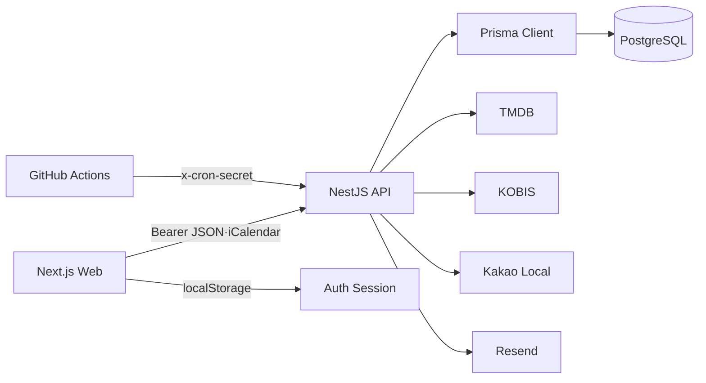
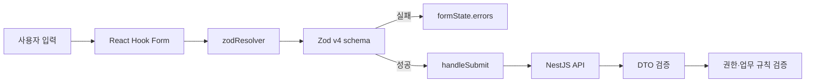
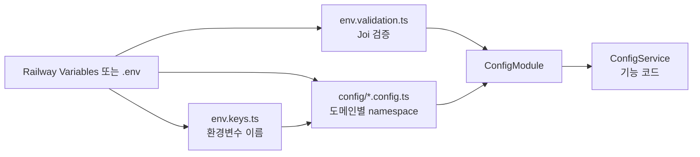
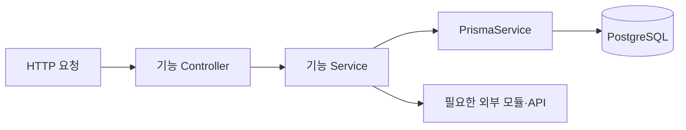
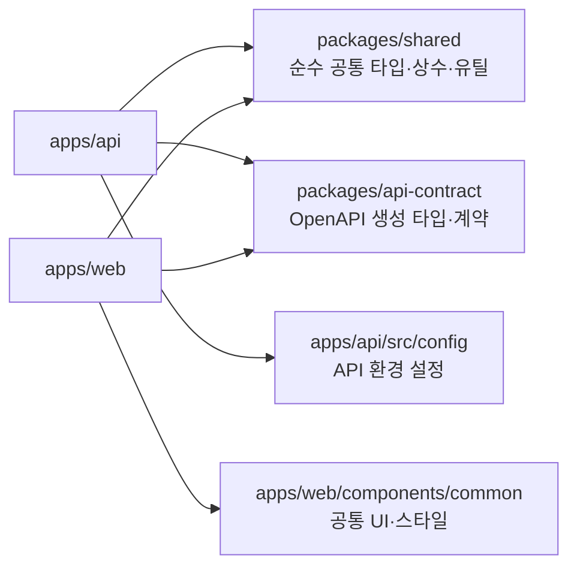
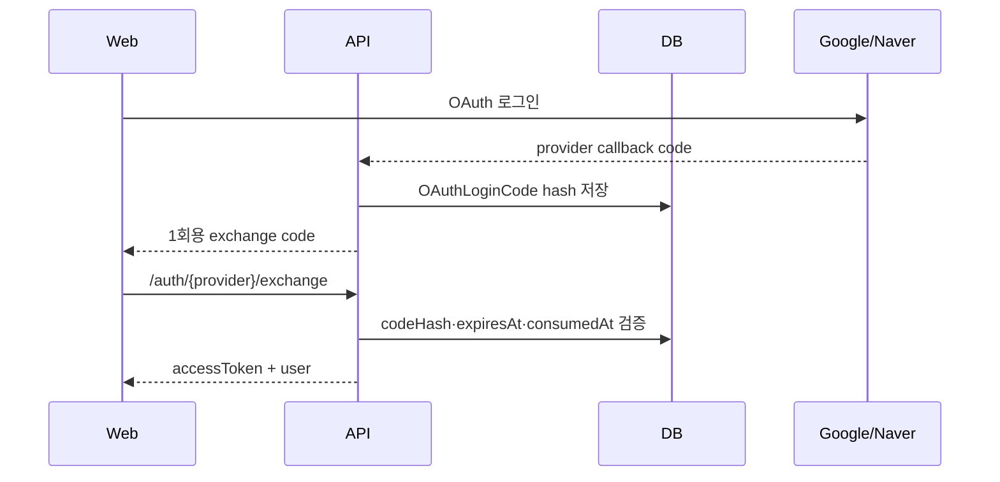
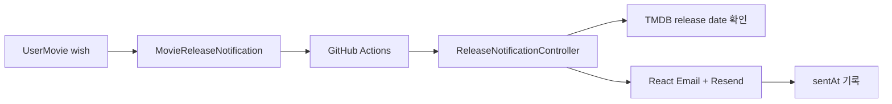

# CINEMO 아키텍처

## 서비스 경계




### Web

- App Router 기반 Next.js
- 화면: 로비, 개봉 예정, MY CINEMA, 관리자
- 서버 상태: API 응답 기준
- 세션: `auth-store` + `localStorage` 복원
- 포스터 이미지: TMDB remote URL 사용, 서버 이미지 파일 저장 없음
- 폼 상태: `react-hook-form`
- 클라이언트 검증: Zod v4 schema + `zodResolver`
- 서버 검증: NestJS DTO·Service에서 재검증. Web 검증은 UX용 1차 검증

### Web 폼 검증 흐름



`react-hook-form`은 입력값과 제출 상태를 관리하고, Zod는 입력 규칙을 선언함. `zodResolver`가 두 라이브러리를 연결하며 `z.infer<typeof schema>`로 입력 타입을 추출함.

주요 적용 위치:

| 화면·컴포넌트 | 검증 대상 |
| --- | --- |
| `login/page.tsx` | 이메일 형식·비밀번호 길이 |
| `forgot-password/page.tsx` | 비밀번호 재설정 이메일 |
| `reset-password/page.tsx` | 새 비밀번호·확인값 |
| `PostcardCreateModal.tsx` | 원문·한국어 문구·공개 여부 |
| `MovieDetailModal.tsx` | 관람일·관람 방식·플랫폼·평점 |

Web에서 검증이 통과해도 브라우저 요청은 신뢰하지 않음. API DTO와 Service에서 입력·권한·도메인 규칙을 다시 확인한 뒤 Prisma에 전달함. 자세한 내용은 [폼 검증 문서](./library/form-validation.md) 참고.

### API

- NestJS module 단위 도메인 분리
- 전역 JWT guard 사용, 공개 endpoint만 `@Public()`으로 예외 처리
- Prisma를 통한 PostgreSQL 접근
- 환경변수는 `registerAs` 기반 도메인별 config와 전역 `ConfigService`로 관리
- 예외 응답은 전역 `HttpExceptionFilter`에서 `statusCode·message·timestamp`로 통일
- 외부 API 키는 브라우저에 노출하지 않고 API 서버에서만 사용
- Resend 메일·개봉일 Cron은 API 프로세스에서 실행

### 환경 설정 관리

환경 설정은 세 단계로 분리함.



현재 도메인별 설정 파일:

```txt
apps/api/src/config/
├─ database.config.ts  # database.url
├─ auth.config.ts      # auth.secret, auth.frontendUrl
├─ tmdb.config.ts      # tmdb.baseUrl, tmdb.accessToken
├─ ai.config.ts        # ai.claudeKey, ai.openaiKey
├─ oauth.config.ts     # oauth.google.*, oauth.kakao.* 등
├─ mail.config.ts      # mail.resendApiKey, mail.resendFrom
└─ demo.config.ts      # demo.enabled, demo.password
```

`Joi`와 `registerAs`는 대체 관계가 아님.

- `Joi`: 애플리케이션 시작 시 필수값·형식·길이 검증
- `registerAs`: 환경변수를 도메인별 설정 객체로 그룹화하고 기본값 정의
- `ConfigService`: 기능 코드가 namespace 경로로 설정 조회

```ts
configService.getOrThrow<string>('ai.openaiKey');
configService.getOrThrow<string>('database.url');
```

기능 서비스에서 `process.env.OPENAI_KEY`나 원시 `EnvKeys.OPENAI_KEY`를 직접 조회하지 않음. 실제 환경변수 이름은 유지하므로 Railway Variables를 별도로 변경할 필요가 없음.

## NestJS 모듈 구성

모듈은 Controller, Service, 외부 의존성을 기능 단위로 묶는 NestJS의 경계임. `AppModule`은 모듈을 조립하고, 각 기능 모듈은 필요한 모듈만 `imports`에 선언함.

```mermaid
flowchart TD
  App[AppModule]
  Config[ConfigModule<br/>global]
  Prisma[PrismaModule<br/>@Global]
  Auth[AuthModule]
  Postcard[PostcardModule]
  UserMovie[UserMovieModule]
  LobbyBoard[LobbyBoardModule]
  Tmdb[TmdbModule]
  Ai[AiModule]
  Admin[AdminModule]
  Guide[GuideModule]
  Places[PlacesModule]
  Profiles[ProfilesModule]

  App --> Config
  App --> Prisma
  App --> Auth
  App --> Postcard
  App --> UserMovie
  App --> LobbyBoard
  App --> Tmdb
  App --> Ai
  App --> Admin
  App --> Guide
  App --> Places
  App --> Profiles

  Tmdb --> Ai
  LobbyBoard --> Tmdb
  LobbyBoard --> Admin
  UserMovie --> Tmdb
  UserMovie --> Auth
  Postcard --> Auth
  Profiles --> Auth
  Auth --> Admin

  Prisma -. PrismaService 제공 .-> Postcard
  Prisma -. PrismaService 제공 .-> UserMovie
  Prisma -. PrismaService 제공 .-> Admin
  Prisma -. PrismaService 제공 .-> Tmdb
```

### 공용 모듈과 기능 모듈

| 구분 | 모듈 | 의미 |
| --- | --- | --- |
| 전역 모듈 | `PrismaModule` | `@Global()`로 등록된 `PrismaService` 제공. 각 기능 모듈에서 별도 import 불필요 |
| 전역 설정 | `ConfigModule` | `isGlobal: true`로 환경 변수와 설정 제공 |
| 인증 모듈 | `AuthModule` | JWT·OAuth 전략, `AuthService`, `MailService`, 전역 인증·역할 Guard 등록 |
| 기능 모듈 | `PostcardModule` | 엽서 Controller·Service와 엽서 작성·수정 흐름 담당 |
| 기능 모듈 | `UserMovieModule` | 개인 영화 활동과 개봉일 알림 처리 담당 |
| 외부 API 모듈 | `TmdbModule` | TMDB 조회와 영화 데이터 보정·캐시 담당 |
| 외부 API 모듈 | `AiModule` | AI provider 추상화와 AI 기능 담당 |
| 운영 모듈 | `AdminModule` | 관리자 기능과 통계·리포트 담당 |

### `@Global()`과 `imports` 차이

- `@Global()` 모듈: 애플리케이션에서 한 번 import하면 export한 provider를 다른 모듈에서 바로 사용 가능
- 일반 모듈: 다른 모듈의 provider가 필요하면 해당 모듈을 `imports`에 선언해야 함
- `AuthModule`은 현재 `@Global()`이 아님. 다만 `APP_GUARD`로 등록된 `JwtAuthGuard`와 `RolesGuard`는 애플리케이션 전체 요청에 적용됨
- `PostcardModule`에서 현재 `AuthModule`을 import한 이유는 인증 모듈과의 의존성을 모듈 구조에 명시하기 위함. `PostcardService`가 `AuthService`나 `MailService`를 직접 주입하지 않는 현재 상태에서는 기능 동작에 필수는 아님

### 모듈 내부 흐름



- Controller: 경로, 요청 DTO, Swagger 문서, 인증 사용자 ID 연결
- Service: 권한 검사, 업무 규칙, 데이터 조합
- PrismaService: DB connection pool을 통한 query 실행
- Module: 위 구성 요소와 모듈 간 의존성 경계 관리

### 인증·인가 구성

```mermaid
flowchart LR
  Request[API 요청] --> JWT[JwtAuthGuard]
  JWT --> Public{@Public 여부}
  Public -->|예| Controller[Controller]
  Public -->|아니오·유효한 토큰| Roles[RolesGuard]
  Roles --> Controller
  Roles -->|권한 부족| Forbidden[403 Forbidden]
  JWT -->|토큰 없음·유효하지 않음| Unauthorized[401 Unauthorized]
```

- `JwtAuthGuard`: 요청의 `Authorization: Bearer <token>` 헤더에서 JWT를 추출하고 서명·만료·payload를 검증하는 전역 인증 Guard
- `@Public()`: JWT 인증 예외 endpoint 지정
- `RolesGuard`: `@Roles('admin')` 메타데이터를 기준으로 역할 검사
- `@Roles('admin')`: 관리자 전용 endpoint 지정. 권한 부족 시 `403 Forbidden`
- `@ApiBearerAuth()`: Swagger에 Bearer 인증 입력 UI를 표시하는 문서용 데코레이터
- `@UserId()`: JWT payload의 `sub`에서 사용자 ID 추출. 인증 정보가 없으면 `401 Unauthorized`
- `@OptionalUserId()`: 공개 endpoint에서 로그인 사용자 ID를 선택적으로 추출
- `@CurrentUser()`: OAuth Passport 전략이 `request.user`에 넣은 소셜 프로필 추출
- `AuthGuard('google' | 'naver' | 'kakao')`: provider별 OAuth callback 인증

`AuthModule`에서 `JwtAuthGuard`와 `RolesGuard`를 `APP_GUARD`로 등록하여 모든 요청에 적용. 각 Controller에서 필요한 endpoint만 `@Public()`, `@Roles()`, `@ApiBearerAuth()`로 의도를 표시.


### 공유 계층: Shared · API Contract · Common UI

API와 Web 사이에 공유되는 모든 것을 `packages/shared`에 넣지 않음. 공유 대상의 성격에 따라 계층을 분리함.



| 계층 | 위치 | 넣는 것 | 넣지 않는 것 |
| --- | --- | --- | --- |
| Shared | `packages/shared` | API/Web이 함께 쓰는 순수 타입·상수·유틸 | HTTP 응답 계약, DB 접근, React/Nest 실행 로직 |
| API Contract | `packages/api-contract` | OpenAPI에서 생성된 요청·응답 타입과 경로 계약 | 수동으로 복제한 DTO, 비즈니스 로직 |
| Common UI | `apps/web/components/common` | 여러 Web 화면에서 반복되는 컴포넌트·스타일 | API와 Web이 함께 쓰는 타입 |
| API Config | `apps/api/src/config` | NestJS 서버 전용 환경 설정과 namespace | Web 공개 설정, Shared 타입 |

```txt
packages/shared/src/
├─ movie.ts
├─ user-movie.ts
├─ lobby-board.ts
├─ profile.ts
├─ avatar.ts
├─ guide.ts
├─ admin.ts
└─ postcard.ts
```

`MOVIE CHART`처럼 HTTP API의 요청·응답 DTO는 `shared`에 다시 정의하지 않고 `packages/api-contract`의 OpenAPI 생성 타입을 사용함. 상세 기준은 [API 계약과 OpenAPI codegen](./api/api-contract.md) 참고.


## 현재 사용자 여정

```txt
회원가입/로그인
  → 가입 직후 로비 가이드
  → 로비에서 영화 정보 탐색
  → 개봉 예정 영화 저장
  → 개봉일 알림 설정·캘린더 추가
  → MY CINEMA에서 관람 기록·영화 달력 확인
  → POSTCARD에서 영화 문구를 공개하고 댓글로 소통
```


## 데이터 경계


| 영역                         | 역할                          | 저장 기준        |
| -------------------------- | --------------------------- | ------------ |
| `UserMovie`                | 개인 관람 기록, 별점, 감상 메모, 보고 싶어요 | 사용자별 비공개 데이터 |
| `MoviePool`                | TMDB 영화 메타데이터 캐시               | 운영 데이터       |
| `MovieReleaseNotification` | 보고 싶어요 영화의 개봉일 알림 설정        | 사용자별 알림 상태   |
| `Postcard`                 | 영화 문구와 원문을 공개하는 엽서             | 작성자별 콘텐츠       |
| `PostcardBookmark`         | 다른 사용자의 공개 엽서 보관                | 사용자별 보관 상태    |
| `PostcardReaction`         | 공개 엽서 이모지 반응                       | 사용자별 엽서 반응    |
| `PostcardComment`          | 공개 엽서 댓글·대댓글                       | 작성자별 커뮤니티 콘텐츠 |
| `PostcardCommentReaction`  | 댓글 하트 반응                              | 사용자별 댓글 반응    |


`UserMovie.review`: 공개 게시물이 아닌 개인 감상 메모

## 인증 구조




이메일 로그인: 직접 `accessToken` 반환. OAuth callback code는 만료·재사용 방지를 위해 DB에서 소비 처리.

현재 완료 provider: Google·Naver. Kakao는 이메일 제공 권한 문제, Apple은 Developer Program과 추가 설정 문제로 보류 상태.

## 개봉일 알림 구조




- 발송 대상: `enabled=true`인 알림
- 개봉일 변경 시 `sentAt=null`로 초기화
- 메일 발송 성공 후 `sentAt` 기록
- 실패: Nest `Logger` 기록, 다른 사용자 처리 계속 진행


## WebSocket 정책

현재 로비: REST 기반 콘텐츠 흐름
WebSocket: 향후 고객센터 실시간 문의 기능 도입 시 별도 namespace·module 설계

```txt
현재: REST + Cron + 이메일
향후: 고객센터 WebSocket (namespace·권한·메시지 보관 정책을 별도 정의)
```


## 배포 구조

```txt
Web  → Vercel
API  → Railway
DB   → Railway PostgreSQL 또는 Neon
현재 예약 작업 → GitHub Actions가 Railway API endpoint 호출
장기 전환 목표 → Cloud Scheduler가 Cloud Run Job 실행
```

DB migration: 코드 배포와 분리하여 Railway Pre-deploy Command에서 적용. 자세한 내용은 [deploy.md](./deploy.md) 참고.
