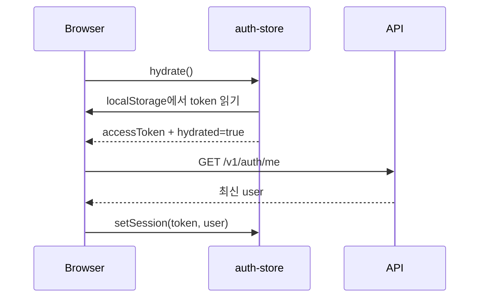

# Auth Store

경로: `apps/web/lib/auth-store.ts`

Zustand로 브라우저의 인증 상태를 관리하는 전역 store.

## 상태 구조

```ts
type AuthState = {
  accessToken: string | null;
  user: AuthUser | null;
  hydrated: boolean;
};
```

| 상태 | 의미 | 저장 위치 |
| --- | --- | --- |
| `accessToken` | API 요청에 사용하는 JWT | Zustand 메모리 + `localStorage` |
| `user` | 현재 로그인한 사용자 정보 | Zustand 메모리 |
| `hydrated` | 브라우저에서 `localStorage` 확인이 끝났는지 여부 | Zustand 메모리 |

## Selector 읽기

```tsx
const accessToken = useAuthStore((s) => s.accessToken);
```

`useAuthStore`는 Zustand hook이고, `(s) => s.accessToken`은 전체 store가 아니라 `accessToken`만 구독하는 selector임.

즉, 컴포넌트에서는 필요한 상태만 읽음.

```tsx
const user = useAuthStore((s) => s.user);
const accessToken = useAuthStore((s) => s.accessToken);
const hydrated = useAuthStore((s) => s.hydrated);
```

## `setSession`과 `setUser`의 차이

### `setSession(accessToken, user)`

```ts
setSession: (accessToken, user) => {
  localStorage.setItem(STORAGE_KEY, accessToken);
  set({ accessToken, user });
},
```

로그인 세션 전체를 설정하는 함수.

- 새 access token을 `localStorage`에 저장함
- Zustand의 `accessToken`을 갱신함
- Zustand의 `user`를 함께 갱신함
- 로그인·회원가입·OAuth 로그인·`/auth/me` 복원에 사용함

사용 위치:

```txt
apps/web/app/(auth)/login/page.tsx
apps/web/app/(auth)/register/page.tsx
apps/web/app/auth/callback/page.tsx
apps/web/components/auth/AuthBootstrap.tsx
```

세션을 새로 만들거나 token과 사용자 정보를 함께 갱신할 때 사용함.

### `setUser(user)`

```ts
setUser: (user) => set({ user }),
```

이미 로그인된 세션에서 사용자 정보만 갱신하는 함수.

- `user`만 Zustand 메모리에서 교체함
- `accessToken`을 변경하지 않음
- `localStorage`의 token도 변경하지 않음
- 프로필·닉네임·아바타 수정 후 화면 상태를 즉시 갱신할 때 사용함

사용 위치:

```txt
apps/web/app/my-cinema/page.tsx
```

## 핵심 차이

| 구분 | `setSession` | `setUser` |
| --- | --- | --- |
| access token | 변경 | 유지 |
| localStorage | token 저장 | 변경 없음 |
| user | 함께 변경 | user만 변경 |
| 사용 시점 | 로그인·세션 복원 | 프로필 정보 수정 |
| 의미 | 인증 세션 교체 | 세션 내부 사용자 정보 갱신 |

```txt
로그인 성공
  → setSession(token, user)
  → token 영속화 + 메모리 상태 갱신

프로필 수정 성공
  → setUser(updatedUser)
  → token은 유지하고 화면의 사용자 정보만 갱신
```

## `hydrate`와 `AuthBootstrap`

새로고침하면 Zustand 메모리는 초기화되지만 `localStorage`는 남아 있음.

```ts
hydrate: () => {
  if (typeof window === 'undefined') return;
  const accessToken = localStorage.getItem(STORAGE_KEY);
  set({ accessToken, hydrated: true });
},
```

`hydrate`는 token을 읽는 역할만 하고, 사용자 정보까지 복원하지는 않음.

전체 흐름:



구현 위치: `apps/web/components/auth/AuthBootstrap.tsx`

- token이 없으면 로그인하지 않은 상태로 유지함
- token이 있으면 `/auth/me`로 최신 사용자 정보를 조회함
- token이 유효하지 않으면 `clearSession()`으로 token과 user를 모두 제거함

## 로그아웃

```ts
clearSession: () => {
  localStorage.removeItem(STORAGE_KEY);
  set({ accessToken: null, user: null });
},
```

로그아웃은 메모리 상태와 영속 token을 함께 제거해야 함. 둘 중 하나만 제거하면 새로고침 후 다시 로그인된 것처럼 보이거나, 화면은 로그아웃인데 API 요청은 token을 사용하는 불일치가 발생함.

## 사용 기준

- 로그인·회원가입·OAuth callback: `setSession`
- `/auth/me` 세션 복원: `setSession`
- 프로필·닉네임·아바타 수정: `setUser`
- 로그아웃·유효하지 않은 token: `clearSession`
- 앱 최초 브라우저 인증 확인: `hydrate`
- API 요청: `useAuthStore((s) => s.accessToken)`로 token만 선택해 사용
