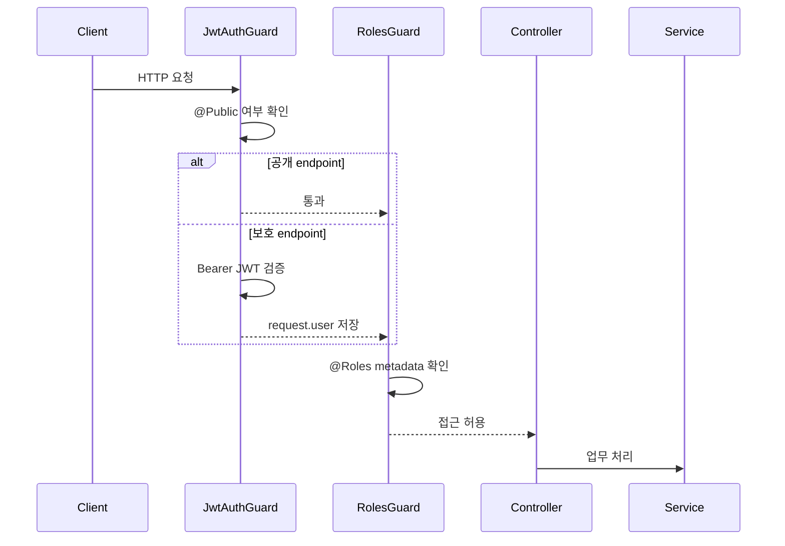

# NestJS Guard

Guard는 요청이 Controller 메서드에 도달하기 전에 실행되어 **접근 가능 여부**를 결정하는 계층임.

```txt
HTTP 요청
  → JwtAuthGuard 인증 확인
  → RolesGuard 권한 확인
  → Controller
  → Service
```

## 인증과 인가

| 구분 | 질문 | CINEMO 구현 |
| --- | --- | --- |
| 인증(Authentication) | 로그인한 사용자인가? | `JwtAuthGuard` |
| 인가(Authorization) | 이 사용자가 해당 기능을 사용할 권한이 있는가? | `RolesGuard` |

인증에 실패하면 `401 Unauthorized`, 권한에 실패하면 `403 Forbidden`을 반환함.

```txt
토큰 없음·유효하지 않음
  → 401 Unauthorized

토큰은 유효하지만 admin 권한 없음
  → 403 Forbidden
```

## 전역 Guard 등록

`apps/api/src/auth/auth.module.ts`에서 두 Guard를 `APP_GUARD`로 등록함.

```ts
providers: [
  {
    provide: APP_GUARD,
    useClass: JwtAuthGuard,
  },
  {
    provide: APP_GUARD,
    useClass: RolesGuard,
  },
];
```

전역 Guard이므로 Controller마다 `@UseGuards()`를 반복하지 않아도 모든 endpoint에 적용됨.

## `JwtAuthGuard`

`JwtAuthGuard`는 Passport의 `jwt` 전략을 사용함.

1. `Authorization: Bearer <token>` 헤더에서 JWT 추출
2. `auth.config.ts`의 secret으로 서명 검증
3. 만료 여부와 payload 검증
4. 성공하면 `request.user`에 payload 저장
5. 실패하면 `401 Unauthorized` 반환

```ts
@Get('me')
getMe(@UserId() userId: string) {
  return this.authService.getMe(userId);
}
```

`@UserId()`는 Guard가 검증한 `request.user.sub`에서 사용자 ID를 읽음. Controller가 요청 body의 사용자 ID를 신뢰하지 않는 이유는 사용자가 다른 사람의 ID를 보낼 수 있기 때문임.

## 공개 endpoint: `@Public()`

전역 Guard를 적용하면서 로그인하지 않아도 접근 가능한 endpoint는 `@Public()`으로 표시함.

```ts
@Public()
@Get('movie-chart')
getMovieChart() {
  return this.lobbyBoardService.getMovieChart();
}
```

현재 CINEMO에서 공개인 기능:

```txt
로비 조회
MOVIE CHART 조회
개봉 예정 영화 조회
공개 엽서 조회
로그인·회원가입
OAuth 로그인 진입·callback
```

공개 endpoint라도 작성·수정·삭제처럼 사용자 식별이 필요한 동작에는 `@Public()`을 붙이지 않음.

## 관리자 권한: `@Roles()`

`RolesGuard`는 endpoint에 선언된 역할 metadata를 읽고 JWT payload의 `role`과 비교함.

```ts
@Roles('admin')
@Post('seed-pool/cancel')
cancelSeedPool() {
  return this.tmdbService.requestSeedCancel();
}
```

```txt
@Roles() 없음
  → 로그인한 사용자면 통과

@Roles('admin') 있음
  → request.user.role이 admin이어야 통과
  → 아니면 403 Forbidden
```

`RolesGuard`는 JWT 자체를 검증하지 않음. 먼저 `JwtAuthGuard`가 `request.user`를 채운 뒤 역할만 확인함.

## Guard 실행 순서



## Guard·Pipe·Interceptor 차이

| 계층 | 책임 | 예시 |
| --- | --- | --- |
| Guard | 요청을 통과시킬지 결정 | JWT·역할 검사 |
| Pipe | 입력값 변환·검증 | `ValidationPipe`, `ParseIntPipe` |
| Interceptor | 실행 전후 공통 처리 | 로깅·응답 변환·실행 시간 측정 |
| Filter | 예외를 HTTP 응답으로 변환 | `HttpExceptionFilter` |

Guard는 권한을 검사하는 계층이지, DTO 입력값 검증이나 DB 권한 규칙 전체를 대신하지 않음. Service에서도 리소스 소유자 확인과 도메인 규칙을 다시 검사해야 함.

## 보안 규칙

- 보호 endpoint에 실수로 `@Public()`을 붙이지 않음
- 요청 body의 `userId`를 인증 정보로 사용하지 않음
- `request.user`는 JWT 검증이 끝난 뒤에만 신뢰함
- 역할 검사만으로 리소스 소유권 검사를 대체하지 않음
- JWT secret과 토큰을 로그에 남기지 않음
- 공개 조회와 공개 작성 endpoint를 혼동하지 않음

## 관련 구현

- `apps/api/src/auth/jwt-auth.guard.ts`
- `apps/api/src/auth/roles.guard.ts`
- `apps/api/src/auth/jwt-strategy.ts`
- `apps/api/src/auth/decorators/public.decorator.ts`
- `apps/api/src/auth/decorators/roles.decorator.ts`
- `apps/api/src/auth/auth.module.ts`
