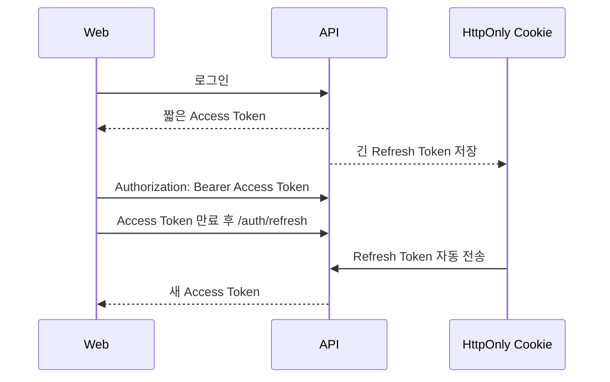

# 세션·토큰 저장 전략

인증 저장 방식은 기능이 커지기 전에 먼저 결정해야 함. Access Token과 Refresh Token은 수명과 역할이 다르므로 같은 위치에 저장하지 않음.

## 현재 구조

현재 CINEMO는 Access Token을 Zustand 메모리와 `localStorage`에 직접 저장함.

```txt
로그인
  → API가 Access Token 반환
  → Zustand에 저장
  → localStorage에도 저장

새로고침
  → localStorage에서 Access Token 복원
  → /auth/me로 사용자 정보 확인
```

구현 위치:

```txt
apps/web/lib/auth-store.ts
  setSession()  → accessToken 저장
  hydrate()     → localStorage에서 accessToken 복원
  clearSession() → localStorage 삭제
```

현재 방식은 구현이 단순하지만 JavaScript에서 `localStorage`를 읽을 수 있음. XSS가 발생하면 저장된 Access Token이 탈취될 수 있다는 보안 trade-off가 있음.

## 목표 구조

```txt
Access Token
  → Zustand 메모리에만 저장
  → 짧은 만료 시간
  → API 요청 Authorization header에 사용

Refresh Token
  → HttpOnly Cookie에 저장
  → JavaScript에서 읽을 수 없음
  → Access Token 재발급에만 사용
```



## 왜 분리하는가

| 토큰 | 역할 | 저장 위치 | 이유 |
| --- | --- | --- | --- |
| Access Token | 일반 API 인증 | 메모리 | 탈취되어도 수명을 짧게 제한 |
| Refresh Token | Access Token 재발급 | HttpOnly Cookie | JavaScript가 직접 읽지 못하게 함 |

HttpOnly는 XSS에 의한 토큰 직접 읽기를 줄여주지만, XSS 자체를 해결하는 기능은 아님. 악성 스크립트는 브라우저 안에서 사용자의 요청을 대신 보낼 수 있으므로 CSP·입력 검증·CSRF 방어도 필요함.

## 현재 배포 구조와 `SameSite`

현재 CINEMO의 배포 구조:

```txt
Web  → Vercel 기본 도메인
API  → Railway 기본 도메인
```

두 기본 도메인은 서로 다른 site이므로 쿠키 정책이 달라짐.

### 현재 도메인을 유지하는 경우

```http
HttpOnly
Secure
SameSite=None
```

`SameSite=None`은 cross-site 요청에서도 쿠키를 전송하기 위한 설정임. 반드시 `Secure`와 함께 사용해야 하며, API에는 다음 방어가 필요함.

- CORS에 허용된 Web origin만 등록
- 클라이언트 요청에 `credentials: 'include'` 사용
- refresh·logout 같은 상태 변경 요청의 Origin 검증
- 필요하면 CSRF token 또는 double-submit cookie 적용
- Cookie `Domain`을 불필요하게 넓히지 않음
- Refresh Token Cookie의 `Path`를 필요한 endpoint 범위로 제한

### custom domain을 사용하는 경우

```txt
https://cinemo.com
https://api.cinemo.com
```

같은 등록 가능 도메인 아래의 서브도메인은 같은 site로 취급됨. 이 경우 cross-origin이므로 CORS는 여전히 필요하지만, 쿠키에는 다음 정책을 검토할 수 있음.

```http
HttpOnly
Secure
SameSite=Strict
```

도메인을 구매해야만 목표 구조를 사용할 수 있는 것은 아님. 현재 Vercel·Railway 조합에서는 `SameSite=None`으로 구현하고, custom domain 연결 후 `Strict`로 강화할 수 있음.

## migration 시점

거의 모든 기능을 만든 뒤 급하게 바꾸기보다, 인증에 의존하는 기능이 더 늘기 전에 설계를 확정하는 것이 좋음.

```txt
지금
  → 목표 저장 전략과 API 계약 문서화

기능 확장 전
  → refresh/logout endpoint 구현
  → Web 세션 복원 흐름 교체
  → 기존 localStorage access token 제거

custom domain 연결 후
  → SameSite 정책 강화 검토
```

현재 구조를 잠시 유지해도 되는 경우:

- 개인 학습·포트폴리오 데모 단계
- 실제 사용자가 거의 없음
- 인증 migration을 진행할 테스트 환경이 아직 없음

빠르게 바꾸는 것이 좋은 경우:

- 실제 사용자에게 공개하기 전
- 관리자 기능과 사용자 기능이 계속 늘어나는 시점
- Access Token 수명·로그아웃·다중 기기 세션을 관리해야 하는 시점

## 필요한 구현 작업

이 migration은 저장 위치만 바꾸는 작업이 아님.

### API

```txt
POST /auth/login
  → Access Token 응답
  → Refresh Token Cookie 설정

POST /auth/refresh
  → Cookie의 Refresh Token 검증
  → 새 Access Token 발급
  → Refresh Token rotation

POST /auth/logout
  → Refresh Token 폐기
  → Cookie 삭제
```

Refresh Token은 원문을 DB에 저장하기보다 hash를 저장하고, rotation·재사용 감지·폐기 정책을 함께 설계함.

### Web

```txt
auth-store.ts
  → Access Token을 메모리에만 보관
  → localStorage 저장·복원 제거

AuthBootstrap
  → 새로고침 시 /auth/refresh 호출
  → 성공하면 새 Access Token과 /auth/me 반영
  → 실패하면 비로그인 상태로 전환

api-fetch.ts
  → refresh 요청에 credentials: 'include' 적용
```

## 최종 결정

```txt
목표 구조
  Access Token        → 메모리
  Refresh Token       → HttpOnly Cookie

현재 Vercel·Railway
  SameSite=None + Secure + CSRF 방어

custom domain 이후
  SameSite=Strict 검토
```

Zustand를 Redux로 바꾸는 문제와는 별개임. Zustand는 Access Token을 메모리에 보관하는 용도로 계속 사용할 수 있음.

## 관련 문서

- [인증 Guard](./guards.md)
- [인증 Store](./auth-store.md)
- [NestJS 환경 설정](../concepts/nest-config.md)
- [Railway 배포](../deploy/railway.md)
