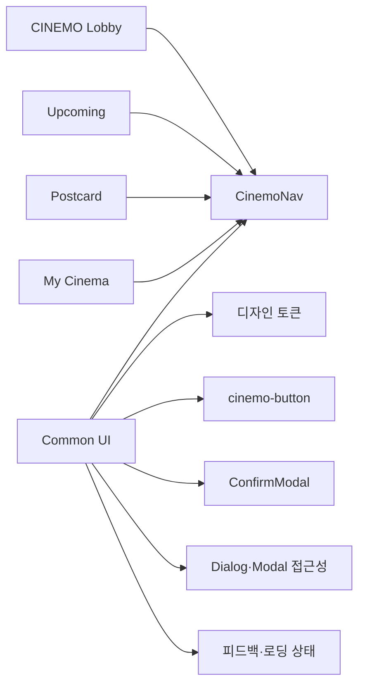

# Common UI

여러 화면에서 반복 사용하는 공통 UI와 스타일의 문서 지도.

## 구성

## 문서 목록

| 문서 | 내용 |
| --- | --- |
| [design-tokens.md](./design-tokens.md) | CINEMO 공통 색상 토큰 |
| [buttons.md](./buttons.md) | `.cinemo-button` 공통 버튼 기준 |
| [navigation.md](./navigation.md) | `CinemoNav` 공통 네비게이션 |
| [confirm-modal.md](./confirm-modal.md) | `ConfirmModal` 공통 확인 모달 |
| [dialog.md](./dialog.md) | Dialog·Modal 접근성 및 Radix 적용 기준 |
| [feedback.md](./feedback.md) | Tooltip·저장 안내·오류·성공 메시지·Toast |
| [typography.md](./typography.md) | UI·엽서 문구·영문 로고의 폰트 기준 |

## 공통 UI 원칙

- 여러 화면에서 같은 이동 구조가 필요하면 `CinemoNav` 사용
- 저장·삭제·복원처럼 확인이 필요한 동작은 `ConfirmModal` 사용
- 반복되는 색상과 버튼 형태는 공통 스타일에서 관리
- 페이지 고유의 색상·상태·API 호출은 페이지 스타일과 컴포넌트에서 관리
- 공통 컴포넌트에는 특정 페이지의 상태나 API 호출을 직접 넣지 않음
- 로딩 상태는 빈 상태·오류 상태와 구분하고, 콘텐츠 구조를 유지하는 Skeleton을 사용

## 스타일 위치

| 대상 | 구현 파일 | 스타일 파일 |
| --- | --- | --- |
| 디자인 토큰·네비게이션·공통 버튼 | `apps/web/components/common/` | `apps/web/app/styles/common.css` |
| 확인 모달 | `apps/web/components/common/ConfirmModal.tsx` | `apps/web/app/styles/confirm-modal.css` |
| 영화차트 예고편 모달 | `apps/web/components/moviechart/MovieChartTrailerModal.tsx` | `apps/web/app/styles/moviechart-modal.css` |

공통 스타일은 전역 스타일 진입점에서 관리하고, 페이지별 CSS에 같은 공통 UI 스타일을 중복 작성하지 않는 구조.

## 관련 문서

- [웹 개념·접근성](../concepts/README.md)
- [애플리케이션 아키텍처](../architecture.md)
