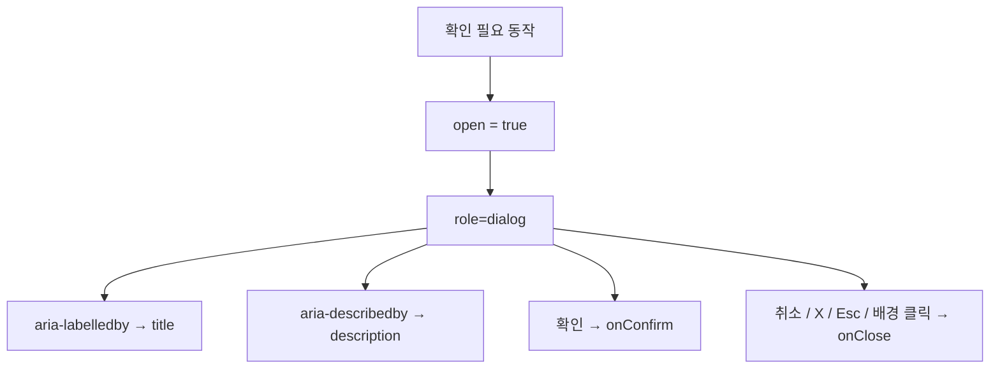

# ConfirmModal

경로: `apps/web/components/common/ConfirmModal.tsx`

저장, 삭제, 기본값 복원처럼 사용자의 확인이 필요한 동작에 사용하는 공통 모달.

## 주요 기능

- `open` 값에 따른 표시 여부 제어
- `title`, `description`을 이용한 모달 제목과 설명 표시
- 선택적인 `eyebrow`, `icon` 지원
- `default`, `danger` 톤 지원
- 확인 버튼과 취소 버튼의 문구 변경 가능
- 확인: `onConfirm`
- 닫기: `onClose`
- `Esc` 키로 닫기
- 배경 영역 클릭으로 닫기
- 닫기 버튼 제공

## 접근성 구조



`Dialog.Title`과 `Dialog.Description`이 Radix가 생성한 접근성 ID와 연결되어 모달의 이름과 설명을 제공함.

현재 `ConfirmModal`은 `@radix-ui/react-dialog`를 사용함. `Esc`, 배경 클릭, 닫기 버튼은 모두 `Dialog.Root`의 `onOpenChange(false)` 흐름으로 연결됨.

## 사용 예시

```tsx
import { ConfirmModal } from '@/components/common/ConfirmModal';

<ConfirmModal
  open={isOpen}
  eyebrow="가이드 저장"
  title="변경 내용을 저장하시겠습니까?"
  description="저장하면 다음 방문부터 변경된 가이드가 표시됩니다."
  confirmLabel="저장"
  cancelLabel="취소"
  onConfirm={handleSave}
  onClose={() => setIsOpen(false)}
/>;
```

위험한 동작에는 `tone="danger"`를 사용하고, 단순 안내 모달에는 `cancelLabel=""`로 취소 버튼을 생략함.

## 스타일 기준

경로: `apps/web/app/styles/confirm-modal.css`

- 배경은 화면 전체를 덮고 블러 처리함
- 모달 본문은 `--cinemo-fg`, 보조 설명은 `--cinemo-muted` 사용
- `eyebrow`는 `--cinemo-gold` 계열로 표시
- 확인·취소 버튼의 높이와 모서리 형태를 공통 적용함
- 일반 확인은 CINEMO 금색, 삭제 같은 위험 동작은 `tone="danger"`로 구분함
- 닫기 버튼·취소 버튼·Esc·배경 클릭으로 닫을 수 있음
- 포커스 트랩과 닫힌 뒤 이전 요소로의 포커스 복원은 Radix Dialog가 담당함
