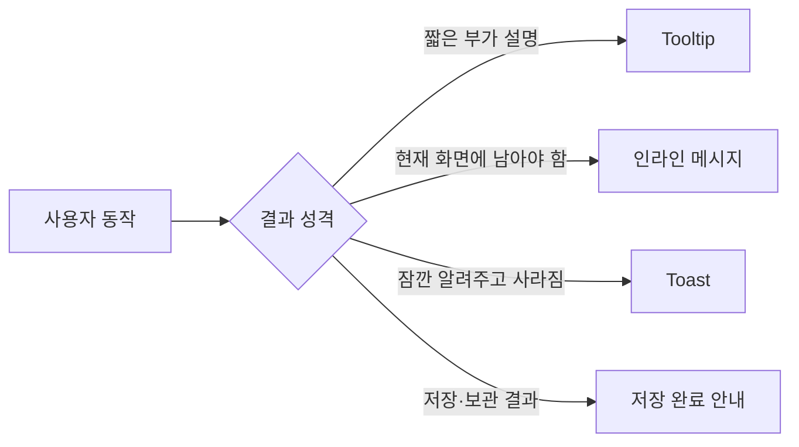

# Feedback UI

사용자 동작의 결과와 현재 상태를 전달하는 UI 정리.



## 현재 구현 위치

현재 CINEMO에는 공통 Toast 컴포넌트가 없고, 기능별로 필요한 피드백을 각 화면에 두는 구조임.

| 피드백 | 현재 구현 위치 | 방식 |
| --- | --- | --- |
| 엽서 보관 완료 | `apps/web/app/postcard/page.tsx` | `bookmarkNotice` 상태 + 1.6초 후 제거 |
| 엽서 보관 Tooltip 스타일 | `apps/web/app/styles/postcard.css` | `.postcard-bookmark-tooltip` |
| 엽서 AI·저장 오류 | `apps/web/components/postcard/PostcardCreateModal.tsx` | `serverError` + `role="alert"` |
| 댓글 로딩·작성·수정 오류 | `apps/web/components/postcard/PostcardCommentSection.tsx` | `error` + `role="alert"` |
| 페이지 조회 오류 | 각 페이지의 `error` 상태 | 화면 내부 오류 메시지 |
| 엽서 목록 로딩 | `apps/web/components/postcard/PostcardListSkeleton.tsx` | 실제 카드 형태의 Skeleton |
| 로비 전광판 로딩 | `apps/web/components/lobby/LobbyBoardSkeleton.tsx` | 차트 내부 포스터·텍스트 형태의 Skeleton |
| 개봉 예정 목록 로딩 | `apps/web/components/upcoming/UpcomingMovieListSkeleton.tsx` | 실제 영화 카드 형태의 Skeleton |

## Tooltip

Tooltip은 아이콘이나 짧은 조작의 의미를 보충하는 용도임. 성공·실패 결과를 전달하는 용도로 사용하지 않음.

### 현재 엽서 Tooltip

경로:

- 상태: `apps/web/app/postcard/page.tsx`
- 스타일: `apps/web/app/styles/postcard.css`

북마크를 클릭하면 다음 문구를 해당 북마크 옆에 잠깐 표시함.

```txt
저장되었습니다.
보관이 취소되었습니다.
```

구현 흐름:

```txt
북마크 클릭
  → togglePostcardBookmarkRequest()
  → bookmarkNotice 설정
  → role="status"로 메시지 표시
  → 1600ms 후 bookmarkNotice 제거
```

아이콘의 의미를 설명하는 Tooltip을 추가할 때는 `role="tooltip"`과 `:hover`, `:focus-visible`을 함께 고려함. 키보드 사용자는 hover를 사용할 수 없으므로 focus에서도 보여야 함.

## 저장 완료 안내

저장·보관처럼 사용자의 동작이 성공했음을 짧게 알려야 하는 경우 사용함.

- 성공 시에만 표시함
- 대상 요소 가까이에 표시해 어떤 동작의 결과인지 연결함
- 일정 시간 뒤 자동으로 숨김
- 화면 이동이나 모달 전환을 막지 않음
- 반복 클릭 시 기존 타이머를 취소하고 새 타이머를 시작함

현재 북마크 안내는 페이지 전용 상태로 구현되어 있음. 여러 화면에서 같은 방식이 반복되면 `Toast` 공통 컴포넌트로 승격하는 것을 검토함.

## 로딩 상태와 Skeleton

데이터 조회 중에는 빈 상태 문구를 사용하지 않음. 빈 상태 문구는 조회가 끝난 뒤 결과가 0건일 때만 표시해야 함.

Skeleton은 실제 콘텐츠의 구조를 닮은 자리 표시자임. 엽서 목록에서는 포스터·영화 제목·문구·메타 정보·반응 영역을 미리 표시해 데이터가 도착해도 카드 레이아웃이 크게 움직이지 않도록 함.

현재 엽서 로딩 구현:

| 대상 | 구현 위치 |
| --- | --- |
| Skeleton 구조 | `apps/web/components/postcard/PostcardListSkeleton.tsx` |
| Skeleton 스타일·shimmer | `apps/web/app/styles/postcard.css` |
| 공개 엽서 목록 | `apps/web/app/postcard/page.tsx` |
| 내 엽서함 목록 | `apps/web/app/my-cinema/postcard/page.tsx` |

적용 기준:

- `/postcard`와 `/my-cinema/postcard`에서 같은 Skeleton 컴포넌트를 사용함
- 데스크톱은 실제 엽서 카드와 같은 가로 구조, 모바일은 세로 구조를 유지함
- Skeleton은 2개를 기본으로 표시함
- 조회가 끝나면 Skeleton 대신 실제 목록·빈 상태·오류 상태 중 하나를 표시함
- `prefers-reduced-motion: reduce`에서는 shimmer 애니메이션을 사용하지 않음
- `loading.tsx`만으로 대체하지 않음. 현재 목록 조회는 클라이언트 `useEffect`에서 수행하므로 컴포넌트의 `loading` 상태와 Skeleton을 함께 사용해야 함

### 로비·개봉 예정 Skeleton

로비와 개봉 예정 페이지도 콘텐츠가 늦게 도착할 때 빈 문구만 보여주지 않고 실제 화면 구조를 유지함.

| 화면 | 기본 Skeleton 수 | 추가 로딩 | 구현 위치 |
| --- | ---: | ---: | --- |
| 로비 전광판 | 3개 순위 행 | 해당 없음 | `LobbyBoardSkeleton.tsx` |
| `/upcoming` 초기 목록 | 6개 영화 카드 | 해당 없음 | `UpcomingMovieListSkeleton.tsx` |
| `/upcoming` 더 보기 | 기존 목록 유지 | 2개 영화 카드 추가 | `UpcomingMovieListSkeleton.tsx` |

로비 전광판은 실제 차트와 Skeleton을 같은 `ChartShell`과 차트 박스 안에서 교체함. 따라서 `누적 관객수`·`관심 등록수` 라벨, 탭, 차트 박스 높이가 로딩 전후에 유지됨.

개봉 예정 목록은 포스터·영화 정보·관심 등록·상세 보기 버튼의 자리까지 미리 표시함. 목록 조회가 끝나면 실제 목록·빈 상태·오류 상태 중 하나로 교체함.

### 개봉 예정 상세 모달 Skeleton

`/upcoming`의 상세 모달은 영화 상세 API 응답을 기다린 뒤 빈 화면을 보여주지 않음.

- 상세 버튼 클릭 즉시 `detailMovieId`를 설정해 모달을 먼저 엶
- 상세 정보가 도착하기 전에는 `MovieDetailModalSkeleton` 표시
- 상세 정보가 도착하면 같은 `Dialog.Root` 안에서 실제 `MovieDetailModal`로 교체
- Skeleton과 실제 모달은 같은 최소 높이·포스터 비율·본문 레이아웃을 사용함
- 로딩 완료 시 모달 크기가 커지거나 위치가 움직이지 않도록 `movie-detail-modal.css`에서 크기를 고정함
- 개봉일 알림 상태 요청은 상세 모달 표시를 막지 않고 백그라운드에서 처리함

구현 위치:

- Skeleton 구조: `apps/web/components/my-cinema/MovieDetailModalSkeleton.tsx`
- 모달 연결·로딩 상태: `apps/web/app/upcoming/page.tsx`
- 모달 스타일: `apps/web/app/styles/movie-detail-modal.css`

포스터 로딩 기준:

- 첫 화면의 대표 포스터만 Next Image `priority` 사용
- 나머지 목록 포스터는 기본 지연 로딩
- `loading="eager"`를 목록 전체에 일괄 적용하지 않음

## 인라인 오류·성공 메시지

### 오류 메시지

입력 검증이나 API 요청 실패처럼 사용자가 내용을 확인하고 다시 시도해야 하는 경우 사용함.

- 오류 문구를 문제가 발생한 입력·버튼 가까이에 표시함
- 동적으로 추가되는 오류는 `role="alert"` 사용
- 요청 시작 전에 이전 오류를 비움
- 새 요청이 실패하면 원인을 알 수 있는 사용자용 문구로 표시함
- `console` 로그만 남기고 화면에 아무것도 표시하지 않는 방식은 사용하지 않음

예시:

```tsx
{serverError ? (
  <p className="postcard-create-modal-error" role="alert">
    {serverError}
  </p>
) : null}
```

### 성공 메시지

성공 결과가 화면의 상태 변화만으로 충분히 보이지 않을 때 사용함. 단순 저장 완료는 Tooltip보다 `role="status"` 기반의 짧은 안내가 적합함.

## Toast

현재 공통 Toast 컴포넌트는 아직 없음.

향후 공통화할 경우 위치는 다음처럼 두는 것이 적절함.

```txt
apps/web/components/common/Toast.tsx
apps/web/app/styles/toast.css
```

권장 책임:

- `success`, `error`, `info` 정도의 의미 있는 상태만 지원
- 전역 상태 또는 Provider가 메시지 표시·제거를 관리
- 자동 숨김 시간 제공
- `role="status"` 또는 오류 성격에 맞는 라이브 영역 사용
- 마우스 hover뿐 아니라 키보드와 모바일 터치에서도 확인 가능
- 페이지별 API 호출이나 문구를 Toast 컴포넌트에 직접 넣지 않음

Toast를 추가하기 전에는 북마크 안내·AI 오류·댓글 오류처럼 여러 화면에서 반복되는 피드백을 하나의 API로 통일할 필요가 있는지 먼저 확인함.

## 선택 기준

| 상황 | 사용할 UI |
| --- | --- |
| 아이콘이나 조작의 의미 설명 | Tooltip |
| 저장·보관 성공을 짧게 알림 | `role="status"` 안내 또는 Toast |
| 사용자가 수정해야 하는 입력 오류 | 인라인 오류 + `role="alert"` |
| 현재 화면 전체의 조회 실패 | 페이지 오류 상태 |
| 잠깐 노출되는 전역 성공·실패 알림 | Toast |
