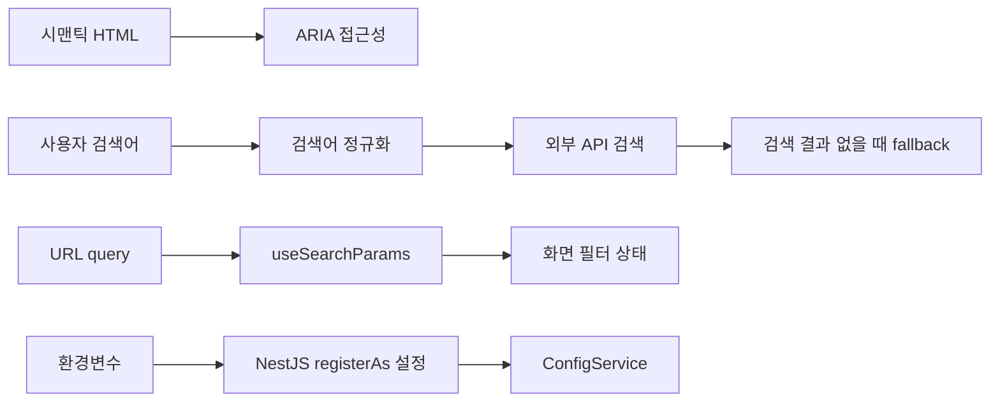

# CINEMO 개념 문서

코드에 반복해서 등장하지만 구현만 봐서는 이해하기 어려운 웹·검색 개념 정리.

## 문서 목록

- [ARIA 접근성](./aria.md)
- [검색어 정규화와 fallback 검색](./search-query.md)
- [URL query와 `useSearchParams`](./url-search-params.md)
- [폼 검증: Zod v4 + React Hook Form](./form-validation.md)
- [API 계약과 OpenAPI codegen](./api-contract.md)
- [API 계약·요청 실행 계층과 `api-fetch`](./openapi-codegen.md)
- [React Hook 사용 기준](./react-hooks.md)
- [NestJS 환경 설정과 `registerAs`](./nest-config.md)
- [전역 ExceptionFilter](./exception-filter.md)
- [NestJS graceful shutdown](./graceful-shutdown.md)
- [영화 달력 구현 패턴과 라이브러리 선택](./movie-calendar.md)

## 읽는 순서

각 문서는 특정 파일의 사용법만 설명하지 않고, 브라우저 입력·문자열 처리·외부 API 요청·접근성 트리처럼 코드가 동작하는 이유까지 기록함.
