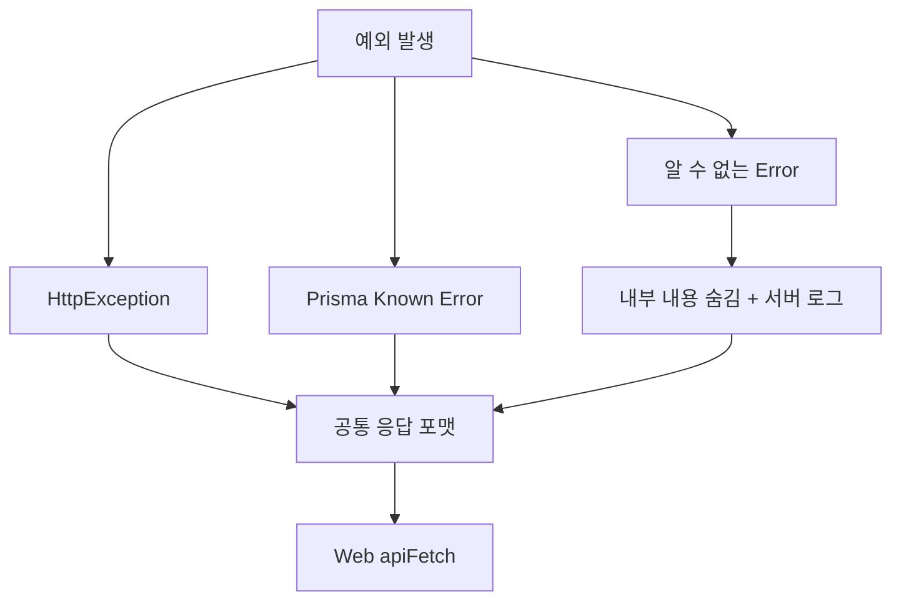

# 전역 ExceptionFilter

NestJS의 예외 응답을 API 전체에서 같은 형식으로 반환하기 위한 계층임.

## 현재 구현

```txt
apps/api/src/common/filters/http-exception.filter.ts
  → 모든 예외를 전역에서 수신
  → HTTP 상태 코드와 사용자 메시지 정리
  → Prisma 주요 에러 변환
  → 예상하지 못한 500 에러 로깅
```

`apps/api/src/main.ts`에서 전역 Filter로 등록함.

```ts
app.useGlobalFilters(new HttpExceptionFilter());
```

## 응답 포맷

모든 API 에러는 다음 기본 형태를 사용함.

```json
{
  "statusCode": 400,
  "message": "요청을 처리하지 못했습니다.",
  "timestamp": "2026-09-13T12:00:00.000Z"
}
```

Web의 `apiFetch`는 `message`를 읽어 사용자에게 표시하므로, 서버 에러의 종류가 달라도 화면의 기본 에러 처리 방식은 동일함.

## 처리 대상



### NestJS `HttpException`

`BadRequestException`, `UnauthorizedException`, `ForbiddenException`, `NotFoundException` 등 NestJS HTTP 예외를 처리함.

```ts
throw new BadRequestException('댓글 내용을 입력해야 합니다.');
```

응답:

```json
{
  "statusCode": 400,
  "message": "댓글 내용을 입력해야 합니다.",
  "timestamp": "..."
}
```

`ValidationPipe`가 반환하는 `message` 배열도 문자열 배열로 합쳐서 Web에서 표시할 수 있게 정리함.

### Prisma 에러

현재 주요 Prisma 에러만 사용자 메시지로 변환함.

| Prisma code | HTTP 상태 | 사용자 메시지 |
| --- | --- | --- |
| `P2002` | `409 Conflict` | 이미 처리된 요청입니다. |
| `P2025` | `404 Not Found` | 요청한 데이터를 찾을 수 없습니다. |
| 그 외 | `500 Internal Server Error` | 데이터베이스 오류가 발생했습니다. |

DB 내부 오류와 SQL 정보는 응답에 포함하지 않음.

### 예상하지 못한 에러

예상하지 못한 일반 `Error`는 다음처럼 처리함.

```txt
응답 → 요청을 처리하지 못했습니다.
로그 → 실제 stack trace 기록
```

서버 내부 경로·SQL·외부 API secret 같은 정보가 사용자에게 노출되지 않도록 함.

## 기존 Prisma Filter와의 차이

기존에는 `PrismaExceptionFilter`만 전역 등록되어 Prisma known error만 통일된 응답을 반환했음.

```txt
기존
  HttpException → NestJS 기본 응답
  Prisma error  → PrismaExceptionFilter
  일반 Error   → 일관된 포맷 보장 안 됨

현재
  HttpException
  Prisma error
  일반 Error
  → HttpExceptionFilter에서 공통 포맷 처리
```

따라서 Prisma 전용 Filter를 별도로 등록하지 않음. Filter가 여러 개로 나뉘어 응답 포맷이 달라지는 것을 방지함.

## 책임 분리

| 계층 | 책임 |
| --- | --- |
| Controller·Service | 어떤 상황에서 어떤 예외를 던질지 결정 |
| `ValidationPipe` | DTO 입력값 검증 |
| `HttpExceptionFilter` | 예외를 HTTP 응답 포맷으로 변환 |
| `apiFetch` | 응답의 `message`를 읽고 Web 에러로 전달 |
| Exception Filter의 Logger | 예상하지 못한 서버 에러 기록 |

Filter가 비즈니스 규칙을 판단하거나 모든 에러 메시지를 새로 만들지는 않음. 도메인에 의미가 있는 메시지는 Service나 Controller에서 예외를 생성할 때 정의함.

## Web과의 연결

```ts
// apps/web/lib/api-fetch.ts
if (!res.ok) {
  throw new Error(parseApiErrorMessage(body, res.status));
}
```

서버 응답의 `message`가 문자열이면 그대로 사용하고, `ValidationPipe`의 배열이면 합쳐서 하나의 메시지로 표시함.

## 확장 시점

현재는 다음 세 필드만으로 충분함.

```txt
statusCode
message
timestamp
```

서비스가 커져 다음 요구가 생기면 `code`와 `details`를 추가로 검토함.

```json
{
  "statusCode": 422,
  "code": "POSTCARD_TEXT_INVALID",
  "message": "엽서 문구를 확인해 주세요.",
  "details": [],
  "timestamp": "..."
}
```

에러 code를 추가할 때는 서버 Filter만 수정하지 않음.

```txt
서버 응답 DTO·Swagger
  → api-contract 생성 타입
  → Web apiFetch와 Toast·모달 표시 정책
```

## 주의 사항

- `@Catch(HttpException)`만 사용하면 Prisma·일반 Error는 처리하지 못함
- `exceptionResponse as any`로 응답 구조를 무조건 단정하지 않음
- 내부 에러 메시지와 stack trace를 클라이언트 응답에 넣지 않음
- Filter에서 모든 에러를 무조건 400으로 바꾸지 않음
- `401` 인증 실패와 `403` 권한 실패를 구분함
- 에러 포맷을 변경하면 Web `apiFetch`와 OpenAPI 계약도 함께 확인함

## 관련 구현

- `apps/api/src/common/filters/http-exception.filter.ts`
- `apps/api/src/main.ts`
- `apps/web/lib/api-fetch.ts`
- [Guard와 Filter 차이](../auth/guards.md)
- [API 계약과 OpenAPI codegen](./api-contract.md)
