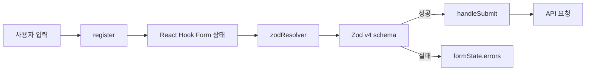
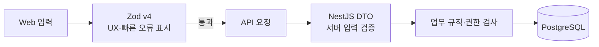

# Zod v4 + React Hook Form

CINEMO Web의 입력 폼 상태 관리와 클라이언트 검증 기준.

관련 패키지:

| 패키지 | 역할 |
| --- | --- |
| `react-hook-form` | 입력값 등록, 폼 상태, 제출 상태, 오류 상태 관리 |
| `zod` v4 | 입력값 구조와 검증 규칙 선언 |
| `@hookform/resolvers` | React Hook Form과 Zod를 연결하는 `zodResolver` 제공 |

## 사용하는 이유

입력값 상태 관리와 검증 규칙을 분리하기 위함.



- `React Hook Form`: 입력마다 별도 `useState`를 만들지 않고 폼 상태를 관리함
- `Zod`: 필수값, 길이, 형식, 범위 같은 규칙을 하나의 schema로 선언함
- `zodResolver`: 제출 시 React Hook Form이 Zod schema를 실행하도록 연결함
- `z.infer`: schema에서 TypeScript 입력 타입을 추출함

## 기본 구조

```tsx
const loginSchema = z.object({
  email: z.email({
    error: '이메일 형식을 확인해 주세요.',
  }),
  password: z.string().min(8, {
    error: '비밀번호는 8자 이상이어야 합니다.',
  }),
});

type LoginFormValues = z.infer<typeof loginSchema>;

const {
  register,
  handleSubmit,
  formState: { errors, isSubmitting },
} = useForm<LoginFormValues>({
  resolver: zodResolver(loginSchema),
});
```

### 동작 순서

1. `register('email')`이 input을 React Hook Form에 등록함
2. 사용자가 값을 입력함
3. `handleSubmit`이 제출 이벤트를 받음
4. `zodResolver`가 Zod schema를 실행함
5. 검증 실패 시 `formState.errors`에 필드별 오류 저장
6. 검증 성공 시 타입이 추론된 `values`를 제출 함수에 전달

## CINEMO 적용 위치

```txt
apps/web/app/(auth)/login/page.tsx
  → 로그인 이메일·비밀번호 검증

apps/web/app/(auth)/forgot-password/page.tsx
  → 비밀번호 재설정 이메일 검증

apps/web/app/(auth)/reset-password/page.tsx
  → 새 비밀번호·확인값 검증

apps/web/components/postcard/PostcardCreateModal.tsx
  → 엽서 원문·한국어 문구·공개 여부 검증

apps/web/components/my-cinema/MovieDetailModal.tsx
  → 관람일·관람 방식·플랫폼·평점 검증

apps/web/components/my-cinema/movie-detail-form.ts
  → 관람 기록 schema와 입력 타입 정의
```

## 클라이언트 검증과 서버 검증의 차이

Web의 Zod 검증은 사용자 경험을 위한 1차 검증임. 브라우저 코드는 사용자가 수정할 수 있으므로 보안 경계가 될 수 없음.



- Zod: 입력창 근처에서 즉시 오류 표시
- NestJS DTO: 외부 요청을 신뢰하지 않고 서버에서 다시 검증
- Service: 사용자 권한, 현재 상태, 도메인 규칙 검증
- Prisma: DB 타입·관계·제약 조건 적용

같은 검증을 Web과 API에 중복 작성하는 이유는 실행 환경과 책임이 다르기 때문.

## 오류 표시 기준

```tsx
{errors.email ? (
  <p role="alert">{errors.email.message}</p>
) : null}
```

- 오류 문구는 schema에 정의해 입력 규칙과 함께 관리함
- 오류 메시지는 사용자가 무엇을 고쳐야 하는지 알 수 있게 작성함
- 서버 요청 실패는 `errors.root.server`처럼 필드 오류와 구분함
- 오류 텍스트는 `role="alert"`로 보조기술에 전달함
- 제출 중에는 `isSubmitting`으로 중복 요청을 막음

## 주의사항

- `z.infer<typeof schema>`를 사용해 schema와 입력 타입이 어긋나지 않게 함
- `defaultValues`를 지정해 uncontrolled input의 초기 상태를 명확히 함
- `nullable`, 빈 문자열, 선택하지 않은 값의 의미를 schema에서 분명히 구분함
- `reset()`을 호출할 때 모달 재사용에 필요한 초기값을 다시 설정함
- API 요청 전에 통과했더라도 서버 검증을 생략하지 않음
- 모든 input에 `useState`를 별도로 만들지 않고 React Hook Form에 상태를 위임함
- `onSubmit`에서 `event.preventDefault()`만 직접 처리하는 방식과 `handleSubmit`을 섞지 않음

## 현재 코드의 선택 기준

```txt
단순 폼 상태·제출·오류 표시
  → React Hook Form

입력 구조·형식·길이·범위 규칙
  → Zod v4 schema

두 라이브러리 연결
  → zodResolver

API 보안·권한·도메인 규칙
  → NestJS DTO + Service
```
