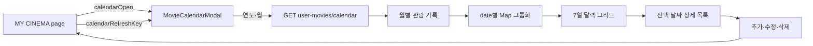

# 영화 달력 구현 패턴

`MY CINEMA`의 영화 달력은 단순히 날짜를 고르는 컴포넌트가 아님.

- 관람 기록을 월별로 조회함
- 날짜 칸에 관람 영화 포스터를 표시함
- 날짜를 선택하면 해당 날짜의 영화 목록을 보여줌
- 선택한 날짜에 영화를 추가하거나 기존 기록을 수정·삭제함
- 서버와 브라우저의 날짜 기준을 KST로 통일함

따라서 일반적인 날짜 입력 라이브러리와 동일하게 판단하면 안 됨. 현재는 영화 기록 화면의 레이아웃과 데이터 흐름을 제어하기 위해 자체 달력 UI를 사용함.

## 현재 구현 위치

| 역할 | 위치 | 담당 내용 |
| --- | --- | --- |
| 달력 UI·월 조회·날짜 선택 | `apps/web/components/my-cinema/MovieCalendarModal.tsx` | 달력 그리드, 월 이동, 포스터, 선택 날짜 상세 |
| MY CINEMA 상태·CRUD 연결 | `apps/web/app/my-cinema/page.tsx` | 모달 열기, 영화 추가·수정·삭제, 갱신 |
| 달력 API 요청 | `apps/web/lib/user-movie-api.ts` | `GET /user-movies/calendar?year=&month=` 요청 |
| 날짜별 `.ics` 다운로드 | `apps/web/lib/movie-calendar.ts` | 영화 상세에서 캘린더 이벤트 파일 생성 |
| KST 날짜 공통 유틸 | `apps/web/lib/date-kst.ts` | 날짜 키와 KST 표시 형식 |

## 전체 데이터 흐름



## 구현 패턴

### 1. 달력 칸은 파생 데이터로 계산

`getCalendarDays(year, month)`가 해당 월의 시작 요일과 마지막 날짜를 계산해 빈 칸과 날짜 배열을 만듦.

```ts
const firstDay = new Date(Date.UTC(year, month - 1, 1)).getDay();
const lastDate = new Date(Date.UTC(year, month, 0)).getDate();
```

달력의 날짜 칸은 서버 데이터가 아니라 `year`, `month`에서 계산되는 값이므로 `useMemo`로 파생함.

```ts
const days = useMemo(() => getCalendarDays(year, month), [year, month]);
```

`useMemo` 안에서 API 요청이나 상태 변경을 하면 안 됨. 계산 비용이 있는 파생 값만 넣어야 함.

### 2. 날짜별 영화는 `Map`으로 그룹화

API가 반환한 평평한 영화 목록을 날짜별로 묶음.

```ts
const moviesByDate = new Map<string, UserMovieCalendarItem[]>();

for (const item of calendar.items) {
  const movies = moviesByDate.get(item.date) ?? [];
  movies.push(item);
  moviesByDate.set(item.date, movies);
}
```

렌더링할 때 매번 전체 목록을 검색하지 않고 `YYYY-MM-DD` 키로 바로 찾을 수 있음.

- 시간 복잡도: 날짜별 조회 평균 `O(1)`
- 같은 날 여러 편을 관람한 경우 배열로 보존 가능
- 화면 표시 순서와 서버 응답 순서는 별도 정책으로 관리 가능

### 3. 날짜는 `Date` 객체보다 날짜 키를 우선 사용

관람일은 시각이 아니라 달력상의 날짜이므로 화면과 API에서 `YYYY-MM-DD` 문자열을 기준으로 사용함.

```txt
2026-09-13
```

이유:

- `Date`는 시각과 타임존을 함께 가지므로 자정 근처에 날짜가 바뀔 수 있음
- `<input type="date">`의 값과 API query가 같은 형식을 사용함
- 날짜 비교, `Map` 그룹화, 서버 요청이 단순해짐

달력 칸 계산의 월 산술은 `Date.UTC`를 사용하고, 현재 연·월 계산은 `Asia/Seoul`을 지정한 `Intl.DateTimeFormat`을 사용함. 브라우저 실행 환경의 로컬 타임존에 의존하지 않는 것이 핵심임.

> [!warning]
> `new Date('2026-09-13')`처럼 타임존을 생략한 파싱을 관람일의 기준값으로 사용하지 않음. 날짜 키를 시각으로 바꿔야 하는 경우에만 `T00:00:00+09:00`처럼 KST 기준을 명시함.

### 4. 월 이동과 데이터 조회를 분리

월 이동은 `changeCalendarPeriod`에서 다음 상태를 한 번에 변경함.

1. 로딩 상태 시작
2. 이전 에러 제거
3. 선택 날짜 초기화
4. 연도·월 변경
5. `useEffect`가 변경된 연도·월로 API 재요청

월 이동 함수 안에서 직접 API를 호출하지 않는 이유는 월 상태를 단일 진입점으로 만들기 위해서임. 버튼, 연도 선택, 월 선택, 오늘 이동이 모두 같은 흐름을 사용함.

### 5. 요청 취소 플래그로 오래된 응답 무시

월을 빠르게 이동하면 이전 요청이 나중에 끝날 수 있음. effect cleanup에서 `cancelled`를 바꿔 오래된 응답이 현재 화면을 덮어쓰지 못하게 함.

```ts
let cancelled = false;

// 요청 완료 후
if (!cancelled) {
  setCalendar(response);
}

return () => {
  cancelled = true;
};
```

이는 네트워크 요청 자체를 취소하는 것이 아니라, 완료된 이전 응답의 상태 반영을 차단하는 방식임. 추후 `AbortController`를 도입하면 요청 자체도 취소할 수 있음.

### 6. 부모는 CRUD 상태, 달력은 조회·표시 상태를 담당

`MovieCalendarModal`은 월별 조회와 날짜 선택을 담당하고, `my-cinema/page.tsx`는 추가·수정·삭제 모달과 API mutation을 담당함.

```txt
MovieCalendarModal
  ├─ 월별 조회
  ├─ 날짜 선택
  ├─ 날짜별 포스터 표시
  └─ onAdd / onEdit / onDelete callback

my-cinema/page.tsx
  ├─ 추가 모달 상태
  ├─ 수정 모달 상태
  ├─ 삭제 확인 모달 상태
  └─ mutation 완료 후 달력 갱신
```

화면 컴포넌트가 사용자 전체 상태나 다른 모달을 직접 관리하지 않게 하여 책임을 나눔.

### 7. mutation 후 `calendarRefreshKey`로 달력 갱신

추가·수정·삭제가 성공하면 부모가 `calendarRefreshKey`를 증가시키고, 달력 모달에 `key`로 전달함.

```tsx
<MovieCalendarModal
  key={calendarRefreshKey}
  ...
/>
```

현재 구현에서는 모달을 새 인스턴스로 시작해 월별 기록을 다시 가져오는 방식임. 단순하고 안전하지만, 나중에 React Query나 mutation 후 `invalidateQueries`를 사용하면 전체 재마운트 없이 캐시를 갱신할 수 있음.

## UI 표시 규칙

- 달력은 일요일 시작 7열 구조임
- 미래 날짜는 선택할 수 없음
- 날짜 칸에는 관람 영화 포스터를 최대 2개까지 표시함
- 2개를 초과하면 `+N`으로 나머지 개수를 표시함
- 날짜를 선택하면 상세 목록에서 제목·관람일·수정·삭제를 표시함
- 월 데이터 조회 중에는 로딩 상태, 실패하면 에러 상태, 기록이 없으면 빈 상태를 표시함
- 포스터가 없으면 빈 포스터 영역을 사용해 날짜 칸의 구조가 흔들리지 않게 함

## 라이브러리를 사용할지

### 현재 결론

지금은 자체 구현을 유지하는 편이 적합함.

`react-datepicker` 같은 라이브러리는 단일 날짜 입력을 편하게 만드는 목적에 가까움. 현재 달력의 핵심인 날짜별 포스터, 같은 날짜의 여러 관람 기록, 선택 날짜 상세, CRUD 연결을 대신 해결하지 못함. 이미 날짜 입력은 `input[type="date"]`로 충분히 처리하고 있음.

### 후보 비교

| 후보 | 잘 맞는 경우 | CINEMO 판단 |
| --- | --- | --- |
| [React DayPicker](https://daypicker.dev/) | 날짜 선택·월 이동·비활성 날짜·로컬라이징·키보드 접근성을 직접 구현하는 경우 | 나중에 달력 그리드와 접근성만 맡기기 좋은 1순위 후보 |
| [React Aria Calendar](https://react-aria.adobe.com/Calendar) | 접근성, 키보드 상호작용, 국제화 기준을 강하게 가져가야 하는 경우 | 접근성 요구가 커질 때 검토. 스타일과 도메인 UI 작업량은 더 큼 |
| [FullCalendar](https://fullcalendar.io/docs/react) | 일정·이벤트·주간/일간 뷰·드래그 앤 드롭이 필요한 경우 | 현재의 개인 영화 관람 월 달력에는 기능이 과함 |
| `react-datepicker` | 입력창 중심의 단일 날짜 선택 | 현재 `input[type="date"]`를 대체할 필요가 낮음 |

React DayPicker는 선택 모드, 비활성 날짜, 로컬라이징, 커스텀 컴포넌트를 제공하므로 현재 요구에 가장 가까움. 다만 포스터를 날짜 칸 안에 그리는 영화 전용 UI와 서버 데이터 그룹화는 여전히 CINEMO 코드가 담당해야 함. 라이브러리를 도입해도 도메인 로직이 사라지는 것은 아님.

## 권장 진행 순서

```txt
1. 현재 자체 달력 유지
2. KST 경계·윤년·월 이동·미래 날짜 테스트 추가
3. 모달 focus 이동·복귀, 달력 키보드 이동 보강
4. API 캐시/갱신 요구가 커지면 React Query 도입 검토
5. 달력 접근성 구현 부담이 커질 때 React DayPicker 검토
6. 일정 드래그·주간/일간 뷰가 필요할 때만 FullCalendar 검토
```

### 라이브러리 도입 기준

다음 중 하나가 실제 요구가 되기 전에는 교체하지 않음.

- 키보드로 날짜 칸을 이동하는 동작을 직접 유지하기 어려움
- 스크린리더·포커스·국제화 대응을 더 엄격하게 해야 함
- 범위 선택, 다중 선택, 여러 달 보기 같은 기능이 추가됨
- 달력의 기본 구조보다 영화 데이터 처리에 개발 시간을 집중해야 함

## 현재 개선 후보

- `aria-labelledby`에 고정 문자열 ID를 사용하므로 여러 달력 모달을 동시에 렌더링할 가능성이 생기면 `useId`로 교체
- 현재의 바깥 클릭 감지와 modal focus trap을 별도로 점검
- `WEEKDAYS` 시각 텍스트와 실제 날짜 버튼의 스크린리더 읽기 순서 점검
- 요청 중 월을 연속 변경할 때 `AbortController`로 이전 fetch 취소 검토
- `calendarRefreshKey` 재마운트 방식은 데이터 캐시 방식으로 전환할 때 제거 검토

> [!note]
> 라이브러리 도입은 “코드가 더 짧아지는가”보다 현재 요구를 얼마나 안정적으로 해결하는가로 판단함. CINEMO 달력의 차별점은 날짜 선택 자체가 아니라 날짜와 영화 관람 기록을 결합한 화면임.
