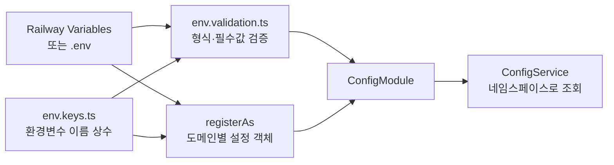

# NestJS 환경 설정 구조

NestJS 환경 설정은 `환경변수 이름 → 도메인별 설정 객체 → ConfigService` 순서로 사용함.



## 현재 구조

```txt
apps/api/src/config/
├─ database.config.ts
├─ auth.config.ts
├─ tmdb.config.ts
├─ ai.config.ts
├─ oauth.config.ts
├─ mail.config.ts
├─ demo.config.ts
├─ env.keys.ts
└─ env.validation.ts
```

`jwt.config.ts`는 별도 파일로 두지 않음. JWT는 인증 도메인에 속하므로 `auth.config.ts`에서 관리함.

## 파일별 책임

| 파일 | 설정 범위 | 예시 조회 경로 |
| --- | --- | --- |
| `database.config.ts` | PostgreSQL 연결 문자열 | `database.url` |
| `auth.config.ts` | JWT secret·만료 시간·OAuth callback에 사용할 Web 주소 | `auth.secret`, `auth.frontendUrl` |
| `tmdb.config.ts` | TMDB·KOBIS API | `tmdb.baseUrl`, `tmdb.accessToken` |
| `ai.config.ts` | Claude·OpenAI API | `ai.claudeKey`, `ai.openaiModel` |
| `oauth.config.ts` | Kakao·Google·Naver·Apple OAuth | `oauth.google.clientId` |
| `mail.config.ts` | Resend 발송 설정 | `mail.resendApiKey`, `mail.resendFrom` |
| `demo.config.ts` | demo seed와 테스트 계정 | `demo.enabled`, `demo.password` |

## `registerAs` 사용

각 설정 파일은 `registerAs`로 환경변수를 도메인 객체로 변환함.

```ts
// apps/api/src/config/ai.config.ts
import { registerAs } from '@nestjs/config';
import { EnvKeys } from './env.keys';

export default registerAs('ai', () => ({
  claudeKey: process.env[EnvKeys.CLAUDE_KEY],
  claudeModel: process.env[EnvKeys.CLAUDE_MODEL] ?? 'claude-haiku-4-5',
  openaiKey: process.env[EnvKeys.OPENAI_KEY],
  openaiModel: process.env[EnvKeys.OPENAI_MODEL] ?? 'gpt-5-mini',
}));
```

`registerAs('ai', ...)`의 `'ai'`가 namespace가 됨.

```ts
configService.getOrThrow<string>('ai.openaiKey');
configService.getOrThrow<string>('ai.openaiModel');
```

환경변수 원래 이름을 서비스마다 반복하지 않고, 서비스는 의미 있는 설정 경로만 알게 됨.

## `AppModule` 등록

`registerAs` 파일을 만든 것만으로는 활성화되지 않음. `ConfigModule.forRoot`의 `load` 배열에 등록해야 함.

```ts
// apps/api/src/app.module.ts
ConfigModule.forRoot({
  isGlobal: true,
  envFilePath: '.env',
  load: [
    databaseConfig,
    authConfig,
    tmdbConfig,
    aiConfig,
    oauthConfig,
    mailConfig,
    demoConfig,
  ],
  validationSchema: envValidationSchema,
  validationOptions: { convert: true },
});
```

`isGlobal: true`이므로 각 기능 모듈에서 `ConfigModule`을 반복 import하지 않아도 `ConfigService`를 주입할 수 있음.

## Joi와 `registerAs`의 차이

둘은 대체 관계가 아니라 책임이 다름.

| 구분 | 담당 | 실패 시점 |
| --- | --- | --- |
| Joi `env.validation.ts` | 환경변수의 필수 여부·형식·길이 검증 | 애플리케이션 시작 시 |
| `registerAs` | 환경변수를 도메인별 객체로 묶고 기본값·이름을 정의 | 설정 로딩 시 |
| `ConfigService` | 애플리케이션 코드에 설정 전달 | 사용 시 |

따라서 `registerAs`로 옮겼다고 `Joi`를 삭제하면 안 됨.

## 사용 규칙

```ts
// 권장
configService.getOrThrow<string>('database.url');
configService.getOrThrow<string>('ai.openaiKey');

// 지양: 서비스 코드에서 원시 환경변수 이름을 직접 관리
configService.getOrThrow<string>(EnvKeys.OPENAI_KEY);
process.env.OPENAI_KEY;
```

- 환경변수의 실제 이름은 `env.keys.ts`와 `registerAs` 파일에서 관리
- 기능 서비스는 namespace 경로만 사용
- 필수 설정은 `getOrThrow` 또는 config factory의 명시적 오류로 처리
- 선택 설정은 `get`으로 읽고 기능 비활성화·fallback 정책을 함께 둠
- secret 값은 로그·응답·Web 코드에 노출하지 않음

## Railway 배포

Railway는 `.env` 파일 대신 서비스의 **Variables**를 `process.env`로 주입함. 이번 구조 변경은 환경변수 이름을 변경한 것이 아니라 NestJS 내부의 접근 방식을 바꾼 것이므로 Railway Variables는 그대로 사용함.

```txt
Railway Variables
  DATABASE_URL
  API_JWT_SECRET
  FRONTEND_URL
  OPENAI_KEY
  OPENAI_MODEL
        ↓
ConfigModule + registerAs
        ↓
database.url / auth.secret / auth.frontendUrl / ai.openaiKey
```

배포 시 확인할 것:

- Railway에 기존 환경변수 이름이 그대로 등록되어 있는지 확인
- `pnpm --filter api build`에서 NestJS 설정 파일이 `dist`에 함께 빌드되는지 확인
- 새 환경변수 추가·변경 후 Railway 재배포
- 필수 변수 누락 시 Joi 또는 config factory 오류로 서버 시작이 중단되는지 확인
- 로컬 전용 `.env` 파일을 Git에 커밋하지 않음

현재 `PORT`, 일반 `CRON_SECRET`, `NEST_CRON_SECRET`, 독립 실행 CLI의 환경변수 검사는 도메인 설정 목록 밖에 있으므로 기존 접근을 유지함. 추후 실행환경 설정을 별도 `app.config.ts` 또는 `security.config.ts`로 분리할 때 함께 이동할 수 있음.

## 관련 구현

- `apps/api/src/config/env.keys.ts`
- `apps/api/src/config/env.validation.ts`
- `apps/api/src/config/*.config.ts`
- `apps/api/src/app.module.ts`
- [Railway 배포](../deploy/railway.md)
