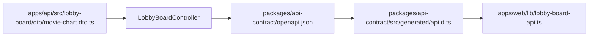

# OpenAPI codegen과 API 계약

API 응답 타입을 `packages/shared`에 수동으로 복제하지 않고, 서버가 공개한 OpenAPI 스키마에서 Web 타입을 자동 생성하는 방식.

## 현재 적용 범위

`MOVIE CHART`부터 적용함.



## 파일별 책임

| 위치 | 책임 |
| --- | --- |
| `apps/api/src/lobby-board/dto/movie-chart.dto.ts` | 응답 구조와 nullable 필드를 서버 기준으로 정의 |
| `apps/api/src/lobby-board/lobby-board.controller.ts` | `@ApiOkResponse`로 실제 응답 DTO를 OpenAPI에 연결 |
| `packages/api-contract/openapi.json` | 서버에서 생성된 API 계약 스냅샷 |
| `packages/api-contract/src/generated/api.d.ts` | OpenAPI에서 자동 생성된 TypeScript 타입 |
| `apps/web/lib/lobby-board-api.ts` | 생성 타입을 `apiFetch`에 연결하는 Web API 함수 |

## 타입 생성

```bash
pnpm generate:api
```

실행 순서:

1. API를 빌드하고 Nest Swagger 문서 생성
2. `packages/api-contract/openapi.json`에 스키마 저장
3. `openapi-typescript`가 `packages/api-contract/src/generated/api.d.ts` 생성

생성 파일은 직접 수정하지 말고 DTO·컨트롤러를 수정한 뒤 다시 생성함.

## `shared`와의 구분

### `packages/shared`에 둘 것

- API와 무관한 도메인 상수
- 여러 화면에서 직접 공유하는 값 객체
- 로비 방 ID, 티켓 상태처럼 서버·Web 양쪽에서 동일한 의미를 갖는 타입

### OpenAPI codegen으로 관리할 것

- HTTP 응답·요청 DTO
- 상태 코드별 API 계약
- nullable 여부, 배열 구조, 필드명
- Swagger 데코레이터로 공개되는 외부 API 모델

`MOVIE CHART`의 `MovieChartItem`과 `MovieChartResponse`는 이제 generated 타입을 사용함. `shared`에 같은 응답 타입을 다시 만들면 서버 DTO와 수동 타입이 서로 어긋날 수 있음.

## `api-fetch.ts`를 만든 이유

`apps/web/lib/api.ts`는 실제로 `apiFetch()` 하나만 제공하고 있었음. `api.ts`라는 이름은 API 응답 타입·endpoint 정의·여러 API 모듈이 들어 있는 파일처럼 보일 수 있어 책임이 모호함.

파일명을 `api-fetch.ts`로 바꿔 이 파일이 **OpenAPI 계약을 생성하는 파일이 아니라, Web에서 API 요청을 보내는 공통 fetch 실행 계층**이라는 점을 드러냄.

```txt
OpenAPI 생성 타입
  → packages/api-contract/src/generated/api.d.ts

기능별 API 함수
  → apps/web/lib/postcard-api.ts
  → apps/web/lib/lobby-board-api.ts

공통 HTTP 요청 실행
  → apps/web/lib/api-fetch.ts
  → apiFetch()
```

`api-fetch.ts`는 기능별 endpoint를 직접 정의하지 않고, 여러 API 모듈이 반복하는 전송 처리를 한 곳에서 담당함.

- API base URL과 `/v1` prefix 조합
- Bearer Access Token 주입
- JSON 요청 헤더 설정
- HTTP 오류 응답의 `message` 추출
- JSON 파싱 실패·빈 응답 처리
- `204 No Content` 처리

따라서 `api-fetch.ts`는 `api-contract`를 대체하지 않음. 계약 타입은 서버 DTO·Swagger에서 생성하고, `api-fetch.ts`는 그 타입을 전달받아 실제 네트워크 요청을 실행함.

```ts
// apps/web/lib/lobby-board-api.ts
import type { components } from '@cinemo/api-contract';
import { apiFetch } from './api-fetch';

type MovieChartResponse = components['schemas']['MovieChartResponseDto'];

export function getMovieChartRequest() {
  return apiFetch<MovieChartResponse>('/lobby/movie-chart');
}
```

### 이름을 구분하는 기준

| 대상 | 파일명 예시 | 책임 |
| --- | --- | --- |
| 공통 요청 실행기 | `api-fetch.ts` | `fetch`·헤더·토큰·오류 처리 |
| 기능별 API 모듈 | `postcard-api.ts` | 엽서 endpoint와 요청 타입 연결 |
| 계약 타입 | `api-contract/src/generated/api.d.ts` | OpenAPI에서 생성된 요청·응답 구조 |

현재는 Web 앱 규모와 인증·에러 처리 요구사항을 고려해 직접 만든 `apiFetch`를 사용함. 추후 `openapi-fetch`, Orval, React Query를 도입하더라도 공통 요청 실행 정책과 생성 타입의 책임은 분리해서 유지함.

## `apiFetch`를 바로 바꾸지 않은 이유

현재 `apps/web/lib/api-fetch.ts`의 `apiFetch`는 다음 공통 동작을 담당함.

- `/v1` 버전 prefix 조합
- Bearer 토큰 주입
- 빈 응답·JSON 파싱·HTTP 오류 메시지 처리

따라서 1단계에서는 OpenAPI codegen을 타입 계약에 먼저 적용하고, 요청 클라이언트 교체는 인증·에러 처리 요구사항을 정리한 뒤 별도 작업으로 진행함.

## 주의할 점

- `@ApiProperty({ nullable: true, type: Number })`처럼 nullable 타입을 명시해야 생성 타입이 `number | null`이 됨
- DTO를 추가했어도 컨트롤러 응답 데코레이터에 연결하지 않으면 스키마에 나타나지 않음
- OpenAPI 스키마와 생성 타입은 서버 DTO 변경 직후 함께 갱신해야 함
- `openapi.json`과 `api.d.ts`는 생성 산출물이므로 수동 편집 금지
