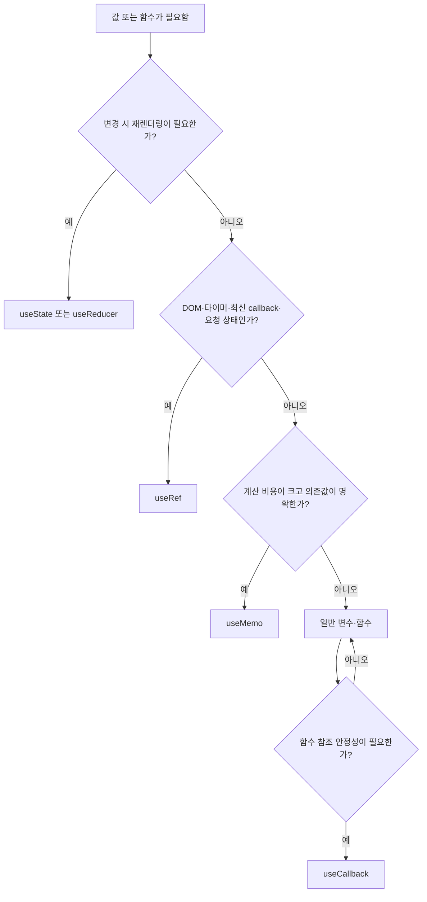

# CINEMO React Hook 사용 기준

React Hook은 “많이 쓰는 것이 좋은 최적화 도구”가 아니라, **렌더링·DOM·접근성·비동기 작업의 생명주기**에 맞춰 선택함.

## 현재 사용 요약

| Hook | CINEMO에서 사용하는 목적 | 대표 위치 |
| --- | --- | --- |
| `useRef` | DOM 참조, 재렌더링이 필요 없는 값, 최신 callback·요청 상태 보관 | `MovieShelf`, `MovieCalendarModal`, `PostcardPageContent` |
| `useId` | label·dialog와 연결되는 고유 접근성 ID 생성 | `ConfirmModal`, `PostcardCreateModal` |
| `useMemo` | 계산 결과를 의존값이 바뀔 때만 재계산 | `MovieCalendarModal`, `AdminUsersPage` |
| `useCallback` | callback 참조를 유지해 effect·자식 컴포넌트 의존성 안정화 | `MovieShelf` |

## `useRef`

### 기본 동작

`useRef(initialValue)`는 `{ current: initialValue }` 형태의 동일한 객체를 렌더링 사이에 유지함.

```txt
값 변경
  → ref.current 변경
  → React 재렌더링 없음
```

화면에 즉시 반영되어야 하는 값은 `useState`, 렌더링과 무관하게 유지할 값이나 DOM 참조는 `useRef`를 사용함.

### CINEMO 사용 사례

#### DOM 요소 참조

- `apps/web/components/my-cinema/MovieDetailSelect.tsx`: 바깥 영역 클릭 감지를 위한 `rootRef`
- `apps/web/components/my-cinema/MovieCalendarModal.tsx`: 기간 선택 영역의 바깥 클릭 감지를 위한 `rootRef`
- `apps/web/components/my-cinema/MovieShelf.tsx`: 필터 영역·무한 스크롤 sentinel·스크롤 컨테이너 참조

```ts
const rootRef = useRef<HTMLDivElement>(null);

useEffect(() => {
  if (!open) return;
  // rootRef.current로 현재 DOM 영역 확인
}, [open]);
```

#### 타이머·최신 callback 보관

- `apps/web/app/postcard/page.tsx`: 북마크 안내 Tooltip 타이머 ID 보관
- `apps/web/hooks/useAvailabilityCheck.ts`: `validate`와 `check`의 최신 callback을 보관해 debounce effect가 callback 변경만으로 다시 실행되지 않게 함
- `apps/web/components/my-cinema/ProfileModal.tsx`: 한글 IME 조합 중 Enter 처리 여부 보관

#### 중복 요청·비동기 상태 제어

- `apps/web/app/auth/callback/page.tsx`: React Strict Mode에서도 OAuth code 교환 요청을 중복 실행하지 않도록 Promise와 code 보관
- `apps/web/components/my-cinema/MovieShelf.tsx`: 추가 로딩 중복 실행 방지와 오래된 요청 응답 판별을 위한 ref 사용
- `apps/web/app/admin/ops/page.tsx`: seed progress 복구 처리 여부 보관

### 사용하지 말아야 하는 경우

- ref에 넣은 값을 화면에 표시해야 하는 경우 → `useState`
- 단순 계산 결과를 저장하려는 경우 → 먼저 일반 변수로 충분한지 검토
- 모든 값을 무조건 ref로 바꾸는 경우 → React 렌더링 흐름이 끊김

## `useId`

### 기본 동작

컴포넌트 인스턴스마다 안정적인 고유 ID를 생성함. ID를 직접 문자열로 만들지 않아도 서버 렌더링과 클라이언트 hydration에서 일관된 연결을 유지할 수 있음.

### CINEMO 사용 사례

- `apps/web/components/common/ConfirmModal.tsx`: `titleId`, `descriptionId`를 생성하고 `aria-labelledby`, `aria-describedby`에 연결
- `apps/web/components/postcard/PostcardCreateModal.tsx`: 입력·설명 영역의 접근성 ID 생성

```tsx
const titleId = useId();
const descriptionId = useId();

<section
  role="dialog"
  aria-labelledby={titleId}
  aria-describedby={descriptionId}
>
```

### 주의사항

- CSS selector나 사용자에게 보여줄 비즈니스 ID 생성 용도로 사용하지 않음
- 배열의 `key` 생성 용도로 사용하지 않음
- 접근성 관계가 필요하지 않으면 ID를 만들지 않음

## `useMemo`

### 기본 동작

계산 결과를 memoized value로 유지하고 dependency가 바뀔 때만 계산함.

```txt
의존값 변경 없음 → 이전 계산 결과 재사용
의존값 변경      → 계산 함수 다시 실행
```

### CINEMO 사용 사례

#### 달력 계산·그룹화

`apps/web/components/my-cinema/MovieCalendarModal.tsx`에서 사용함.

- `days`: 선택한 연·월의 달력 날짜 배열 계산
- `moviesByDate`: 관람 영화를 날짜별 `Map`으로 그룹화

둘 다 `year`, `month`, `calendar`가 바뀔 때만 다시 계산하면 됨.

#### 관리자 사용자 검색 결과

`apps/web/app/admin/users/page.tsx`의 `guests`에서 검색어에 따른 필터 결과를 계산함. `people`과 `query`가 바뀔 때만 다시 필터링함.

### 사용하지 말아야 하는 경우

- 계산이 매우 간단한 문자열 조합·속성 접근
- dependency가 매번 새로운 객체라 항상 다시 계산되는 경우
- “재렌더링을 막고 싶다”는 이유만으로 모든 계산에 적용하는 경우

`useMemo` 자체에도 메모리 유지와 dependency 비교 비용이 있으므로, 계산 비용과 재렌더링 빈도를 함께 보고 선택함.

## `useCallback`

### 기본 동작

함수를 dependency가 바뀔 때만 새로 생성함. 함수 내부 로직을 자동으로 빠르게 만드는 Hook은 아님.

### CINEMO 사용 사례

`apps/web/components/my-cinema/MovieShelf.tsx`에서 사용함.

- `seedMarks`: 목록을 받아 영화별 wish·watched 상태를 병합
- `loadMore`: 무한 스크롤에서 다음 페이지를 요청

두 callback은 `useEffect`의 dependency로 사용되고, `loadMore`는 `IntersectionObserver` callback에서 참조됨. `accessToken`, `kind`, 검색·필터·페이지 상태가 바뀔 때만 최신 함수가 필요함.

```ts
const loadMore = useCallback(async () => {
  // 다음 페이지 요청
}, [accessToken, kind, page, searchQuery, filterYear, filterMonth]);
```

### 사용하지 말아야 하는 경우

- 자식 컴포넌트가 memoized가 아니고 effect dependency에도 들어가지 않는 callback
- dependency가 매 렌더링마다 바뀌어 callback도 매번 새로 만들어지는 경우
- 단순히 모든 함수를 감싸는 경우

## 선택 기준



## 안티 패턴

| 안티 패턴 | 문제 |
| --- | --- |
| 모든 계산에 `useMemo` 적용 | dependency 관리와 메모리 비용 증가 |
| 모든 callback에 `useCallback` 적용 | 코드 복잡도만 증가하고 이득이 없음 |
| 화면 상태를 `useRef`에 저장 | 값 변경 후 화면이 갱신되지 않음 |
| `useId`를 배열 key로 사용 | 데이터의 identity가 아니라 접근성 ID이므로 목록 key에 부적합 |
| effect 내부에서 바뀌는 callback을 dependency에서 무조건 제외 | 오래된 closure를 참조할 수 있음 |

## 관련 구현

- `apps/web/components/common/ConfirmModal.tsx`
- `apps/web/components/postcard/PostcardCreateModal.tsx`
- `apps/web/components/my-cinema/MovieShelf.tsx`
- `apps/web/components/my-cinema/MovieCalendarModal.tsx`
- `apps/web/hooks/useAvailabilityCheck.ts`
- `apps/web/app/postcard/page.tsx`
- `apps/web/app/auth/callback/page.tsx`
