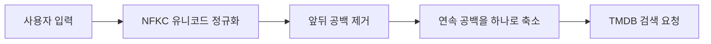
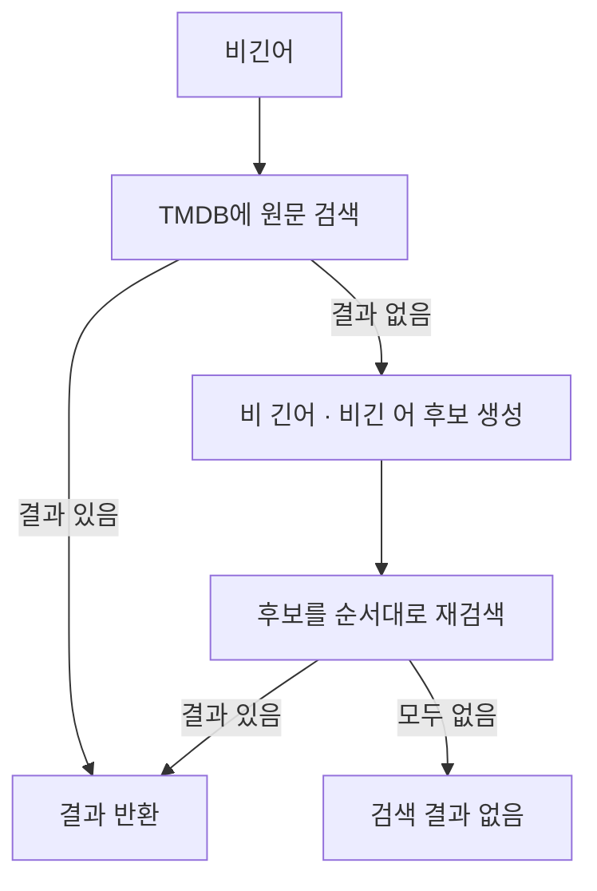

# 검색어 정규화와 fallback 검색

관련 코드:

- API: `apps/api/src/lib/search-query.ts`
- Web: `apps/web/lib/search-query.ts`
- API 적용 위치: `apps/api/src/tmdb/tmdb.service.ts`

## 왜 필요한가

사용자가 입력한 영화 제목은 사람이 보기에는 같아도 문자열로는 다를 수 있음.

```txt
" 비긴 어게인 "
"비긴  어게인"
"비긴어게인"
```

TMDB 검색 API는 전달받은 문자열과 띄어쓰기를 기준으로 검색하므로 `비긴어`와 `비긴 어`가 서로 다른 결과가 될 수 있음. 사용자 입력을 그대로 외부 API에 전달하면 검색 결과가 없는데도 영화가 존재하지 않는 것처럼 보이는 문제가 생김.

## 정규화 단계



### `normalize('NFKC')`

전각 문자와 호환 문자를 비교에 적합한 형태로 정규화함.

```ts
query.normalize('NFKC');
```

예를 들어 키보드나 복사 과정에서 들어온 전각 문자를 일반 문자와 비교할 수 있게 함. 이 단계는 띄어쓰기 제거가 아니라 문자 표현의 차이를 줄이는 단계.

### `trim()`

검색어 양 끝의 불필요한 공백 제거.

```ts
query.trim();
```

입력창에 남은 앞뒤 공백 때문에 같은 제목이 다른 검색어로 처리되는 문제 방지.

### `replace(/\s+/g, ' ')`

연속된 공백, 줄바꿈, 탭을 하나의 일반 공백으로 축소.

```ts
query.replace(/\s+/g, ' ');
```

정규화 함수 전체:

```ts
export function normalizeSearchQuery(query: string): string {
  return query.normalize('NFKC').trim().replace(/\s+/g, ' ');
}
```

## 붙여 쓴 한글 제목 fallback

정규화만으로는 `비긴어`를 `비긴 어`로 바꿀 수 없음. 어디에서 단어가 나뉘는지 문자열만으로 알 수 없기 때문.

그래서 API 검색 결과가 없고 입력어에 공백이 없으면 가능한 분리 위치를 만들어 순차적으로 재검색함.

```txt
비긴어
  ├─ 비 긴어
  └─ 비긴 어
```



### `Array.from()`을 사용하는 이유

문자열의 분리 단위를 배열로 다루기 위해 사용함.

```ts
const characters = Array.from(query);
```

문자열 인덱스와 문자 단위 처리를 분리하면 후보 생성 의도가 분명해지고, 유니코드 문자를 다룰 때 단순 인덱싱보다 안전함.

### API 요청을 무제한으로 만들지 않음

모든 분리 위치를 무제한으로 요청하면 제목이 길어질수록 외부 API 호출 수가 증가함. 현재는 제목 앞쪽과 뒤쪽의 후보만 제한적으로 시도함.

```ts
const splitIndexes = new Set<number>();
```

`Set`을 사용해 앞·뒤 후보가 겹칠 때 같은 분리 위치를 중복 요청하지 않음.

## Web과 API의 역할 분리

```txt
Web
  → 입력값의 기본 정규화
  → API 요청

API
  → 최종 정규화
  → 원래 검색
  → fallback 후보 생성
  → TMDB 호출
```

서버에서도 정규화하는 이유:

- Web 외의 클라이언트가 API를 호출할 수 있음
- 서버가 외부 API 요청을 통제해야 함
- 입력 검증과 외부 API 비용 제어를 서버에서 수행해야 함

## 주의사항

- `trim()`만으로 붙여 쓴 한글 제목 문제를 해결할 수 없음
- 검색어 정규화와 제목 의미 분석은 다른 문제임
- fallback 후보를 너무 많이 만들면 TMDB 요청 비용과 응답 시간이 증가함
- 검색어가 비어 있으면 외부 API를 호출하지 않음
- 검색 결과가 없을 때만 fallback을 실행해 정상 검색에서는 추가 요청을 만들지 않음
- 사용자 입력을 임의로 영구 수정하지 않고 검색 요청에만 정규화 값을 사용함

## 테스트 기준

| 입력 | 기대 동작 |
| --- | --- |
| ` 비긴 어게인 ` | 앞뒤 공백 제거 후 검색 |
| `비긴  어게인` | 연속 공백을 하나로 줄여 검색 |
| `비긴어` | `비 긴어`, `비긴 어` fallback 검색 |
| `싱스트리트` | 띄어쓰기 후보를 만들어 검색 |
| 빈 문자열 | TMDB 요청 없이 빈 결과 반환 |

검색 기능을 수정할 때는 정상 검색 결과뿐 아니라 공백 차이, 붙여 쓴 한글 제목, 빈 입력을 함께 확인해야 함.
