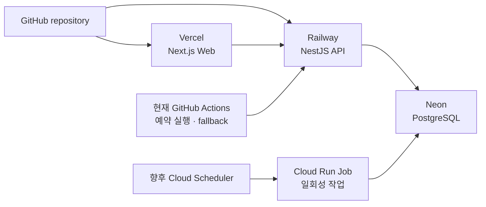

# CINEMO 배포 문서

현재 배포 구조: GitHub → Vercel·Railway, Railway → Neon, GitHub Actions → Railway API.
예약 작업은 현재 GitHub Actions를 사용하고, 장기적으로 [Cloud Scheduler + Cloud Run Job](./cloud-scheduler.md)으로 확장함. Railway Cron은 현재 선택하지 않음.




| 영역    | 서비스            | 역할                                          |
| ----- | -------------- | ------------------------------------------- |
| Web   | Vercel         | Next.js 프론트엔드                               |
| API   | Railway        | NestJS API · Prisma                         |
| DB    | Neon           | PostgreSQL                                  |
| Batch 현재 | GitHub Actions | 예약 실행·수동 실행·로그 확인 |
| Batch 확장 목표 | Cloud Scheduler + Cloud Run Job | MovieChartSnapshot·MoviePool·개봉일 알림 |
| Report 유지 | GitHub Actions | Daily Excel 호출 및 artifact 90일 보관 |


현재 Web 주소: [https://cinemo-six.vercel.app](https://cinemo-six.vercel.app)

## 문서 순서

1. [Railway](./railway.md): API 빌드·migration·서비스 오류
2. [Neon](./neon.md): PostgreSQL 연결·환경변수
3. [Vercel](./vercel.md): Web 빌드·환경변수
4. [GitHub Actions](./github-actions.md): 현재 예약 실행·Daily Excel·수동 실행
5. [Cloud Scheduler](./cloud-scheduler.md): 장기 예약 실행 구조·Cloud Run Job
6. [Railway Cron 검토](./railway-cron.md): 현재 선택하지 않은 이유와 비교 기준
7. [배포 전 체크리스트](./checklist.md): 배포 직전 확인


## 공통 배포 흐름

```txt
코드 push
  → Vercel Web build
  → Railway API build
  → Prisma Client generate
  → Railway Pre-deploy에서 prisma migrate deploy
  → NestJS API 시작
  → GitHub Actions 예약 실행·수동 실행 확인
```


## 공통 원칙

- 운영 DB 변경은 이미 생성된 migration을 `prisma migrate deploy`로 적용
- Prisma Client는 API build 전에 생성
- `localhost` 주소는 배포 환경의 API 주소로 사용하지 않음
- 현재 예약 작업 Secret은 GitHub Actions Secrets에 등록
- Cloud Scheduler 전환 시에는 Cloud Run Job 환경변수와 Scheduler 인증을 별도로 관리
