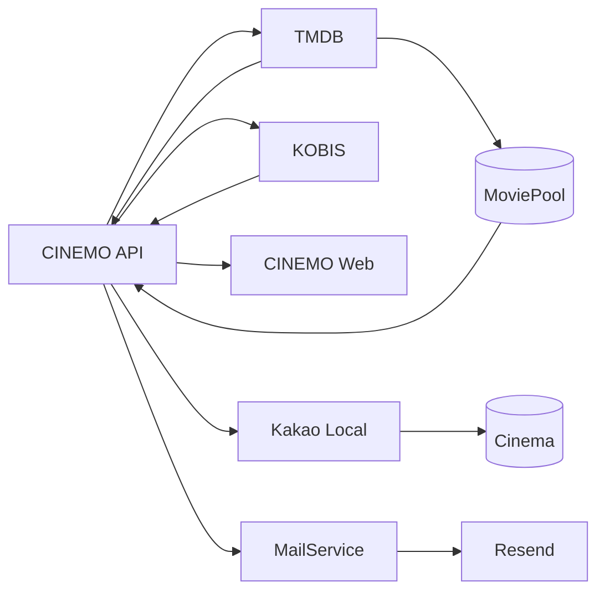

# CINEMO 외부 API·메일 서비스

CINEMO가 외부 서비스와 연결하는 방식 정리.



## 역할 분리

| API | 주요 데이터 | CINEMO 사용처 |
|---|---|---|
| TMDB | 제목·줄거리·포스터·개봉일·감독·장르·OTT | 영화 상세·개봉 예정·MY CINEMA |
| KOBIS | 국내 극장 순위·일일 관객 수·누적 관객 수 | 로비 `BOX OFFICE NOW` |
| 카카오 Local 장소 검색 | 영화관 장소명·주소·카카오 장소 ID·좌표 | 영화관 수집·Cinema DB 동기화 |
| 네이버지도·카카오맵·Google Maps | 길찾기·외부 지도 화면 | Web 영화관 목록의 외부 링크 |
| 메가박스·롯데시네마·CGV | 공식 단독개봉·상영 정보 | 향후 극장별 단독개봉 탐색 |
| Resend | 이메일 발송 | 비밀번호 재설정·개봉일 알림 |

TMDB와 KOBIS는 모두 영화 데이터를 제공하지만 기준과 목적이 다름.
TMDB의 인기순위와 KOBIS의 국내 극장 순위는 같은 값으로 취급하지 않음.
Resend는 영화 데이터가 아닌 CINEMO의 메일 발송 담당.

## CINEMO 연결 기준

```txt
브라우저
  → CINEMO API
      → TMDB: 영화 메타데이터·포스터·상세
      → KOBIS: 국내 박스오피스
      → Kakao Local: 영화관 검색·Cinema 동기화
      → MoviePool: TMDB 메타데이터 캐시
      → MailService: React Email HTML 생성·Resend 발송
  → Web 응답
```

- 외부 API 인증 정보는 NestJS API 서버에서만 사용
- Web에서 TMDB·KOBIS를 직접 호출하지 않음
- Web에서 카카오 Local API를 직접 호출하지 않음
- TMDB 데이터는 필요 시 `MoviePool`에 저장
- KOBIS 박스오피스는 API 메모리 캐시 사용
- Resend API는 `MailService`에서만 호출
- 외부 API 장애가 로비·영화 기능 전체 장애로 확장되지 않도록 기능별 fallback 적용

## 문서 목록

- [TMDB 영화 데이터](./tmdb.md)
- [KOBIS 박스오피스](./kobis.md)
- [카카오 Local 영화관 검색](./kakao.md)
- [네이버 지역 검색 기록](./naver.md)
- [법정동 코드 API](./legal-dong-code.md)
- [극장별 단독개봉·상영 정보](./cinema-exclusive.md)
- [Resend 이메일 발송](./resend.md) · [홈페이지](https://resend.com/)

## 환경변수

```env
TMDB_BASE_URL=https://api.themoviedb.org/3
TMDB_ACCESS_TOKEN=발급받은_Read_Access_Token
KOBIS_API_KEY=발급받은_KOBIS_API_KEY
KAKAO_REST_API_KEY=발급받은_카카오_REST_API_KEY
RESEND_API_KEY=발급받은_RESEND_API_KEY
RESEND_FROM=발신자_이메일_주소
```

등록 기준:

```txt
로컬   apps/api/.env
배포   Railway API Variables
코드   apps/api/src/config/env.keys.ts
검증   apps/api/src/config/env.validation.ts
```

`.env`와 외부 API Secret은 Git에 커밋하지 않음.

## 선택 기준

```txt
영화 메타데이터·포스터·상세·OTT
  → TMDB

국내 극장 박스오피스 순위·관객 수
  → KOBIS

영화관 장소·주소·좌표 수집
  → Kakao Local

비밀번호 재설정·개봉일 알림 이메일
  → Resend
```

API별 요청 형태·응답 매핑·실패 처리·확인 순서는 각 문서 참고.
