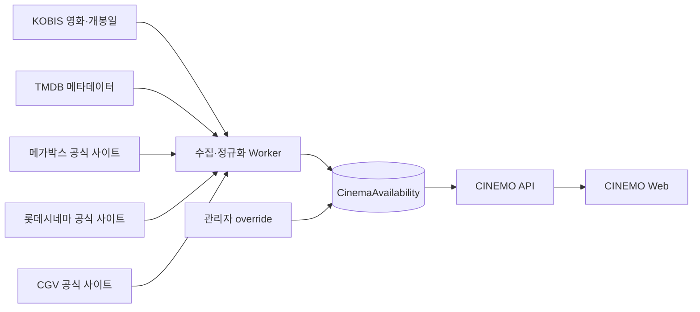

# 극장별 단독개봉·상영 정보

> [!Info]
> 메가박스·롯데시네마·CGV의 단독개봉 영화를 놓치지 않도록 제공하기 위한 향후 기능 설계 문서. 현재 자동 수집 기능은 아직 구현하지 않음.

## 해결하려는 문제

사용자는 극장마다 따로 존재하는 단독개봉 영화를 놓칠 수 있음.

```txt
메가박스 ONLY
롯데시네마 ONLY
CGV 단독 상영
```

CINEMO에서는 영화별로 어느 극장에서 단독으로 상영되는지 한곳에서 확인할 수 있게 하는 것이 목표임.

## 데이터 출처 역할

| 출처 | 담당 데이터 | 기준 |
|---|---|---|
| KOBIS | 국내 영화·개봉일·박스오피스 | 국내 극장 영화의 기본 기준 |
| TMDB | 제목·포스터·줄거리·상세·영상 | 영화 메타데이터 보완 |
| 메가박스 | `MEGAONLY` 등 공식 단독 표기·상영 정보 | 메가박스 단독 여부 |
| 롯데시네마 | 공식 영화·예매·상영 정보 | 롯데시네마 상영 여부 |
| CGV | 공식 영화·예매·상영 정보 | CGV 상영 여부 |
| 관리자 override | 누락·오분류·예외 보정 | 최종 운영 보정 |

## 권장 구조



## 크롤링을 사용하는 이유

극장별 단독개봉 표기와 상영 정보는 KOBIS·TMDB의 일반 영화 메타데이터에 없는 경우가 많음. 따라서 공식 극장 사이트의 실제 표기와 상영 정보를 읽는 방식이 가장 직접적인 기준임.

다만 크롤링 결과를 곧바로 “단독개봉”으로 확정하면 안 됨.

- HTML·API 응답 구조가 바뀔 수 있음
- 지역·날짜·상영관에 따라 결과가 달라질 수 있음
- 특정 극장에 아직 일정이 등록되지 않은 것과 단독개봉은 다름
- 로그인·세션·봇 차단·요청 제한이 있을 수 있음
- 극장 사이트 이용약관과 robots 정책을 확인해야 함

따라서 크롤링은 높은 정확도의 보조 데이터원이지만, 관리자 override와 실패 상태를 함께 설계해야 함.

## 단독 여부 판정 원칙

### 확정 가능한 경우

- 메가박스 공식 영화 상세에 `MEGAONLY` 같은 단독 표기가 있음
- 극장 공식 단독개봉 카테고리에 영화가 명시되어 있음
- 공식 데이터 응답에 단독 여부 필드가 있음

### 확정하면 안 되는 경우

- 한 극장 사이트에서만 검색됨
- 다른 극장에 오늘 상영시간표가 없음
- TMDB에 극장 정보가 없음
- 한 지역의 상영관에서만 상영됨

이런 경우에는 `unknown`으로 저장하고, 사용자에게 “단독개봉”이라고 단정하지 않음.

## 예정 모델

```txt
CinemaAvailability
├─ tmdbId
├─ cinema: megabox | lotte | cgv
├─ status: exclusive | screening | unknown
├─ scope: nationwide | region | theater
├─ regionCode?
├─ theaterCode?
├─ sourceUrl?
├─ sourceLabel?
├─ validFrom?
├─ validUntil?
├─ fetchedAt
└─ confidence
```

- `tmdbId`와 `cinema`를 논리적 연결 기준으로 사용함
- 단독 여부와 일반 상영 여부를 구분함
- 전국 단독인지 특정 지역·지점 단독인지 `scope`로 구분함
- 원본 확인을 위해 `sourceUrl`, `sourceLabel`, `fetchedAt`를 보관함
- 크롤링 실패와 실제 데이터 없음은 `unknown` 또는 수집 상태로 구분함

## 수집 방식

```txt
예약된 API Worker
  → 극장 공식 단독개봉·영화 목록 요청
  → 응답 정규화
  → 영화명·개봉일·포스터로 TMDB/KOBIS 매칭
  → CinemaAvailability upsert
  → 이전 데이터의 validUntil 갱신
```

- Web 브라우저에서 극장 사이트를 직접 호출하지 않음
- API 서버 또는 별도 Worker에서 수집함
- 요청 간격·재시도·실패 로그·캐시를 둠
- 매 요청마다 크롤링하지 않고 일정 주기로 갱신함
- 수집 실패 시 기존 데이터에 마지막 확인 시각을 표시함

## 관리자 override

크롤링만으로 해결하기 어려운 예외를 관리자 페이지에서 보정함.

- 단독개봉 여부 수동 지정
- 극장 선택
- 포스터·영상·원본 링크 보정
- 적용 기간 지정
- 비활성화와 기본값 복귀
- 수정 사유와 수정 관리자 기록

적용 우선순위:

```txt
관리자 override
  → 극장 공식 수집 데이터
    → KOBIS·TMDB 보조 데이터
      → unknown
```

## 초기 구현 범위

처음부터 전국 지점별 상영시간표를 모두 수집하지 않음.

1. 메가박스·롯데시네마·CGV의 단독개봉 카테고리 수집
2. 공식 단독 표기와 원본 링크 저장
3. KOBIS·TMDB 영화와 `tmdbId` 매칭
4. 관리자 override 추가
5. 이후 필요할 때 지역·지점별 상영시간표 확장

## 관련 문서

- [TMDB 영화 데이터](./tmdb.md)
- [KOBIS 박스오피스](./kobis.md)
- [MovieMediaOverride](../prisma/admin/movie-media-override.md)
