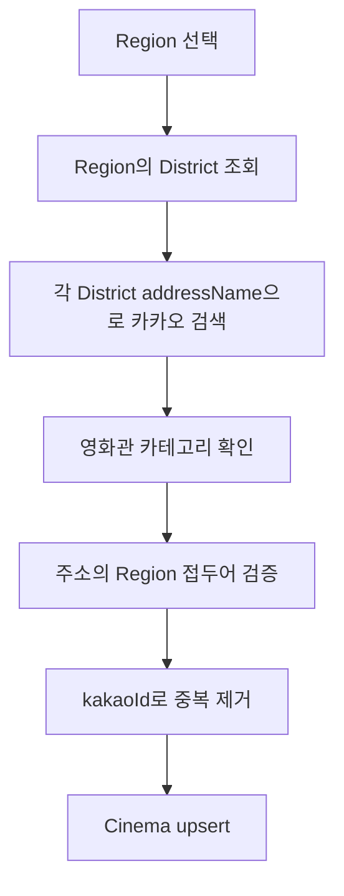

# 카카오 Local 영화관 검색

## 현재 사용 목적

카카오 Local 키워드 검색 API를 이용해 지역별 영화관 데이터를 수집하고, 검색 결과를 CINEMO의 `Cinema` 테이블에 저장함.

카카오 API를 Web에서 직접 호출하지 않는다. REST API 키가 노출되지 않도록 NestJS API 서버에서만 호출한다.

```txt
카카오 Local API
  → 지역별 영화관 검색
  → CINEMO API에서 필요한 필드만 DTO로 변환
  → Cinema DB에 upsert
  → Web은 Cinema DB만 조회
```

## API 주소

Base URL과 endpoint path를 분리해 관리한다.

```ts
private readonly kakaoLocalBaseUrl =
  'https://dapi.kakao.com/v2/local';

private readonly keywordSearchPath = '/search/keyword.json';
```

최종 요청 주소:

```txt
https://dapi.kakao.com/v2/local/search/keyword.json
```

## 인증

```env
KAKAO_REST_API_KEY=카카오_앱_REST_API_KEY
```

요청 헤더:

```txt
Authorization: KakaoAK {KAKAO_REST_API_KEY}
Accept: application/json
```

카카오 로그인용 환경변수와 장소 검색용 REST API 키를 구분한다.

```txt
KAKAO_REST_API_KEY       → Local 장소 검색
KAKAO_OAUTH_CLIENT_SECRET → Kakao OAuth 로그인
```

## 검색 요청

```txt
GET /v2/local/search/keyword.json
  ?query=서울특별시 강남구 영화관
  &category_group_code=CT1
  &size=15
  &page=1
```

`CT1`은 카카오 장소 검색의 영화관 카테고리 그룹 코드임. 응답의 `category_name`에도 영화관이 포함되는지 한 번 더 검사한다.

```ts
if (!place.category_name.includes('영화관')) {
  continue;
}
```

## 페이지 수집과 중복 제거

카카오 응답은 한 페이지에 최대 15건을 반환한다. 현재 서비스는 `is_end`와 `pageable_count`를 확인하면서 최대 45페이지까지 요청한다.

```txt
size=15
page=1..45
→ 약 675건까지 페이지 수집 가능
→ 실제 결과가 끝나면 조기 종료
```

45는 영화관 개수가 아니라 카카오 API의 페이지 상한을 코드로 제한한 값이다. 결과 수가 많다고 무한히 요청하지 않도록 둔 안전장치임.

같은 영화관이 여러 구·군 검색 결과에 포함될 수 있으므로 카카오 장소 ID를 기준으로 `Map`에 저장한다.

```ts
places.set(place.id, normalizedPlace);
```

## 외부 응답과 내부 DTO 분리

카카오 원본 응답 타입과 CINEMO가 사용하는 DTO를 분리한다.

```txt
KakaoPlaceDocumentDto
  → 카카오 API 원본 필드 표현

KakaoPlaceResponseDto
  → documents와 meta를 포함한 카카오 응답

KakaoCinemaPlaceDto
  → CINEMO에 필요한 영화관 필드만 표현

CinemaResponseDto
  → DB에 저장된 영화관을 Web에 반환하는 API 계약
```

영화관 검색 DTO에는 다음 필드만 사용한다.

| 필드 | 의미 |
| --- | --- |
| `kakaoId` | 카카오 장소 고유 ID |
| `name` | 영화관 이름 |
| `category` | 카카오 장소 카테고리 |
| `address` | 지번 주소 |
| `roadAddress` | 도로명 주소. 없으면 `null` |
| `placeUrl` | 카카오 장소 상세 URL. 없으면 `null` |
| `longitude` | 경도. 카카오 원본 `x`를 숫자로 변환 |
| `latitude` | 위도. 카카오 원본 `y`를 숫자로 변환 |

카카오 원본의 `category_group_code`, `category_group_name` 등은 현재 DB와 Web 화면에 필요하지 않으므로 내부 영화관 DTO에 포함하지 않는다.

## 지역별 동기화 방식

광역 Region 하나를 바로 검색하지 않고 해당 Region의 District 주소를 검색어로 사용한다. 그래야 `경기도 영화관`처럼 결과가 넓게 섞이거나 서울·인천 결과가 섞이는 문제를 줄일 수 있다.



검색 결과 주소가 선택 Region에 속하는지 별칭 목록으로 검증한다.

```ts
const REGION_ALIASES: Record<string, string[]> = {
  서울특별시: ['서울특별시', '서울'],
  경기도: ['경기도', '경기'],
  강원특별자치도: ['강원특별자치도', '강원'],
};
```

실제 코드에는 전체 Region의 정식명과 축약명을 기록한다. 이 별칭은 카카오 주소 표기가 `서울특별시`와 `서울`처럼 달라질 수 있기 때문에 필요하다.

## Cinema 저장 기준

```txt
POST /kakao/places/cinemas/sync?region=서울특별시
```

동기화 순서:

1. `Region`을 이름으로 조회
2. 해당 Region의 `District.addressName` 목록 조회
3. District별 카카오 영화관 검색
4. 선택 Region과 주소가 일치하는 결과만 남김
5. `kakaoId`로 중복 제거
6. `regionId`를 연결해 `Cinema` upsert
7. 기존 해당 Region 데이터 중 이번 결과에 없는 항목 삭제

현재 `districtId`는 `null`로 저장한다. 주소 문자열만으로 경기도의 시·군·구를 항상 안전하게 판별할 수 없는 상태에서 잘못된 District 관계를 만들지 않기 위한 결정임.

## 조회 API와 동기화 API의 분리

```txt
GET /kakao/places/cinemas?region=서울특별시
  → 카카오 API를 직접 조회하는 테스트·검증용 endpoint

POST /kakao/places/cinemas/sync?region=서울특별시
  → 카카오 검색 결과를 Cinema DB에 저장하는 endpoint

GET /cinemas?region=서울특별시
  → 외부 API를 호출하지 않고 Cinema DB만 조회하는 Web용 endpoint
```

화면에서는 `GET /cinemas`만 사용한다. 페이지를 열 때마다 카카오 API를 호출하지 않으므로 API 호출량과 응답 시간을 줄일 수 있다.

## 좌표 처리

카카오 응답의 좌표는 문자열이다.

```ts
const longitude = Number(place.x);
const latitude = Number(place.y);

if (!Number.isFinite(longitude) || !Number.isFinite(latitude)) {
  continue;
}
```

DB에는 숫자로 저장하고, Web의 Leaflet Marker에는 `[위도, 경도]` 순서로 전달한다.

```txt
Kakao x → longitude
Kakao y → latitude
Leaflet position → [latitude, longitude]
```

## 구현 파일

```txt
apps/api/src/kakao/
├─ kakao-place.service.ts
├─ kakao-place.controller.ts
├─ kakao.module.ts
├─ constants/region-aliases.ts
└─ dto/
   ├─ kakao-place-document.dto.ts
   ├─ kakao-place-meta.dto.ts
   ├─ kakao-place-response.dto.ts
   ├─ kakao-cinema-place.dto.ts
   ├─ kakao-cinema-query.dto.ts
   └─ kakao-cinema-sync-response.dto.ts
```

## 현재 확인된 한계

- 카카오 검색 결과의 전체 영화관 수가 실제 전국 영화관 수와 일치한다고 보장할 수 없음
- 검색어·페이지·카테고리·카카오 등록 상태에 따라 결과 수가 달라질 수 있음
- 같은 영화관의 지점명이나 주소가 변경될 수 있음
- 폐점·휴업 상태는 검색 결과만으로 완전히 판별하지 않음
- Region 동기화 때마다 해당 Region의 기존 목록을 새 검색 결과 기준으로 정리함

따라서 현재 데이터는 **카카오 Local API를 기반으로 수집한 영화관 위치 데이터**이며, 공식 영화관 전체 목록의 절대 기준으로 취급하지 않는다.
