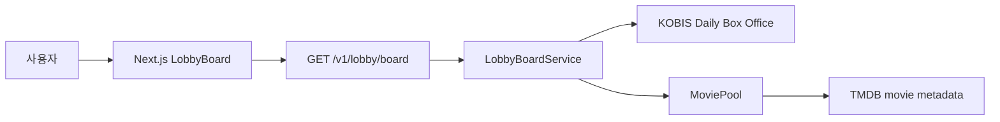
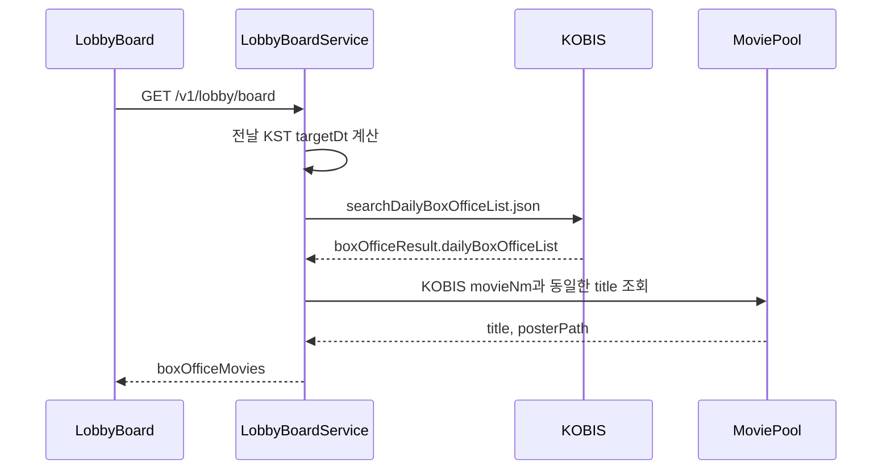
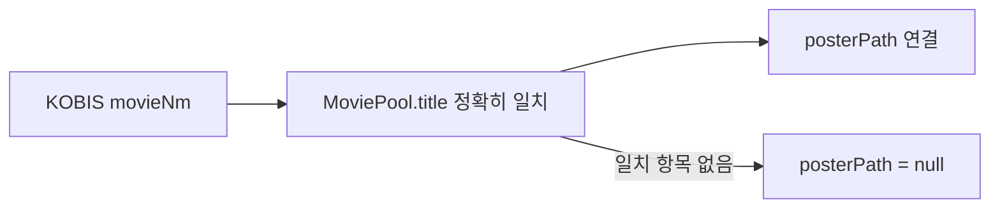
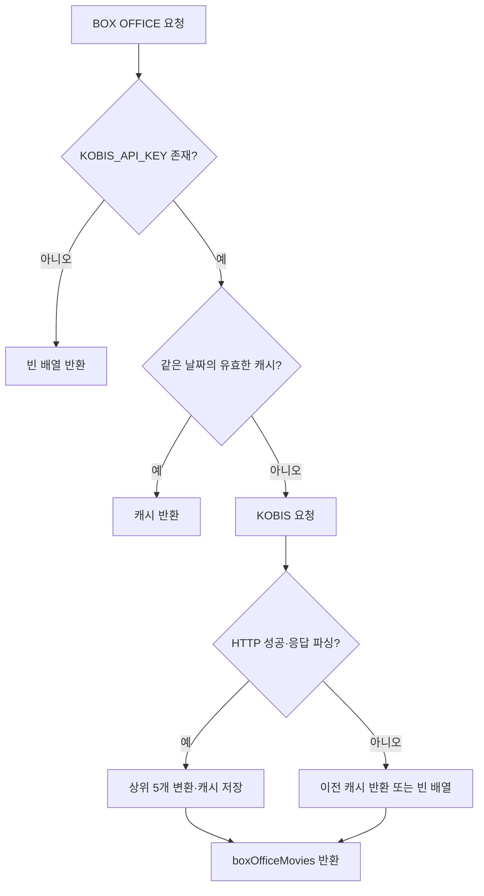

# 외부 API · KOBIS 박스오피스

KOBIS는 `Korean Box Office Information System`의 약자.
영화진흥위원회 영화관입장권통합전산망에서 제공하는 국내 영화관 박스오피스 데이터.

공식 사이트: <https://www.kobis.or.kr>

공식 Open API: <https://www.kobis.or.kr/kobisopenapi/homepg/main/main.do>

## CINEMO에서의 역할

KOBIS는 로비의 `BOX OFFICE NOW`에 국내 극장 순위와 누적 관객 수를 제공.
영화 상세 정보와 포스터는 TMDB와 CINEMO `MoviePool`에서 보완.



| 데이터 | 담당 | CINEMO 사용처 |
|---|---|---|
| 국내 극장 순위 | KOBIS | `BOX OFFICE NOW` 순위 |
| 일일·누적 관객 수 | KOBIS | 누적 관객 수 표시 |
| 영화 제목 | KOBIS·TMDB | 박스오피스 제목·영화 상세 |
| 포스터 | TMDB 경로·MoviePool | 박스오피스 포스터 |
| 개봉일·줄거리·감독·장르 | TMDB·MoviePool | 영화 상세·개봉 예정 |
| 사용자 관심 수 | CINEMO DB | `UPCOMING INTEREST` |

KOBIS의 국내 극장 순위와 TMDB의 인기순위는 다른 데이터.

## 먼저 확인할 코드

```txt
apps/api/src/lobby-board/lobby-board.controller.ts
  GET /lobby/board
  @Public() 공개 endpoint

apps/api/src/lobby-board/lobby-board.service.ts
  getBoard()
  getBoxOfficeMovies()
  KOBIS 호출·응답 변환·포스터 보완·캐시

packages/shared/src/lobby-board.ts
  BoardBoxOfficeMovie
  LobbyBoardResponse

apps/web/lib/lobby-board-api.ts
  getLobbyBoardRequest()

apps/web/components/lobby/LobbyBoard.tsx
  BOX OFFICE NOW 탭
  순위·관객 수·순위 변동·포스터 표시

apps/api/src/config/env.keys.ts
  EnvKeys.KOBIS_API_KEY

apps/api/src/config/env.validation.ts
  KOBIS_API_KEY 선택값 검증
```

## API 호출 형태

일일 박스오피스 API:

```http
GET https://www.kobis.or.kr/kobisopenapi/webservice/rest/boxoffice/searchDailyBoxOfficeList.json
  ?key=<KOBIS_API_KEY>
  &targetDt=<YYYYMMDD>
```

현재 CINEMO는 `targetDt`에 전날 KST 날짜 사용.
KOBIS의 일일 집계가 완료된 날짜를 조회하기 위한 기준.

### 개봉 예정 영화 조회 시 날짜 형식

`searchMovieList`의 `openStartDt`와 `openEndDt`는 일자 전체가 아닌 연도 4자리만 받음.

```txt
잘못된 요청: openStartDt=20260916
올바른 요청: openStartDt=2026
```

CINEMO는 연도 범위로 KOBIS 목록을 조회한 뒤 응답의 `openDt`를 `YYYY-MM-DD`로 변환해 실제 요청 범위에 맞게 다시 필터링함. 날짜 전체를 `openStartDt`에 보내면 KOBIS 오류 응답이 반환되고 개봉일 확정 상태가 전부 `false`가 될 수 있음.

```txt
현재 KST 날짜: 2026-09-10
targetDt:     20260909
```

실제 코드 흐름:



## KOBIS 원본 응답 형태

KOBIS 응답은 `boxOfficeResult` 안에 `dailyBoxOfficeList` 배열을 포함.
주요 값은 문자열로 전달되므로 CINEMO에서 숫자 변환 필요.

```json
{
  "boxOfficeResult": {
    "boxofficeType": "일별 박스오피스",
    "showRange": "20260909~20260909",
    "dailyBoxOfficeList": [
      {
        "rank": "1",
        "movieNm": "영화 제목",
        "audiCnt": "12345",
        "audiAcc": "987654",
        "rankInten": "2",
        "rankOldAndNew": "OLD"
      }
    ]
  }
}
```

현재 코드에서 읽는 KOBIS 필드:

| KOBIS 필드 | 자료 형태 | CINEMO 변환·사용 |
|---|---|---|
| `rank` | 문자열 | `Number()` 후 `rank` |
| `movieNm` | 문자열 | `title` |
| `audiCnt` | 문자열 | 사용하지 않음. 해당 날짜 관객 수 |
| `audiAcc` | 문자열 | `Number()` 후 `audienceCount`. 누적 관객 수 |
| `rankInten` | 문자열 | `Number()` 후 `rankChange` |
| `rankOldAndNew` | 문자열 | `NEW`이면 `rankChange=null` |

`dailyBoxOfficeList` 전체 중 상위 5개만 로비 응답에 포함.

## CINEMO 응답 형태

KOBIS 원본을 그대로 Web에 전달하지 않고 `BoardBoxOfficeMovie`로 변환.

```ts
type BoardBoxOfficeMovie = {
  rank: number;
  title: string;
  audienceCount: number;
  rankChange: number | null;
  posterPath: string | null;
};

type LobbyBoardResponse = {
  boxOfficeMovies: BoardBoxOfficeMovie[];
  upcomingInterestMovies: BoardUpcomingInterestMovie[];
};
```

응답 예시:

```json
{
  "boxOfficeMovies": [
    {
      "rank": 1,
      "title": "영화 제목",
      "audienceCount": 987654,
      "rankChange": 2,
      "posterPath": "/poster/path.jpg"
    }
  ],
  "upcomingInterestMovies": []
}
```

## 관객 수와 순위 변동 표시

### 관객 수

`audiCnt`가 아닌 `audiAcc`를 사용.
로비에서 보여주는 값은 전날 하루 관객 수가 아닌 누적 관객 수.

```txt
audiCnt          → 전날 하루 관객 수
audiAcc          → 누적 관객 수
audienceCount    → CINEMO 화면 표시 기준
```

화면 폭을 고려한 축약:

```txt
87,382     → 8.7만
1,234,567  → 123.4만
```

10,000 이상 값은 소수 첫째 자리까지 버림 처리.
원본 수치는 숫자 영역의 `title` 속성으로 확인하는 구조.

### 순위 변동

```txt
rankOldAndNew = NEW  → rankChange = null → NEW
rankChange > 0       → ArrowUp
rankChange < 0       → ArrowDown
rankChange = 0       → Minus
```

`rankInten`이 빈 문자열 또는 0으로 변환되는 경우 `rankChange=0` 처리.

## 포스터 보완 방식

KOBIS는 CINEMO가 사용하는 TMDB 포스터 경로를 제공하지 않음.
따라서 KOBIS의 `movieNm`과 `MoviePool.title`을 정확히 비교해 `posterPath` 보완.



현재 조회 조건:

```ts
where: {
  title: {
    in: list.map((movie) => movie.movieNm),
  },
}
```

영화명 표기 방식이 다르거나 MoviePool에 아직 없는 영화는 포스터 없이 표시.
박스오피스 순위와 누적 관객 수는 포스터 유무와 관계없이 표시.

## 로비 화면 연결

`LobbyBoard`는 `/v1/lobby/board` 응답의 `boxOfficeMovies`를 `BOX OFFICE NOW` 탭에 연결.

```txt
boxOfficeMovies
  → rank
  → title
  → audienceCount
  → rankChange
  → posterPath
```

`UPCOMING INTEREST` 탭은 같은 API 응답의 `upcomingInterestMovies` 사용.
KOBIS 데이터와 사용자 관심 데이터는 같은 응답 안에 있지만 서로 다른 데이터 흐름.

## 환경변수

```env
KOBIS_API_KEY=발급받은_KOBIS_API_KEY
```

등록 위치:

```txt
로컬: apps/api/.env
배포: Railway API Variables
코드 키: EnvKeys.KOBIS_API_KEY
검증: envValidationSchema의 선택값
```

`KOBIS_API_KEY`는 현재 선택값.
키가 없으면 KOBIS 호출 없이 `boxOfficeMovies=[]` 반환.
따라서 박스오피스 데이터 부재가 로비 전체 오류로 이어지지 않음.

## 캐시와 실패 처리

캐시는 API 프로세스 메모리에 날짜별 단일 항목으로 저장.
같은 `targetDt`에 대해 10분간 유효.



현재 구현의 세부 기준:

- 유효한 동일 날짜 캐시가 있으면 외부 API 호출 생략
- KOBIS HTTP 응답이 비정상이면 빈 배열 반환
- fetch·JSON 파싱·MoviePool 조회 과정에서 예외 발생 시 이전 캐시가 있으면 fallback
- 이전 캐시가 없으면 빈 배열 반환
- 메모리 캐시라 API 재시작 또는 다중 인스턴스 확장 시 공유되지 않음

## API 확인 순서

1. API 실행 환경에 `KOBIS_API_KEY` 등록 여부 확인
2. API 재시작으로 환경변수 재로드
3. `GET /v1/lobby/board` 호출
4. 응답의 `boxOfficeMovies` 배열 확인
5. `audienceCount`가 `audiAcc` 기준인지 확인
6. `rankChange=null` 항목이 `NEW`로 표시되는지 확인
7. `posterPath`가 MoviePool 제목 일치 결과인지 확인
8. KOBIS 실패 시 로비 전체가 아닌 박스오피스 영역만 빈 상태인지 확인

```bash
curl --fail-with-body \
  http://localhost:3050/v1/lobby/board
```

`/v1/lobby/board`는 `@Public()` endpoint라 로그인 토큰 없이 조회 가능.

## 한계와 개선 대상

- 메모리 캐시라 API 재시작 시 삭제
- 여러 API 인스턴스에서 캐시 공유 불가
- 영화명 정확 일치 방식이라 표기 차이에 취약
- KOBIS 원본의 지역·상영관·영화 유형 필터는 현재 미사용
- 마지막 성공 조회 시각을 Web에 표시하지 않음
- KOBIS 실패 원인을 사용자 화면에 상세 노출하지 않음

확장 방향:

```txt
Redis 또는 DB 기반 날짜별 캐시
  → 다중 API 인스턴스 캐시 공유

TMDB id 매칭 보완
  → 영화명 정확 일치 의존도 감소

마지막 성공 조회 시각 저장
  → 데이터 기준 시점 명확화
```
