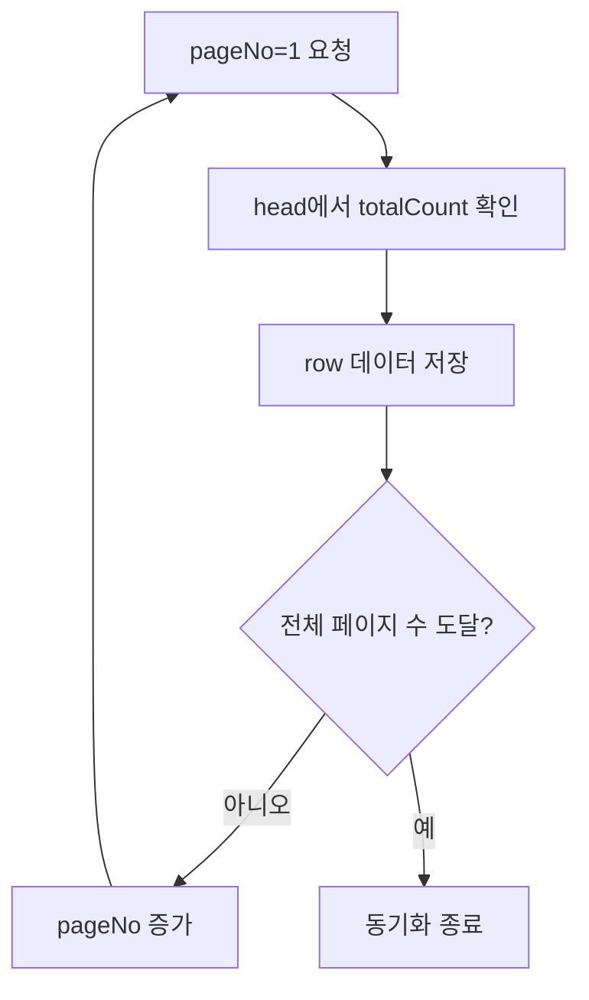
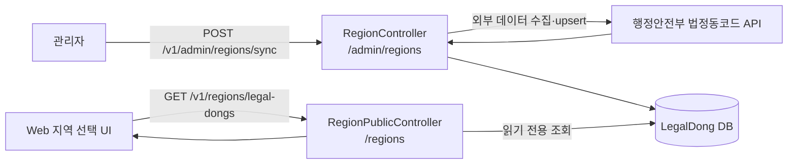
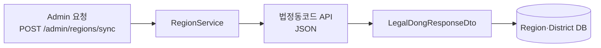

# 행정구역 데이터 API

## 사용 API

행정구역 이름과 법정동 코드를 가져올 때 행정안전부 법정동코드 API를 사용한다.

```txt
https://apis.data.go.kr/1741000/StanReginCd/getStanReginCdList
```

이 API는 행정구역의 이름과 코드 정보를 제공한다.

```txt
좌표 제공      → 하지 않음
지역명·지역코드 → 제공
```

따라서 `Region`, `District`의 지도 중심 좌표는 이 API 응답만으로 결정할 수 없다. 좌표는 별도의 기준으로 정하거나, 영화관 좌표를 이용해 나중에 계산해야 한다.

## 요청 형식

현재 프로젝트는 XML이 아니라 JSON을 사용한다.

```ts
url.searchParams.set('ServiceKey', serviceKey);
url.searchParams.set('type', 'json');
url.searchParams.set('pageNo', '1');
url.searchParams.set('numOfRows', '1000');
```

공식 요청 파라미터:

| 파라미터 | 필수 | 의미 |
| --- | --- | --- |
| `ServiceKey` | 필수 | 공공데이터포털 API 인증키 |
| `pageNo` | 필수 | 현재 페이지 번호 |
| `numOfRows` | 필수 | 페이지당 결과 수 |
| `type` | 필수 | `json` 또는 `xml` |
| `locatadd_nm` | 선택 | 특정 지역명 검색 |

`flag`는 공식 요청 파라미터 목록에 포함되지 않으므로 사용하지 않는다.

## 응답 성공 여부 확인

이 API는 HTTP 상태 코드와 별도로 응답 본문에 자체 처리 결과를 내려준다.

```json
{
  "RESULT": {
    "resultCode": "INFO-0",
    "resultMsg": "NOMAL SERVICE"
  }
}
```

`INFO-0`은 행정안전부 법정동코드 API의 정상 처리 코드다.

```txt
HTTP 200 + resultCode=INFO-0
→ HTTP 통신과 API 처리 모두 성공

HTTP 200 + resultCode가 INFO-0이 아님
→ HTTP 통신은 성공했지만 API 처리 실패

HTTP 4xx 또는 5xx
→ HTTP 요청 자체가 실패
```

따라서 `response.ok`만 확인하면 부족하다. HTTP 요청 성공 후에도 `RESULT.resultCode`를 확인해야 한다.

```ts
private assertLegalDongResponse(data: LegalDongResponseDto): void {
  const headSection = data.StanReginCd?.find((section) => section.head);
  const result = headSection?.head?.find((item) => item.RESULT)?.RESULT;

  if (result?.resultCode !== 'INFO-0') {
    throw new InternalServerErrorException(
      `법정동 코드 API 에러 [${
        result?.resultCode ?? 'UNKNOWN'
      }]: ${result?.resultMsg ?? '응답 형식이 올바르지 않아요.'}`,
    );
  }
}
```

`head[2]`처럼 배열 위치를 고정하지 않고 `RESULT`를 찾아야 한다. 응답 배열의 순서가 변경될 가능성이 있기 때문이다.

## JSON 응답 구조

최상위에 `StanReginCd` 배열이 있고, `head`와 `row`가 서로 다른 배열 원소로 내려온다.

```json
{
  "StanReginCd": [
    {
      "head": [
        {
          "totalCount": 20560
        },
        {
          "numOfRows": "1000",
          "pageNo": "1",
          "type": "JSON"
        },
        {
          "RESULT": {
            "resultCode": "INFO-0",
            "resultMsg": "NOMAL SERVICE"
          }
        }
      ]
    },
    {
      "row": [
        {
          "region_cd": "2717010900",
          "sido_cd": "27",
          "sgg_cd": "170",
          "umd_cd": "109",
          "ri_cd": "00",
          "locatjumin_cd": "2717010900",
          "locatjijuk_cd": "2717010900",
          "locatadd_nm": "대구광역시 서구 원대동3가",
          "locat_order": 9,
          "locat_rm": "",
          "locathigh_cd": "2717000000",
          "locallow_nm": "원대동3가",
          "adpt_de": ""
        }
      ]
    }
  ]
}
```

### 응답 타입 구분

```txt
LegalDongResponseDto
└── StanReginCd: LegalDongSectionDto[]
    ├── head: LegalDongHeadItemDto[]
    │   ├── totalCount
    │   ├── numOfRows
    │   ├── pageNo
    │   ├── type
    │   └── RESULT
    └── row: LegalDongRowDto[]
        ├── region_cd
        ├── sido_cd
        ├── sgg_cd
        ├── umd_cd
        ├── ri_cd
        ├── locatjumin_cd
        ├── locatjijuk_cd
        ├── locatadd_nm
        ├── locat_order
        ├── locat_rm
        ├── locathigh_cd
        ├── locallow_nm
        └── adpt_de
```

## `LegalDong` DB 필드 의미

API의 snake_case 필드는 DB에서 의미가 드러나는 camelCase 필드로 변환해 저장한다.

| DB 필드 | API 필드 | 의미 | 예시 | `null` 가능 여부 |
| --- | --- | --- | --- | --- |
| `regionCode` | `region_cd` | 전체 법정동 코드 | `2717010900` | 불가 |
| `sidoCode` | `sido_cd` | 시·도 코드 | `27` | 불가 |
| `sigunguCode` | `sgg_cd` | 시·군·구 코드 | `170` | 불가 |
| `eupmyeondongCode` | `umd_cd` | 읍·면·동 코드 | `109` | 불가 |
| `riCode` | `ri_cd` | 리 코드 | `00` | 불가 |
| `residentCode` | `locatjumin_cd` | 법정동 주민 코드 | `2717010900` | 불가 |
| `landCode` | `locatjijuk_cd` | 법정동 지적 코드 | `2717010900` | 불가 |
| `addressName` | `locatadd_nm` | 전체 지역 주소명 | `대구광역시 서구 원대동3가` | 불가 |
| `order` | `locat_order` | 지역 정렬 순서 | `9` | 불가 |
| `remark` | `locat_rm` | 지역 비고 | `""` | 가능 |
| `upperCode` | `locathigh_cd` | 상위 지역 코드 | `2717000000` | 불가 |
| `lowestName` | `locallow_nm` | 가장 하위 지역명 | `원대동3가` | 불가 |
| `effectiveDate` | `adpt_de` | 법정동 적용일자 | `""` 또는 `20000101` | 가능 |

### 코드 필드 읽는 순서

```txt
sidoCode             → 시·도
sigunguCode          → 시·군·구
eupmyeondongCode     → 읍·면·동
riCode               → 리
```

예시:

```txt
27 / 170 / 109 / 00
대구광역시 / 서구 / 원대동3가 / 리 없음
```

### `000`, `00`의 의미

상위 단계 지역 행에는 하위 코드가 없으므로 0으로 채워진다.

```txt
시·도 행
  sidoCode=11, sigunguCode=000, eupmyeondongCode=000, riCode=00

시·군·구 행
  sidoCode=11, sigunguCode=110, eupmyeondongCode=000, riCode=00

읍·면·동 행
  sidoCode=11, sigunguCode=110, eupmyeondongCode=101, riCode=00
```

따라서 다음 조건으로 시·도와 시·군·구 목록을 구분할 수 있다.

```ts
// 시·도
sigunguCode === '000' && eupmyeondongCode === '000'

// 시·군·구
sigunguCode !== '000' && eupmyeondongCode === '000'

// 읍·면·동
eupmyeondongCode !== '000'
```

### `null`이 되는 필드

API 응답에서 `locat_rm`, `adpt_de`가 빈 문자열로 내려올 수 있다. 현재 upsert 코드에서는 빈 문자열을 의미 없는 값으로 보고 `null`로 변환한다.

```ts
remark: row.locat_rm || null,
effectiveDate: row.adpt_de || null,
```

```txt
API의 "" → DB의 null
```

반면 코드·이름·정렬 순서 필드는 법정동 데이터 식별과 계층 구분에 필요하므로 필수 필드로 둔다.

### `head`의 역할

`head`는 한 객체로 고정되지 않는다. 세 개의 객체가 배열로 내려온다.

| 객체 | 필드 | 의미 |
| --- | --- | --- |
| 1번째 | `totalCount` | 전체 결과 수 |
| 2번째 | `numOfRows`, `pageNo`, `type` | 페이지 정보와 응답 형식 |
| 3번째 | `RESULT` | 처리 결과 코드와 메시지 |

따라서 다음처럼 `head.totalCount`로 바로 접근하면 안 된다.

```ts
// 잘못된 접근
response.StanReginCd[0].head.totalCount;
```

필요한 head 객체를 찾아서 사용한다.

```ts
const sections = response.StanReginCd ?? [];
const head = sections.find((section) => section.head)?.head ?? [];
const totalCount = head.find((item) => item.totalCount)?.totalCount;
const pageInfo = head.find((item) => item.numOfRows);
const result = head.find((item) => item.RESULT)?.RESULT;
const rows = sections.find((section) => section.row)?.row ?? [];
```

DTO에서는 `head`와 `row`가 1건일 때 객체로 변환되는 경우까지 고려해 배열로 정규화한다.

## 페이지 처리

응답 예시의 `totalCount`가 `20560`, `numOfRows`가 `1000`이므로 한 번 호출하면 전체 데이터가 오지 않는다.

```txt
전체 데이터 20,560건
페이지당 1,000건
필요한 페이지 약 21개
```



현재 `region.service.ts`의 1페이지 호출 코드는 응답 구조 확인용이다. 전체 행정구역을 DB에 저장할 때는 `pageNo`를 증가시키며 모든 페이지를 요청해야 한다.

## Admin 동기화와 Public 조회의 차이

법정동 데이터에는 두 개의 흐름이 있음. 하나는 관리자가 외부 API 데이터를 DB에 동기화하는 작업이고, 다른 하나는 Web이 DB에 저장된 데이터를 읽는 작업임.



| Controller | endpoint | 권한 | 역할 |
| --- | --- | --- | --- |
| `RegionController` | `POST /v1/admin/regions/sync` | 관리자 | 외부 API 호출 및 DB 동기화 |
| `RegionPublicController` | `GET /v1/regions/legal-dongs` | 공개 읽기 | Web 지역 선택 목록 조회 |

`RegionPublicController`는 외부 API를 호출하지 않는다. 관리자 동기화가 끝난 뒤 `LegalDong` DB에서 필요한 지역 필드만 읽어 `LegalDongAreaResponseDto[]`로 반환함.

```txt
관리자 동기화만 필요하고 Web이 지역 데이터를 조회하지 않음
  → RegionPublicController 불필요

Web 지역 선택 UI가 DB의 지역 목록을 사용함
  → RegionPublicController 필요
```

`RegionController`에 public 조회를 섞지 않는 이유는 관리자용 쓰기 작업과 일반 사용자용 읽기 작업의 권한·책임이 다르기 때문임.

## 구현 파일

```txt
apps/api/src/region/
├── region.controller.ts
├── region.module.ts
├── region.service.ts
└── dto/
    ├── legal-dong-response.dto.ts
    ├── legal-dong-section.dto.ts
    ├── legal-dong-head-item.dto.ts
    ├── legal-dong-result.dto.ts
    └── legal-dong-row.dto.ts
```



## 다른 API와 혼동하지 않기

```txt
행정구역 이름·법정동 코드
  → 행정안전부 법정동코드 API

영화관 이름·주소·영화관 좌표
  → Kakao Local 키워드 검색 API

지도에 영화관 표시
  → Leaflet + OpenStreetMap
```

행정구역 API의 `region_cd`와 카카오 영화관 검색 API의 `x`, `y`는 서로 다른 데이터다. 행정구역 API 응답에 영화관 좌표가 있다고 가정하면 안 된다.
