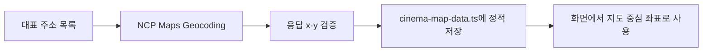

# 영화관 검색 API 기준 — 이전 구현 기록

> [!warning]
> 현재 영화관 수집에는 Naver Place API를 사용하지 않는다. 영화관 검색·DB 동기화는 [카카오 Local 영화관 검색](./kakao.md)으로 전환했다. 이 문서는 Naver 연동을 검토하고 제거하는 과정의 기록으로 보관한다.

## 결론

영화관 검색에는 **NAVER API HUB 지역 검색 API**를 사용한다.

```txt
https://naverapihub.apigw.ntruss.com/search/v1/local
```

현재 프로젝트에서 사용하는 조합은 다음과 같다.

```txt
영화관 검색  → NAVER API HUB 지역 검색 API
지도 표시    → Leaflet + OpenStreetMap
```

NCP Maps의 Dynamic Map이나 존재 여부가 확인되지 않은 `map-place` API를 사용하지 않는다.

## API 제품 구분

영화관 목록 검색과 주소 좌표 변환은 서로 다른 API 제품임.

공식 문서:

- [NAVER API HUB 지역 검색](https://api.ncloud-docs.com/docs/naver-api-hub-search-local)
- [NCP Maps Geocoding](https://api.ncloud-docs.com/docs/ko/application-maps-geocoding)

| 목적 | 제품 | 엔드포인트 | 반환 데이터 |
| --- | --- | --- | --- |
| 영화관 목록 검색 | NAVER API HUB 지역 검색 | `https://naverapihub.apigw.ntruss.com/search/v1/local` | 업체명, 카테고리, 주소, 홈페이지 링크, 좌표 |
| 주소를 좌표로 변환 | NCP Maps Geocoding | `https://maps.apigw.ntruss.com/map-geocode/v2/geocode` | 주소 검색 결과와 `x`·`y` 좌표 |

두 API는 헤더 형식이 비슷해도 같은 API가 아니다. 콘솔 Application에서 각 제품의 사용 API가 선택되어 있어야 하며, 한 제품의 사용 권한을 다른 제품의 권한으로 간주하면 안 된다.

### Application API 선택 누락으로 발생한 403

NCP Maps Application을 만들 때 인증 키만 발급받고 **API 선택에서 Geocoding을 선택하지 않으면** Geocoding 요청이 HTTP 403으로 거절된다.

```txt
console.ncloud.com/maps/application
  → Maps Application 선택
  → Application 수정
  → API 선택에서 Geocoding 체크
  → 저장
```

이때 발생하는 403은 다음 문제가 아니다.

- `query` 주소 형식 문제
- `@Public()` 여부
- Geocoding URL 경로 오타

Geocoding Application 권한이 없는 Client ID·Client Secret으로 요청한 것이 원인이다. 따라서 Maps 키를 발급받은 뒤에도 Application의 API 선택에서 Geocoding이 체크되어 있는지 먼저 확인한다.

### 영화관 목록 검색

```txt
NAVER API HUB → 지역 검색
GET https://naverapihub.apigw.ntruss.com/search/v1/local
```

영화관 이름이나 지역명을 검색해 네이버 지역 서비스에 등록된 업체·기관 목록을 받는다. 검색 결과에 영화관의 이름, 카테고리, 주소, 공식 홈페이지 링크, `mapx`, `mapy`가 포함된다.

### Maps Geocoding

```txt
NCP Maps → Geocoding
GET https://maps.apigw.ntruss.com/map-geocode/v2/geocode
```

주소를 입력해 해당 주소의 좌표를 받는다. 예를 들어 지역 대표 좌표를 만들 때 `서울특별시청`, `부산광역시청`처럼 기준이 명확한 주소를 조회한다.

```txt
GET /map-geocode/v2/geocode?query=서울특별시청
```

응답의 좌표 의미:

```txt
x → 경도(longitude)
y → 위도(latitude)
```

Geocoding 결과는 행정구역의 정확한 도형 중심점이 아니라 입력한 주소의 좌표다. 따라서 지역 대표 좌표를 만들 때는 어떤 주소를 기준으로 조회했는지 기록해야 한다.

### Geocoding 응답 구조

```json
{
  "status": "OK",
  "meta": {
    "totalCount": 1,
    "page": 1,
    "count": 1
  },
  "addresses": [
    {
      "roadAddress": "서울특별시 중구 세종대로 110 서울특별시청",
      "jibunAddress": "서울특별시 중구 태평로1가 31 서울특별시청",
      "englishAddress": "110, Sejong-daero, Jung-gu, Seoul, Republic of Korea",
      "addressElements": [
        {
          "types": ["SIDO"],
          "longName": "서울특별시",
          "shortName": "서울특별시",
          "code": ""
        }
      ],
      "x": "126.9783882",
      "y": "37.5666103",
      "distance": 0
    }
  ],
  "errorMessage": ""
}
```

| 필드 | 의미 |
| --- | --- |
| `status` | 요청 처리 상태. `OK`이면 API 요청 자체는 성공 |
| `meta.totalCount` | 전체 검색 결과 수 |
| `meta.page` | 현재 페이지 |
| `meta.count` | 현재 응답 결과 수 |
| `addresses` | 주소 검색 결과 목록 |
| `roadAddress` | 도로명 주소 |
| `jibunAddress` | 지번 주소 |
| `addressElements` | 시·도, 시·군·구, 도로명 등 주소 구성 요소 |
| `x` | 경도(longitude) |
| `y` | 위도(latitude) |
| `distance` | 검색 중심 좌표와의 거리(m) |
| `errorMessage` | 오류 메시지. 정상 응답에서는 빈 문자열일 수 있음 |

`status`가 `OK`여도 `meta.totalCount`가 `0`이면 검색 결과가 없는 상태다. 이 경우 `addresses`는 빈 배열이다.

응답 DTO는 역할별로 분리한다.

```txt
apps/api/src/maps/dto/
├─ geocoding-query.dto.ts
├─ geocoding-address-element.dto.ts
├─ geocoding-address.dto.ts
├─ geocoding-meta.dto.ts
└─ geocoding-response.dto.ts
```

## Swagger query 중복 문제

DTO를 `@Query()`로 받으면서 controller에 아래 선언을 함께 추가하면 Swagger UI에서 같은 query 필드가 중복으로 표시될 수 있다.

```ts
@ApiQuery({ type: GeocodingQueryDto })
geocode(@Query() dto: GeocodingQueryDto) {}
```

DTO의 `@ApiProperty()` 또는 `@ApiPropertyOptional()`와 `@Query() DTO` 조합만 사용한다.

```ts
@Get()
@ApiOkResponse({ type: GeocodingResponseDto })
geocode(@Query() dto: GeocodingQueryDto) {
  return this.geocodingService.geocode(dto.query);
}
```

### 적용 기준

```txt
DTO 기반 Query
  → DTO 필드에 @ApiProperty 또는 @ApiPropertyOptional 작성
  → controller에서는 @Query() DTO 사용
  → @ApiQuery({ type: DTO })는 중복 선언하지 않음
```

이 기준을 다음 controller에도 적용한다.

- `RegionPublicController.findLegalDongAreas`
- `LobbyBoardController.getMovieChartHistory`
- `LobbyBoardController.getMovieChartStats`
- `MapsGeocodingController.geocode`

단일 원시 query 파라미터를 직접 받는 경우에는 DTO를 사용하지 않고 명시적인 `@ApiQuery({ name: 'query' })`를 사용할 수 있다. DTO 방식과 명시적 `@ApiQuery` 방식을 한 endpoint에서 섞지 않는다.

### 정적 지역 좌표 생성 흐름

지역을 선택할 때마다 Geocoding API를 호출하지 않는다. 최초 데이터 준비 단계에서 대표 주소를 한 번 조회하고, 검증한 결과를 `cinema-map-data.ts`에 저장한다.



정적 좌표만 사용하는 운영 화면에서는 런타임마다 Geocoding API를 호출하지 않는다. 이 경우 Maps 인증키는 운영 화면의 필수 환경변수로 둘 필요가 없다. 반대로 API 서버가 실행 중 Geocoding을 호출한다면 Maps 인증키를 `required()`로 검증해야 한다.

## NCP Maps API와 영화관 검색 API의 차이

### NCP Maps에서 제공하는 공식 기능

NCP Maps 공식 문서의 REST API 목록은 다음과 같다.

```txt
Directions 5/15       → 경로 탐색
Geocoding             → 주소를 좌표로 변환
Reverse Geocoding     → 좌표를 주소로 변환
Static Map            → 지도 이미지를 생성
```

Dynamic Map은 REST 검색 API가 아니다.

```txt
Web Dynamic Map       → 웹 JavaScript API
Mobile Dynamic Map    → Android/iOS SDK
```

따라서 NCP Maps 목록에서 영화관 이름을 검색하고 네이버 지도 장소 ID를 받는 REST API를 찾는 방식으로 진행하지 않는다.

### 현재 선택한 검색 API

지역이나 영화관 이름으로 영화관 검색 결과를 받는 용도다.

```txt
NAVER API HUB 지역 검색 API
→ 영화관 이름, 카테고리, 주소, 공식 홈페이지 링크, 좌표 반환
```

이 API는 NCP Maps API와 다른 검색 API다. 둘을 같은 API로 기록하거나 `네이버 지도 장소 검색 API`라고 부르지 않는다.

## 인증

API 서버에서 제품별 NCP 인증 키를 사용한다.

```txt
X-NCP-APIGW-API-KEY-ID: {제품별 Client ID}
X-NCP-APIGW-API-KEY: {제품별 Client Secret}
```

환경 변수는 네이버 로그인 OAuth 키와 분리한다.

```env
# 네이버 로그인 OAuth
NAVER_CLIENT_ID=네이버_로그인_Client_ID
NAVER_CLIENT_SECRET=네이버_로그인_Client_Secret
NAVER_CALLBACK_URL=네이버_로그인_콜백_URL

# NAVER API HUB 지역 검색
NAVER_API_HUB_CLIENT_ID=NAVER_API_HUB_Client_ID
NAVER_API_HUB_CLIENT_SECRET=NAVER_API_HUB_Client_Secret

# NCP Maps Geocoding
NCP_MAPS_CLIENT_ID=NCP_MAPS_Client_ID
NCP_MAPS_CLIENT_SECRET=NCP_MAPS_Client_Secret
```

브라우저에서 네이버 검색 API를 직접 호출하지 않는다. 인증 키가 노출되므로 CINEMO API 서버가 외부 API를 호출한다.

## 요청 흐름

브라우저 요청:

```txt
GET /v1/naver/cinemas/search?query=강남
```

CINEMO API 서버의 외부 요청:

```txt
GET https://naverapihub.apigw.ntruss.com/search/v1/local
  ?query=강남%20영화관
  &display=5
  &sort=random
```

서비스에서 검색어 뒤에 `영화관`을 붙여 영화관 결과를 우선한다.

## 응답 구조

```json
{
  "lastBuildDate": "Fri, 18 Sep 2026 10:21:31 +0900",
  "total": 5,
  "start": 1,
  "display": 5,
  "items": [
    {
      "title": "CGV 압구정",
      "link": "https://cgv.co.kr/cnm/bzplcCgv/0040001",
      "category": "문화,예술>영화관",
      "description": "",
      "telephone": "",
      "address": "서울특별시 강남구 신사동 603-2",
      "roadAddress": "서울특별시 강남구 논현로 848",
      "mapx": "1270288499",
      "mapy": "375245166"
    }
  ]
}
```

### 주요 필드

| 필드 | 의미 |
| --- | --- |
| `lastBuildDate` | 검색 결과가 생성된 시각 |
| `total` | 검색어와 일치하는 전체 결과 수 |
| `start` | 현재 응답의 시작 위치 |
| `display` | 현재 응답에 포함된 결과 수 |
| `items` | 검색 결과 목록 |
| `title` | 영화관 이름. HTML 태그가 포함될 수 있음 |
| `link` | 영화관 공식 홈페이지 링크. 네이버 지도 장소 ID가 아님 |
| `category` | 장소 카테고리 |
| `description` | 장소 설명 |
| `telephone` | 전화번호 |
| `address` | 지번 주소 |
| `roadAddress` | 도로명 주소 |
| `mapx` | 경도에 10,000,000을 곱한 문자열 |
| `mapy` | 위도에 10,000,000을 곱한 문자열 |

좌표는 Leaflet이 사용하는 `[위도, 경도]` 순서로 변환한다.

```ts
const latitude = Number(item.mapy) / 10_000_000;
const longitude = Number(item.mapx) / 10_000_000;
const position: [number, number] = [latitude, longitude];
```

## 네이버 지도 상세페이지에 대한 기준

지역 검색 API의 `link`는 영화관 공식 홈페이지 주소다.

```txt
link
→ https://cgv.co.kr/...
→ 네이버 지도 장소 ID가 아님
```

따라서 다음과 같은 네이버 지도 장소 상세 URL을 안정적으로 만들 수 없다.

```txt
https://map.naver.com/p/search/영화관이름/place/장소ID
```

`placeId`가 검색 API 응답에 없으므로, 현재 화면에서는 영화관 이름으로 네이버 지도를 검색하는 URL만 사용할 수 있다.

```ts
const mapSearchUrl = `https://map.naver.com/p/search/${encodeURIComponent(
  cinema.name,
)}`;
```

네이버 플레이스의 리뷰·메뉴·사진·상세 운영 정보까지 가져오는 공식 공개 API는 현재 사용하지 않는다. 해당 데이터는 지역 검색 API의 범위를 벗어난다.

## 응답 타입의 역할 구분

세 타입은 이름이 비슷하지만 서로 다른 단계에서 사용한다.

```txt
CinemaSearchItemDto
→ 네이버 API가 반환하는 외부 검색 결과 한 건

CinemaResponseDto
→ CINEMO DB에 저장된 영화관 한 건을 클라이언트에 반환하는 응답

CinemaMapCinema
→ 웹 지도에서 마커와 목록을 표시하기 위해 변환한 프론트엔드 타입
```

### 타입별 데이터 흐름

```mermaid
flowchart LR
    A[NAVER API HUB 지역 검색 API]
    B[CinemaSearchItemDto\n외부 응답 한 건]
    C[(Cinema 테이블\nCINEMO DB)]
    D[CinemaResponseDto\nDB 응답 한 건]
    E[CinemaMapCinema\n지도 표시용 타입]
    F[영화관 목록과 지도 마커]

    A --> B
    B -->|정규화·좌표 변환·upsert| C
    C -->|지역·구 조회| D
    D -->|position: [latitude, longitude]| E
    E --> F
```

### 각 타입의 책임

| 타입 | 위치 | 책임 |
| --- | --- | --- |
| `CinemaSearchItemDto` | API 외부 연동 DTO | 네이버 검색 응답 형식 표현 |
| `CinemaResponseDto` | CINEMO API 응답 DTO | DB 영화관 데이터를 외부에 공개할 형식 정의 |
| `CinemaMapCinema` | 웹 지도 모듈 | 위도·경도를 Leaflet용 `position`으로 변환한 화면 모델 |

외부 API DTO를 프론트 화면에서 직접 사용하지 않는다. 외부 응답을 DB 모델과 CINEMO 응답 DTO로 변환하면 네이버 API 응답 형식이 바뀌어도 웹 화면에 미치는 영향을 줄일 수 있다.

## Swagger와 구현 파일

Swagger:

```txt
http://localhost:3050/api
GET /v1/naver/cinemas/search?query=강남
```

구현 파일:

```txt
apps/api/src/naver/
├─ naver-place.module.ts
├─ naver.controller.ts
   ├─ naver-place.service.ts
   └─ dto/
      ├─ cinema-search-query.dto.ts
      ├─ cinema-search-item.dto.ts
      ├─ cinema-search-response.dto.ts
      └─ cinema-response.dto.ts
```

DTO 응답 구조:

```txt
CinemaSearchResponseDto
  ├─ lastBuildDate
  ├─ total
  ├─ start
  ├─ display
  └─ items: CinemaSearchItemDto[]
       ├─ title
       ├─ link
       ├─ category
       ├─ description
       ├─ telephone
       ├─ address
       ├─ roadAddress
       ├─ mapx
       └─ mapy
```

DB 조회 응답 구조:

```txt
CinemaResponseDto[]
  └─ CinemaResponseDto
       ├─ id
       ├─ brand
       ├─ name
       ├─ category
       ├─ address
       ├─ roadAddress
       ├─ officialUrl
       ├─ latitude
       ├─ longitude
       ├─ region
       └─ district
```

## 오류 기준

### HTTP 401

```json
{
  "error": {
    "errorCode": "210",
    "message": "Permission Denied",
    "details": "A subscription to the API is required."
  }
}
```

키가 틀렸다는 뜻으로만 단정하지 않는다. NCP 콘솔에서 해당 애플리케이션에 **검색 API 이용 권한이 연결되어 있는지** 먼저 확인한다.

### HTTP 500

CINEMO API가 외부 검색 API의 오류를 내부 오류 메시지로 감싼 상태다. 실제 원인은 API 서버 로그의 외부 응답 상태 코드와 응답 본문으로 확인한다.

## 사용하지 않는 방향

다음 방식은 현재 프로젝트 기준으로 선택하지 않는다.

```txt
map-place/v1/search
→ 공식 Maps 목록에서 영화관 검색 API로 확인하지 못한 경로

네이버 지도 내부 상세 API
→ 공식 공개 API가 아니므로 사용하지 않음

Dynamic Map
→ 지도 렌더링용 JavaScript API/SDK이며 영화관 검색 API가 아님
```
