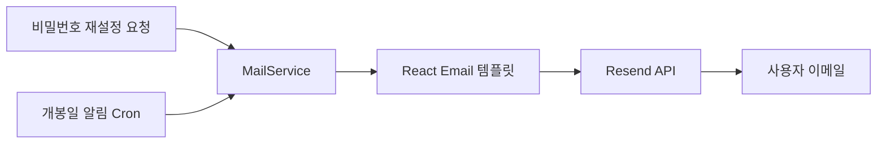
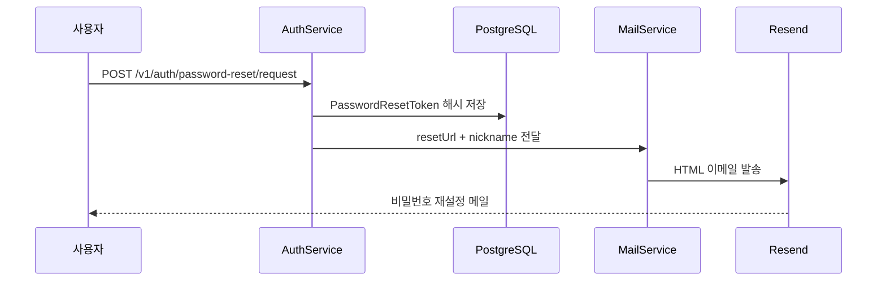
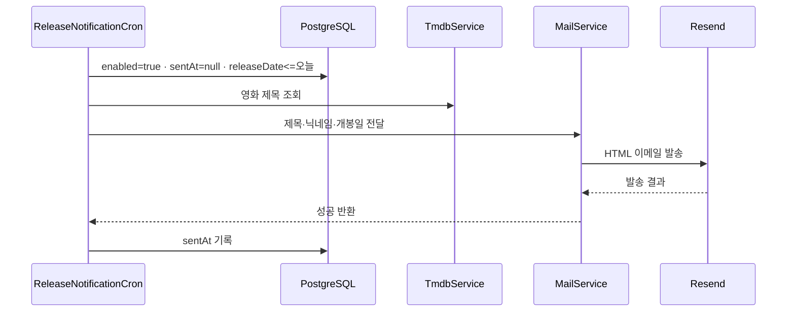
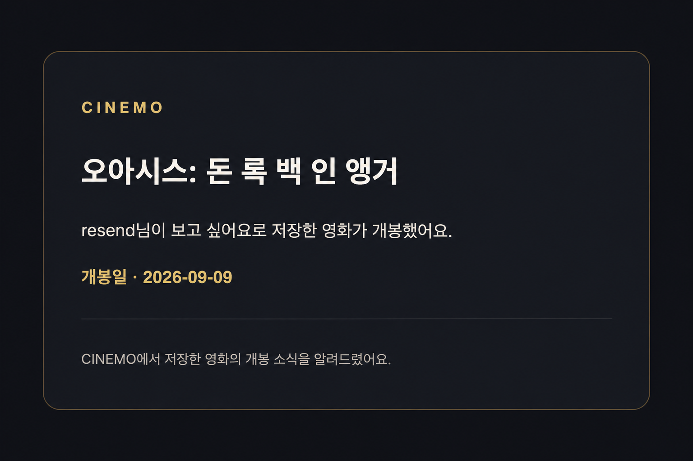

# Resend 이메일 발송

CINEMO API에서 이메일을 발송할 때 사용하는 외부 메일 서비스.

- 비밀번호 재설정 링크 발송
- 개봉일 알림 발송
- React Email로 HTML 생성
- NestJS `MailService`에서 Resend API 호출

## Resend 홈페이지와 역할

[Resend 홈페이지](https://resend.com/)

Resend는 애플리케이션에서 트랜잭션 이메일을 발송하고 발송 상태를 확인하는 메일 서비스.
CINEMO의 API가 메일 HTML을 만든 뒤 Resend API에 발송 요청을 전달.

```txt
CINEMO API
  → React Email: HTML 생성
  → Resend: 발송 요청·전달 상태 관리
  → 사용자 이메일 수신함
```

Resend 대시보드에서 발송 메일의 수신자·제목·전달 상태·HTML 미리보기·로그 확인 가능.

## 전체 흐름



## 연결 파일

```txt
apps/api/src/auth/mail.service.ts
apps/api/src/auth/emails/password-reset-email.tsx
apps/api/src/auth/emails/release-notification-email.tsx
apps/api/src/auth/auth.service.ts
apps/api/src/user-movie/release-notification.cron.ts
apps/api/src/config/env.keys.ts
apps/api/src/config/env.validation.ts
apps/api/.env.example
```

## 설치 패키지

| 패키지 | 버전 | 용도 |
| --- | --- | --- |
| `resend` | `^6.26.0` | Resend SDK와 이메일 발송 |
| `@react-email/components` | `^1.0.12` | 이메일 JSX 컴포넌트 |
| `@react-email/render` | `^2.1.0` | React Email JSX를 HTML로 변환 |
| `react` | `19.2.8` | 이메일 템플릿 렌더링 기반 |
| `react-dom` | `19.2.8` | React 렌더링 런타임 |

## 환경변수

```env
RESEND_API_KEY=re_발급받은_API_키
RESEND_FROM=onboarding@resend.dev
```

| 변수 | 검증 | 용도 |
| --- | --- | --- |
| `RESEND_API_KEY` | 비어 있지 않은 문자열 | Resend 인증 |
| `RESEND_FROM` | 이메일 주소 형식 | 발신자 주소 |

환경변수 등록 위치:

```txt
로컬   apps/api/.env
배포   Railway API Variables
키 목록 apps/api/src/config/env.keys.ts
검증   apps/api/src/config/env.validation.ts
예시   apps/api/.env.example
```

`RESEND_FROM`에는 URL이 아닌 이메일 주소 입력. API 키와 실제 환경변수 파일은 Git에 커밋하지 않음.

## 테스트 발신자를 사용하는 이유

현재 CINEMO는 도메인 인증을 완료한 자체 발신 도메인이 없음. 그래서 개발·테스트 단계에서 테스트용 발신자 주소를 사용.

```env
RESEND_FROM=onboarding@resend.dev
```

여기서 중요한 구분:

| 값 | 코드 위치 | 의미 |
| --- | --- | --- |
| `RESEND_FROM` | `from` | CINEMO 메일의 발신자 주소 |
| 사용자 이메일 | `to` | 실제 메일을 받을 주소 |

`onboarding@resend.dev`를 `RESEND_FROM`에 넣었다고 해서 사용자의 이메일로 발송하지 않는 구조가 아님. 사용자가 `/forgot-password`에 입력한 이메일 또는 알림 대상 사용자의 이메일이 `to`로 전달.

```ts
await this.resend.emails.send({
  from: this.from,
  to: input.to,
  subject,
  html,
});
```

운영 전환 시 Resend 대시보드에서 소유한 도메인을 등록하고 DNS 인증을 완료한 뒤 다음처럼 자체 도메인 발신자 사용.

```env
RESEND_FROM=no-reply@mail.cinemo.example
```

실제 도메인과 주소는 운영 환경에서 확보한 값으로 교체. 도메인 인증과 발신자 설정은 [Resend 도메인 관리 문서](https://resend.com/docs/dashboard/domains/introduction) 참고.

## MailService

`MailService` 생성 시 `EnvKeys.RESEND_API_KEY`와 `EnvKeys.RESEND_FROM`을 필수 조회.

```ts
this.resend = new Resend(
  this.configService.getOrThrow<string>(EnvKeys.RESEND_API_KEY),
);
this.from = this.configService.getOrThrow<string>(EnvKeys.RESEND_FROM);
```

Resend 요청 공통 필드:

```ts
await this.resend.emails.send({
  from: this.from,
  to: input.to,
  subject: '메일 제목',
  html,
});
```

응답의 `error`를 확인하고 발송 실패 시 예외 발생. API 계층에서 실패를 숨기지 않고 호출자에게 전달.

## 비밀번호 재설정 메일



- `POST /v1/auth/password-reset/request`는 공개 endpoint
- 가입하지 않은 이메일에도 같은 안내 문구 반환
- 원본 토큰은 이메일 링크에만 포함
- DB에는 SHA-256 해시만 저장
- 재설정 링크 유효 시간: 30분
- 템플릿: `PasswordResetEmail`
- 메일 제목: `CINEMO 비밀번호 재설정`
- 링크 경로: `${FRONTEND_URL}/reset-password?token=...`

가입하지 않은 이메일에 동일한 응답을 반환하는 이유: 이메일 계정 존재 여부 노출 방지.

## 개봉일 알림 메일



- 실행 주체: NestJS `@Cron()`
- 실행 시각: 매일 오전 9시, `Asia/Seoul`
- 대상: `MovieReleaseNotification`의 `enabled = true`, `sentAt = null`
- 당일 대상 기준: `releaseDate <= KST 오늘`
- 템플릿: `ReleaseNotificationEmail`
- 메일 제목: `{영화 제목} 개봉 알림`
- 성공 후 `sentAt` 기록으로 중복 발송 방지
- 한 건 실패 시 `Logger` 기록 후 다음 알림 처리

개봉일 알림의 저장·상태 API·Cron 수동 테스트는 [../lobby/upcoming.md](../lobby/upcoming.md#개봉일-알림) 참고.

## React Email 템플릿

React Email 컴포넌트는 브라우저 화면용 UI가 아닌 메일 HTML 생성용 컴포넌트.

```ts
const html = await render(
  PasswordResetEmail({
    nickname: input.nickname,
    resetUrl: input.resetUrl,
    expiresInMinutes: 30,
  }),
);
```

현재 템플릿:

| 템플릿 | 사용처 |
| --- | --- |
| `PasswordResetEmail` | 비밀번호 재설정 링크 |
| `ReleaseNotificationEmail` | 개봉일 알림 |

메일 스타일은 앱 CSS와 공유하지 않고 템플릿 내부 인라인 스타일로 관리. 이메일 클라이언트마다 외부 CSS 지원 범위가 다르기 때문.

## 테스트 메일 확인

### 비밀번호 재설정 메일

1. 가입된 사용자 이메일로 `/forgot-password`에서 재설정 요청
2. `AuthService`가 해당 이메일을 `to`로 사용
3. 수신함·스팸함에서 `CINEMO 비밀번호 재설정` 메일 확인
4. 링크 클릭 후 `/reset-password?token=...` 이동 확인

### 개봉일 알림 메일

1. 영화 상세에서 `보고 싶어요` 저장
2. 개봉일 알림 활성화
3. Swagger에서 `POST /v1/release-notifications/cron` 실행하거나 다음 오전 9시 Cron 대기
4. 알림 대상 사용자의 이메일 수신함 확인

수동 Cron 실행에는 `x-cron-secret` 헤더와 `NEST_CRON_SECRET` 값 필요. 테스트 조건과 endpoint는 [lobby/upcoming.md](../lobby/upcoming.md#개봉일-알림) 참고.

### Resend 대시보드에서 확인

[Resend 대시보드](https://resend.com/login) 로그인 후 `Emails` 메뉴에서 발송 기록 선택.

확인 항목:

- 실제 수신자 주소
- 발신자 주소
- 메일 제목
- 전달 상태
- Preview·Plain Text·HTML
- 발송 요청 로그와 실패 원인

Resend 대시보드의 발송 메일 관리 기능은 [Managing Emails](https://resend.com/docs/dashboard/emails/introduction) 참고.

### 개봉일 알림 메일 미리보기

현재 `ReleaseNotificationEmail` 렌더링 결과 예시.



이미지 파일: `docs/assets/release-notification-email.png`

## 확인 순서

1. `RESEND_API_KEY`와 `RESEND_FROM` 등록
2. API 서버 시작 시 환경변수 검증 통과 확인
3. `/forgot-password`에서 가입된 이메일 입력
4. 수신 메일의 비밀번호 재설정 링크 확인
5. 개봉일 알림은 알림 설정 후 수동 Cron endpoint 또는 다음 정기 실행으로 확인

수동 Cron endpoint:

```txt
POST /v1/release-notifications/cron
x-cron-secret: NEST_CRON_SECRET 값
```

## 실패 처리

| 위치 | 처리 |
| --- | --- |
| 환경변수 검증 | API 시작 중단 |
| `resend.emails.send()` 오류 | `MailService`에서 예외 발생 |
| 비밀번호 재설정 요청 | API 오류 응답으로 전달 |
| 개봉일 알림 Cron | NestJS `Logger` 기록 후 다음 알림 계속 처리 |

Resend 장애가 로그인·영화 조회 전체로 확장되지 않도록 메일 발송 기능 경계 안에서 오류 처리.
