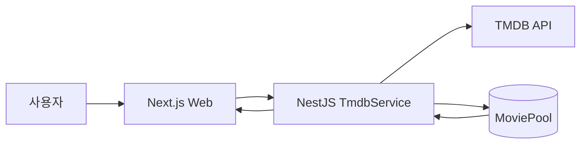
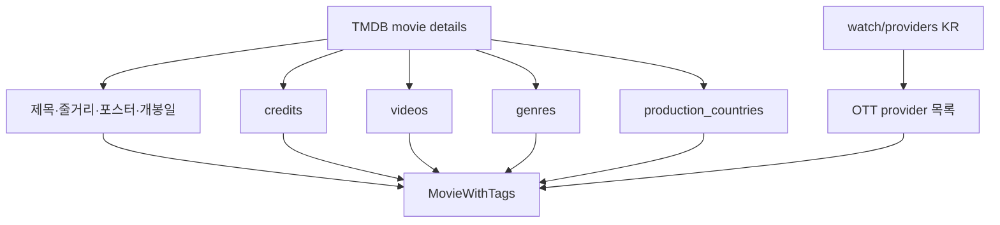
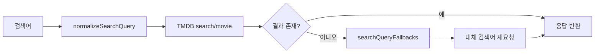
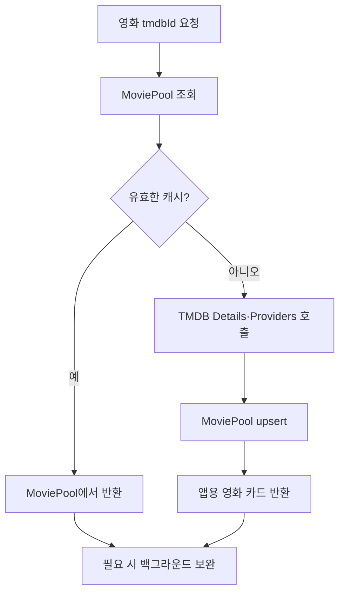
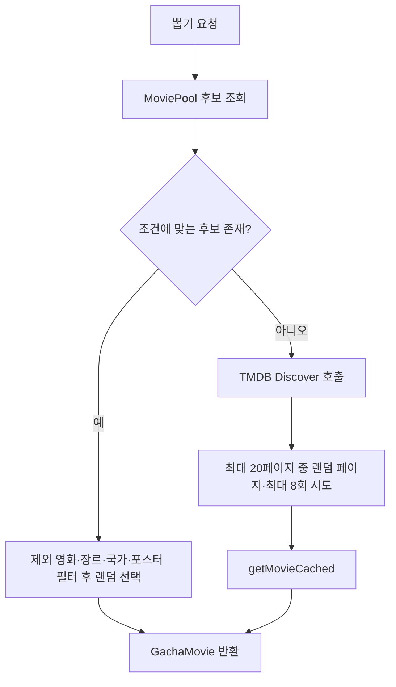

# 외부 API · TMDB 영화 데이터

TMDB는 CINEMO의 영화 메타데이터·포스터·상세 정보 원천.
KOBIS는 국내 극장 박스오피스 원천. 두 API의 역할 분리 기준은 [kobis.md](./kobis.md) 참고.

공식 문서:

- 시작 가이드: <https://developer.themoviedb.org/docs/getting-started>
- API 레퍼런스: <https://developer.themoviedb.org/reference/intro/getting-started>

## CINEMO에서의 역할



| 데이터 | 원천 | CINEMO 사용처 |
|---|---|---|
| 영화 제목·줄거리 | TMDB | 영화 카드·영화 상세 |
| 포스터 경로 | TMDB | 뽑기·개봉 예정·MY CINEMA |
| 개봉일 | TMDB | 개봉 예정·캘린더·개봉일 알림 |
| 감독·출연진 | TMDB Details + credits | 영화 상세 |
| 장르·제작 국가 | TMDB Details | MoviePool 필터 |
| OTT 제공 정보 | TMDB Watch Providers KR | 영화 상세 |
| 국내 극장 순위·누적 관객 수 | KOBIS | 로비 `BOX OFFICE NOW` |
| 사용자 보고 싶어요 수 | CINEMO DB | `UPCOMING INTEREST` |

TMDB의 인기순위와 KOBIS의 국내 극장 순위는 서로 다른 기준.

## 먼저 확인할 코드

```txt
apps/api/src/tmdb/tmdb.controller.ts
  CINEMO API endpoint·권한·query parameter

apps/api/src/tmdb/tmdb.service.ts
  TMDB 요청·응답 변환·MoviePool 캐시·뽑기·provider 보완

apps/api/src/tmdb/tmdb.module.ts
  TmdbService·SeedRunService 등록과 다른 모듈 export

apps/api/src/tmdb/seed-run.service.ts
  수동·cron seed 실행 기록과 진행 상태

packages/shared/src/gacha.ts
  GACHA_MACHINES·GACHA_TMDB_FILTERS·GachaMovie·MovieWithTags

packages/shared/src/lobby-board.ts
  로비 박스오피스·개봉 예정 응답 타입

apps/web/lib/tmdb-api.ts
  Web → CINEMO API 요청 함수와 응답 타입

apps/web/lib/tmdb-image.ts
  posterPath → TMDB 이미지 전체 URL 변환

apps/api/src/config/env.keys.ts
  EnvKeys.TMDB_BASE_URL·TMDB_ACCESS_TOKEN

apps/api/src/config/env.validation.ts
  TMDB 환경변수 검증
```

## 서버에서만 호출하는 이유

TMDB Access Token은 브라우저에 노출하지 않고 API 서버에서만 사용.

```txt
Web → CINEMO API → TMDB
```

서버 호출 기준:

- Access Token 노출 방지
- 브라우저 CORS와 외부 API 호출 분리
- TMDB 요청 실패·rate limit 처리 집중
- MoviePool 캐시와 뽑기 로직 보호
- 관리자 전용 seed·provider override 권한 분리

Web은 TMDB를 직접 호출하지 않고 `/v1/tmdb/*`, `/v1/lobby/*`, `/v1/tickets/*` 등 CINEMO API만 호출.

## 인증 정보와 환경변수

### TMDB 계정과 Access Token

1. <https://www.themoviedb.org/signup> 회원가입
2. Settings → API → Request an API Key
3. API 설정에서 Read Access Token 확인

현재 CINEMO는 v3 API Key query 방식이 아닌 Bearer Access Token 방식 사용.

```env
TMDB_BASE_URL=https://api.themoviedb.org/3
TMDB_ACCESS_TOKEN=발급받은_Read_Access_Token
```

`apps/api/.env`와 Railway API Variables에 등록.
`.env`와 토큰은 Git에 커밋하지 않음.

검증 기준:

```ts
[EnvKeys.TMDB_ACCESS_TOKEN]: Joi.string().required()
[EnvKeys.TMDB_BASE_URL]: Joi.string().uri().default('https://api.themoviedb.org/3')
```

## TMDB 공통 요청

`TmdbService.get()`이 모든 요청에 공통 적용.

```ts
const url = new URL(`${baseUrl}${path}`);

fetch(url, {
  headers: {
    accept: 'application/json',
    authorization: `Bearer ${token}`,
  },
});
```

기본 주소:

```txt
https://api.themoviedb.org/3
```

요청 실패 시 `ServiceUnavailableException`으로 변환.

```txt
TMDB 요청 실패 (상태 코드)
```

## API 경로와 권한

NestJS 전역 prefix가 `v1`이므로 외부 호출 경로는 `/v1/tmdb/...`.

| 메서드 | CINEMO 경로 | 권한 | 역할 |
|---|---|---|---|
| GET | `/v1/tmdb/movie/:movieId` | Public | 영화 상세 조회 |
| GET | `/v1/tmdb/genres` | 로그인 | 장르 목록 조회 |
| GET | `/v1/tmdb/discover` | 로그인 | 머신 필터 기반 영화 조회 |
| GET | `/v1/tmdb/search?q=&page=` | 로그인 | 영화 제목 검색 |
| GET | `/v1/tmdb/seed-pool/latest` | admin | 최근 seed 실행 조회 |
| GET | `/v1/tmdb/seed-pool/progress` | admin | 수동 seed 진행 조회 |
| POST | `/v1/tmdb/seed-pool` | admin | 특정 머신 seed |
| POST | `/v1/tmdb/seed-pool/all` | admin | 전체 머신 seed |
| POST | `/v1/tmdb/seed-pool/cron` | cron secret | 전체 머신 백그라운드 seed |
| GET | `/v1/tmdb/seed-pool/cron/status` | cron secret | cron seed 상태 조회 |
| POST | `/v1/tmdb/seed-pool/cancel` | admin | seed 취소 요청 |
| GET | `/v1/tmdb/provider-overrides?tmdbId=` | admin | OTT 보정 조회 |
| POST | `/v1/tmdb/provider-overrides` | admin | OTT 보정 저장 |

`@Public()`은 JWT 검사를 생략하는 표시. cron endpoint는 JWT 대신 `x-cron-secret` 검사를 별도로 수행.

## 영화 상세 조회

### TMDB 원본 호출

```http
GET /3/movie/{movie_id}
  ?language=ko-KR
  &append_to_response=credits,videos
```

추가 호출:

```http
GET /3/movie/{movie_id}/watch/providers
```

### CINEMO 변환

`getMovie(movieId)`가 TMDB Details 응답을 앱용 `MovieWithTags`로 변환.



```ts
type GachaMovie = {
  id: number;
  title: string;
  overview: string;
  poster_path: string | null;
  release_date: string;
  director: string | null;
  cast?: string[];
  providers: WatchProvider[];
  trailerUrl?: string | null;
};

type MovieWithTags = GachaMovie & {
  genre_ids: number[];
  origin_countries: string[];
};
```

변환 기준:

- 감독: `credits.crew`에서 `job === 'Director'`인 첫 번째 인물
- 출연진: `credits.cast`를 order 기준 정렬 후 상위 5명
- 장르: `genres[].id` → `genre_ids`
- 제작 국가: `production_countries[].iso_3166_1` → `origin_countries`
- 영상: YouTube 영상만 사용하며 공식 `Trailer`를 우선 선택
- `Trailer`가 없을 때만 `Teaser`를 fallback으로 선택
- TMDB의 `Trailer`·`Teaser` 값은 앱 내부의 소문자 `trailer`·`teaser`로 변환
- OTT: 한국(`KR`)의 `flatrate`, `rent`, `buy` 합산

## Discover 영화 조회

### 기본 호출

```http
GET /3/discover/movie
  ?sort_by=popularity.desc
  &language=ko-KR
  &include_adult=false
  &page=1
```

`discoverMovies(filters, page, language)`가 기본 query와 머신별 filter를 합쳐 호출.

| query | 역할 | 예 |
|---|---|---|
| `with_genres` | 장르 필터 | `53` 스릴러 |
| `with_origin_country` | 제작 국가 필터 | `KR` |
| `language` | 제목·줄거리 응답 언어 | `ko-KR` |
| `sort_by` | 정렬 기준 | `popularity.desc` |
| `page` | 페이지 번호 | `1` |
| `include_adult` | 성인 콘텐츠 포함 여부 | `false` |

### CINEMO 머신과 TMDB filter

```ts
const GACHA_TMDB_FILTERS = {
  random: {},
  thriller: { with_genres: '53' },
  action: { with_genres: '28' },
  comedy: { with_genres: '35' },
  romance: { with_genres: '10749' },
  horror: { with_genres: '27' },
  sf: { with_genres: '878' },
  drama: { with_genres: '18' },
  kr: { with_origin_country: 'KR' },
  jp: { with_origin_country: 'JP' },
  us: { with_origin_country: 'US' },
  fr: { with_origin_country: 'FR' },
  gb: { with_origin_country: 'GB' },
  cn: { with_origin_country: 'CN' },
  de: { with_origin_country: 'DE' },
  in: { with_origin_country: 'IN' },
  picks: {},
};
```

```txt
CINEMO 머신 id
  → GACHA_TMDB_FILTERS
  → TMDB Discover query
  → MoviePool genreIds·originCountries 태그
```

`language=ko-KR`은 텍스트 응답 언어 기준. 한국 영화 필터가 아님.
한국 영화 필터는 `with_origin_country=KR` 사용.

## 검색

### TMDB 원본

```http
GET /3/search/movie
  ?query=인셉션
  &language=ko-KR
  &include_adult=false
  &page=1
```

### CINEMO 처리

`searchMovies(query, page)`가 검색어 정규화와 fallback 검색을 적용.



```txt
싱스트리트
  → 싱 스트리트

붙여 쓴 검색어 결과 0건
  → 첫 음절 뒤 공백
  → 필요 시 두 번째 음절 뒤 공백
```

Web 요청 함수:

```ts
searchMoviesRequest(token, q, page = 1)
  → normalizeSearchQuery(q)
  → encodeURIComponent()
  → GET /tmdb/search?q=&page=
```

현재 검색 endpoint는 로그인 필요. 영화 상세 endpoint는 `@Public()`.

## 개봉 예정 영화

로비의 `UPCOMING INTEREST`와 `/upcoming` 페이지가 `LobbyBoardService.getUpcomingMovies()`를 사용.
TMDB Discover 결과를 기본 목록으로 사용하고, KOBIS는 국내 개봉 데이터 매칭과 정렬 보조에 사용.

```txt
GET /3/discover/movie
  region=KR
  release_date.gte=오늘(KST)
  release_date.lte=오늘부터 1년
  with_release_type=2|3
  language=ko-KR
  page=1~3
```

포함 기준:

- 개봉일이 오늘부터 1년 이내
- 제목에 한글 포함
- 제목이 비어 있지 않고 오류 문구가 아님
- `poster_path` 존재
- `클로저`처럼 확인된 잘못된 항목은 별도 제외
- TMDB 상세 조회에서 제목과 개봉일이 확인되는 영화만 최종 유지

```mermaid
flowchart LR
  Discover[TMDB Discover 1~3페이지] --> Merge[TMDB 후보 중복 제거]
  Kobis[KOBIS 개봉 예정 목록] --> Match[한글·영문 제목 alias 매칭]
  Match --> Rank[KOBIS 일치 여부 보조 정렬]
  Merge --> Detail[TMDB 상세 영화 검증]
  Rank --> Detail
  Detail --> Wish[UserMovie kind=wish 집계]
  Wish --> Interest[interestCount]
  Interest --> Board[UPCOMING INTEREST 상위 5개]
  Interest --> Upcoming[/upcoming 전체 목록]
```

로비는 `interestCount` 내림차순과 제목 순으로 정렬 후 상위 5개 표시.

## MoviePool 캐시

MoviePool은 TMDB 응답을 저장하는 CINEMO 내부 영화 캐시.
뽑기·티켓·영화 상세 요청에서 외부 API 반복 호출을 줄이는 역할.



`getMovieCached(movieId, { force })` 기준:

- `force`가 없고 제목이 정상이며 장르 또는 국가 태그가 있으면 MoviePool 반환
- 캐시 miss 또는 `force=true`면 TMDB 상세 조회
- 상세·장르·국가·provider 정보를 MoviePool에 upsert
- `tmdbId`가 MoviePool unique 기준
- provider override를 합친 뒤 앱 응답 반환
- 제목·줄거리·감독 보완은 백그라운드 실행

MoviePool에 저장하지 않는 기준:

- 제목이 비어 있음
- 제목에 `정보를 찾을 수 없습니다.` 포함
- 포스터가 없는 seed 결과

오류 문구가 저장된 오래된 row는 다음 요청에서 TMDB 재조회 대상으로 분류.

## 랜덤 영화 뽑기

`pickRandomMovie(filters, excludeIds)`는 MoviePool 우선, TMDB fallback 순서.



Pool 후보 조건:

- `excludeIds`에 포함된 영화 제외
- 오류 제목 제외
- 포스터 존재
- `with_genres`가 있으면 `genreIds`에 장르 포함
- `with_origin_country`가 있으면 `originCountries`에 국가 포함

티켓 사용 흐름:

```txt
POST /v1/tickets/use
  → watched 영화 tmdbId 제외
  → GACHA_TMDB_FILTERS 기준 pickRandomMovie
  → Ticket에 machineId·tmdbId 저장
  → GachaMovie 반환
```

## OTT 제공 정보

### TMDB 호출

```http
GET /3/movie/{movie_id}/watch/providers
```

현재 `KR` 지역의 `flatrate`, `rent`, `buy`만 사용.

### CINEMO 정리 기준

- provider id 기준 중복 제거
- `1796`을 `8`로 통합: Netflix Standard with Ads → Netflix
- `2`와 `350`이 함께 있으면 `2` 제거: Apple TV → Apple TV+
- `10`과 `119`가 함께 있으면 `10` 제거: Amazon Video → Prime
- provider 이름의 `Standard with Ads`, `with Ads` 문구 제거

최종 앱 타입:

```ts
type WatchProvider = {
  id: number;
  name: string;
  logo_path: string;
};
```

### 관리자 보정

TMDB 정보가 실제 서비스 상황과 다를 때 관리자가 영화별 provider 보정 가능.

```txt
MovieProviderOverride
  → action=add 또는 remove
  → tmdbId·providerId 기준 저장
  → TMDB provider 목록과 merge
```

관리자 endpoint:

```txt
GET  /v1/tmdb/provider-overrides?tmdbId=
POST /v1/tmdb/provider-overrides
```

### 영화 미디어 보정 예정

TMDB에 원하는 예고편·티저가 없거나 포스터가 잘못 연결된 경우를 대비해, 관리자 페이지 재작성 시 `MovieMediaOverride`를 추가할 예정.

- TMDB·`MoviePool` 원본은 직접 수정하지 않음
- 관리자 포스터·영상 override를 별도로 저장함
- `videoType`은 `trailer`와 `teaser`를 구분함
- 관리자 override가 TMDB 기본값보다 우선함
- 비활성화하면 TMDB 기본값으로 복귀함

자세한 모델·검증 규칙은 [MovieMediaOverride](../prisma/admin/movie-media-override.md)에 정리함.

## 포스터 이미지

TMDB 응답의 `poster_path`는 이미지 경로만 제공.

```txt
poster_path: /abc123.jpg
전체 주소:   https://image.tmdb.org/t/p/w500/abc123.jpg
```

Web 변환 위치:

```txt
apps/web/lib/tmdb-image.ts
  tmdbPosterUrl(posterPath, size)
```

주요 크기:

```txt
w185       작은 카드
w342       기본 영화 카드
w500       큰 카드·상세
original   원본 크기
```

포스터 원본 파일을 CINEMO 저장소나 DB에 저장하지 않음.
TMDB `posterPath`와 `tmdbId`만 저장.

## 한국어 데이터 보완

`AiService`를 통한 보완 대상:

- 짧거나 비어 있는 한국어 줄거리
- 한국어가 아닌 제목
- 한국어가 아닌 감독명

보완 흐름:

```txt
한국어 Details 확인
  → 줄거리·제목·감독의 보완 필요 여부 확인
  → 필요 시 en-US Details 재조회
  → AiService로 한국어 보완
  → MoviePool update
```

보완은 요청 응답을 막지 않는 백그라운드 경로와 상세 조회 중 줄거리 보완 경로로 나뉨.
AI 보완 실패가 기본 TMDB 영화 응답 전체 실패로 이어지지 않도록 예외 처리.

## MoviePool seed

seed는 TMDB Discover 여러 페이지를 조회해 MoviePool을 채우는 관리자 운영 기능.

```txt
seedPool(filters, pages)
  → Discover 페이지 조회
  → 포스터 없는 결과 건너뜀
  → getMovieCached(movieId, { force: true })
  → saved·skipped·failed 집계
```

전체 머신 seed:

```txt
seedPoolAll(pages)
  → GACHA_MACHINES 순회
  → 머신별 GACHA_TMDB_FILTERS 적용
  → seedProgress 갱신
  → MoviePoolSeedRun에 실행 기록
```

실행 경로:

```txt
관리자 수동
  POST /v1/tmdb/seed-pool
  POST /v1/tmdb/seed-pool/all

GitHub Actions cron
  POST /v1/tmdb/seed-pool/cron?pages=3
  header: x-cron-secret
```

seed 자세한 실행·Railway·GitHub Actions 내용은 [deploy/github-actions.md](../deploy/github-actions.md) 참고.

## 캐시·실패 처리 기준

### 공통 TMDB 요청

- HTTP 상태가 성공이 아니면 `ServiceUnavailableException`
- Access Token 또는 Base URL이 없으면 API 설정 오류

### 영화 상세·provider

- 상세 조회 실패는 API 오류로 처리
- provider 조회 실패는 빈 provider 배열로 처리
- AI 한국어 보완 실패는 원본 데이터 유지

### 뽑기

- MoviePool 후보가 없으면 Discover fallback
- Discover 결과가 없으면 `TMDB에서 영화를 찾지 못했습니다.`
- 최대 시도 후 포스터 영화가 없으면 `뽑을 수 있는 영화가 없습니다.`

### 로비 박스오피스

KOBIS 데이터는 TMDB 문서가 아닌 [kobis.md](./kobis.md)의 캐시·실패 기준 적용.

## 확인 순서

1. `apps/api/.env`에 `TMDB_ACCESS_TOKEN` 등록
2. `TMDB_BASE_URL=https://api.themoviedb.org/3` 확인
3. API 재시작으로 환경변수 재로드
4. 공개 영화 상세 endpoint로 TMDB 연결 확인
5. 로그인 후 `/v1/tmdb/search?q=...` 확인
6. `/v1/tmdb/discover?machineId=thriller&page=1` 확인
7. `/v1/tickets/use`에서 MoviePool 우선 뽑기 확인
8. `/upcoming`에서 개봉 예정·포스터·관심 수 확인
9. 관리자라면 seed progress와 provider override 확인

공개 영화 상세 확인:

```bash
curl --fail-with-body \
  http://localhost:3050/v1/tmdb/movie/<TMDB_ID>
```

로그인 필요 endpoint는 Swagger 또는 유효한 Bearer token 사용.

## 한계와 개선 대상

- MoviePool 캐시는 Redis가 아닌 PostgreSQL 기반
- 영화 상세 캐시 유효성 판단이 장르·국가 태그 존재 여부에 의존
- 영화명 정확 일치 방식의 포스터 보완은 표기 차이에 취약
- TMDB rate limit에 대한 분산 캐시·재시도 정책 부재
- 다중 API 인스턴스에서 seed progress가 공유되지 않음
- TMDB provider 정보의 지역별 차이를 현재 `KR` 중심으로만 처리
- 포스터 파일 자체를 저장하지 않으므로 TMDB 이미지 정책과 원본 availability 영향

확장 방향:

```txt
Redis 또는 DB 기반 외부 API 캐시
  → 다중 인스턴스 캐시 공유

TMDB id 매칭 보완
  → 영화명 정확 일치 의존도 감소

rate limit 대응
  → 재시도·backoff·요청 큐

provider 지역 정책 확장
  → 사용자 지역 또는 서비스 정책별 provider 조회
```
