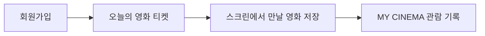
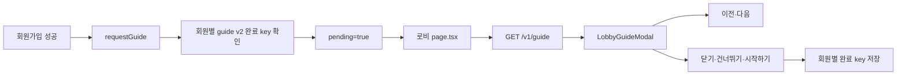

# Web Lobby Guide

회원가입 직후 CINEMO 로비에서 한 번 보여주는 온보딩 가이드.
제품 흐름: 영화 발견 → 저장 → 기록.

## 현재 가이드 단계


| 순서  | ID          | Kicker           | 제목                | 목적                           |
| --- | ----------- | ---------------- | ----------------- | ---------------------------- |
| 1   | `ticket`    | `TODAY'S TICKET` | 오늘의 영화 티켓을 받아보세요  | 매표소에서 티켓을 받고 뽑기방에서 오늘의 영화 발견 |
| 2   | `upcoming`  | `SCREEN`         | 스크린에서 만날 영화를 저장해요 | 개봉 예정작을 `보고 싶어요`로 저장         |
| 3   | `my-cinema` | `MY CINEMA`      | 나만의 영화 기록을 만들어보세요 | 관람 기록을 남기고 포스터를 걸어둠          |


가이드 목적: 기능 목록이 아닌 CINEMO 핵심 사용 흐름 안내.

## 사용자 흐름 요약




회원가입 직후 위 흐름을 3개 단계로 분리해 안내.

## 코드 위치

```txt
packages/shared/src/guide.ts
  GUIDE_STEPS
  DEFAULT_LOBBY_GUIDE_STEPS
  LobbyGuideStep · LobbyGuide · UpdateLobbyGuideInput

apps/api/src/guide/
  guide.module.ts
  guide.controller.ts
  guide.service.ts
  dto/update-lobby-guide.dto.ts

apps/api/prisma/schema.prisma
  LobbyGuide · key="guide" · steps Json

apps/web/lib/guide-api.ts
  getLobbyGuideRequest · updateLobbyGuideRequest

apps/web/lib/guide-store.ts
  회원별 표시 완료 상태 · localStorage

apps/web/components/lobby/LobbyGuideModal.tsx
  단계 조회 · 이전/다음 · 건너뛰기 · 시작하기

apps/web/app/page.tsx
  회원가입 직후 pending 상태일 때 모달 렌더링

apps/web/app/admin/guide/page.tsx
  가이드 편집 · 단계 추가/삭제 · 저장 확인 · 기본값 복원 확인

apps/web/app/styles/admin-guide.css
  로비 가이드 관리자 화면 전용 반응형 CSS
```

공통 관리자 레이아웃: `admin.css`.
가이드 카드·단계 헤더·저장 영역: `admin-guide.css`.
확인 모달: 공통 `ConfirmModal`과 `confirm-modal.css`.

## 표시 흐름




가이드는 로그인이나 일반 재방문 때 자동으로 다시 열리지 않음.
회원가입 성공 시 `requestGuide()`가 호출되고, 완료 처리 후에는 같은 브라우저·사용자 조합에서 다시 열리지 않음.

## 로비 가이드 모달

회원가입 직후 모달: `LobbyGuideModal`.
표시 방식: 전체 가이드 중 현재 단계 하나만 표시.

```txt
상단 닫기 버튼
Kicker
단계 제목
단계 본문
진행 번호: 01 / 03
이전 아이콘 · 건너뛰기 · 다음/시작하기
```

동작 규칙:

- `이전`: 텍스트 대신 `ArrowLeft` 아이콘 버튼
- 첫 단계: 이전 아이콘 버튼 비활성화
- 마지막 단계의 `다음` 버튼: `시작하기`로 변경
- `닫기`, `건너뛰기`, `시작하기`: 가이드 완료 처리
- 모달 바깥 영역 클릭: 가이드 완료 처리
- API 조회 실패: `DEFAULT_LOBBY_GUIDE_STEPS`를 fallback으로 사용
- 단계 수 변경 시 진행 번호 자동 변경
- `role="dialog"`, `aria-modal="true"`, 제목 연결 사용

UI 원칙:

- 본문을 감싸던 큰 네모 박스 제거, 글자 주변 여백만 유지
- 진행 표시: 점 대신 `01 / 03` 형식
- `건너뛰기`: 보조 텍스트 버튼
- `다음`: 주요 텍스트 버튼
- 공통 로비 버튼의 티켓 장식 점은 가이드 모달에서 숨김
- 작은 화면: 모달 내부 스크롤, 버튼은 화면 안에 유지
- 가이드 전용 스타일: `apps/web/app/styles/guide.css`


## 테스트용 모달 미리보기

개발 환경에서 가이드 완료 사용자도 모달을 다시 확인할 수 있도록 미리보기 query 제공.

```txt
http://localhost:3051/?guide=preview
```

동작 조건:

- 로그인된 사용자만 미리보기 실행
- `NODE_ENV=production`에서는 동작하지 않음
- 기존 `localStorage` 완료 상태를 무시하고 모달을 한 번 표시
- 모달 닫기·완료 후 기존 완료 처리 로직 적용
- 실제 회원가입 흐름의 `requestGuide()` 동작에는 영향 없음


## 관리자 확인 모달

관리자 페이지의 저장 작업은 공통 `ConfirmModal`에서 한 번 더 확인 후 실행.

```txt
저장
  현재 가이드 내용을 저장하시겠습니까?
  확인 시 PATCH /v1/guide 실행

기본값으로 되돌리기
  현재 가이드 내용을 기본값으로 되돌리겠습니까?
  확인 시 DEFAULT_LOBBY_GUIDE_STEPS를 DB에 저장
```

저장 완료 문구를 화면 아래에 계속 표시하지 않고, 확인 후 API 결과를 기준으로 편집 상태 갱신.

## 표시 완료 상태

현재 localStorage key:

```txt
cinemo_guide_done:v2:{userId}
```

`v2`: 가이드 내용이 크게 바뀐 시점의 버전 구분자.
기존 `cinemo_guide_done:{userId}`와 분리되어 기존 사용자에게 새 가이드를 다시 보여줄 수 있음.

새로운 큰 가이드 개편: `v3`로 버전 상승.
단순 문구 수정: 관리자 화면에서 저장.

## 단계 데이터 구조

```ts
type LobbyGuideStep = {
  id: string;
  kicker: string;
  title: string;
  body: string;
};
```

관리 규칙:

```txt
단계 수: 1~20개
id: 단계 사이에서 중복 불가
kicker: 최대 64자
title: 최대 128자
body: 최대 200자
빈 값 저장 불가
```

단계 수 변경 시 모달의 점·진행 번호·이전/다음 이동도 함께 변경.

## API


| 메서드   | 경로          | 권한     | 역할           |
| ----- | ----------- | ------ | ------------ |
| GET   | `/v1/guide` | Public | 현재 로비 가이드 조회 |
| PATCH | `/v1/guide` | admin  | 전체 단계 배열 교체  |


PATCH는 부분 수정이 아닌 전체 단계 배열 저장.

```json
{
  "steps": [
    {
      "id": "ticket",
      "kicker": "TODAY'S TICKET",
      "title": "오늘의 영화 티켓을 받아보세요",
      "body": "매표소에서 티켓을 받고 뽑기방에서 오늘의 영화를 발견해요."
    }
  ]
}
```

서버는 저장 전에 ID 중복, 빈 값, 단계 수 검증.

## 기본값과 기존 DB 데이터

`packages/shared/src/guide.ts`의 `DEFAULT_LOBBY_GUIDE_STEPS`: 다음 상황의 기본값.

- `LobbyGuide` 레코드가 처음 생성될 때
- DB의 단계 데이터가 비어 있을 때

기존 관리자가 직접 수정해 저장한 가이드는 자동으로 덮어쓰지 않음.

관리자 화면의 **기본값으로 되돌리기** 사용 시 현재 편집 내용을 기본 4단계로 교체.
확인 모달 재확인 후 DB 저장.

## 관리자 화면 동작

`/admin/guide`에서 다음 작업을 수행.

- ID·Kicker·제목·본문 수정
- 단계 추가
- 단계 삭제
- 저장 전 확인 모달 표시
- 기본값 복원 전 확인 모달 표시
- 저장 중 버튼 비활성화
- ID 중복·빈 값 입력 차단

버튼 동작:

```txt
저장
  "현재 가이드 내용을 저장하시겠습니까?"
  확인 시 현재 입력값을 PATCH로 저장

기본값으로 되돌리기
  "현재 가이드 내용을 기본값으로 되돌리겠습니까?"
  확인 시 DEFAULT_LOBBY_GUIDE_STEPS를 DB에 저장
```

저장 완료 후 별도의 `저장됨` 체크 문구를 계속 노출하지 않고, 다음 조회에서 저장된 값을 다시 불러오는 구조.

## 운영 시 주의점

1. 기본 문구를 코드에서 바꾼 뒤 기존 DB에 반영하려면 관리자 화면에서 저장하거나 **기본값으로 되돌리기** 실행.
2. 가이드 단계 ID 변경 시 기존 사용자 완료 상태와 충돌 여부 확인.
3. 사용자에게 새 가이드를 다시 보여줘야 할 정도의 큰 개편이면 `guide-store.ts`의 버전을 `v3`처럼 상승.
4. 가이드 단계는 실제 접근 가능한 기능만 설명.


## 관련 Prisma 명령

스키마 변경이 있을 때만 마이그레이션 생성.

```bash
pnpm --filter api exec prisma migrate dev --name update_lobby_guide
pnpm --filter api exec prisma migrate deploy
pnpm --filter @cinemo/shared build
```
