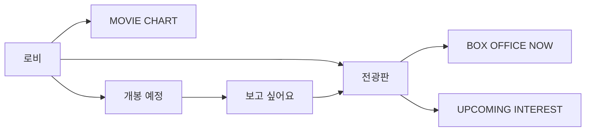

# 로비 문서

로비에서 공개하는 영화 정보와 개봉 예정 기능 문서.

| 문서 | 내용 |
| --- | --- |
| [board.md](./board.md) | 로비 전광판·박스오피스·관심 순위·방문 기록 |
| [moviechart.md](./moviechart.md) | MOVIE CHART 제품 방향·데이터 기준·Snapshot·백필·차트 구현 |
| [upcoming.md](./upcoming.md) | 개봉 예정 목록·상세 모달·관심 등록·캘린더·개봉일 알림 |
| [cinema-map.md](./cinema-map.md) | Region별 영화관 DB 조회·Leaflet 지도·외부 길찾기 링크 |

두 기능은 `LobbyBoardService`와 `UserMovie(kind = wish)`를 통해 연결.
