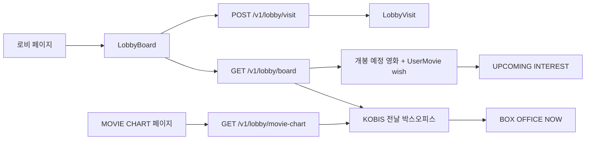
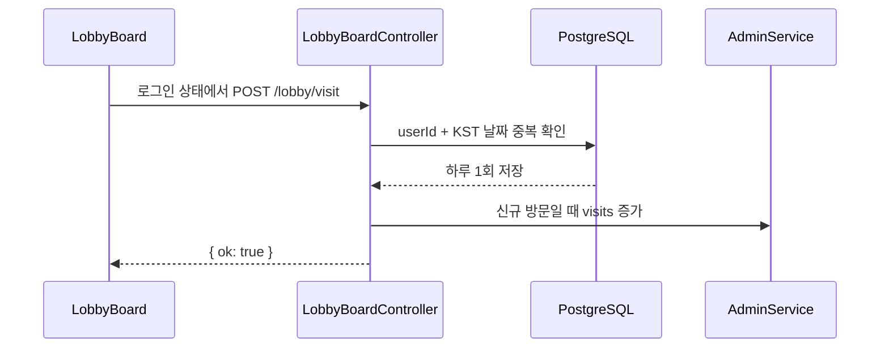
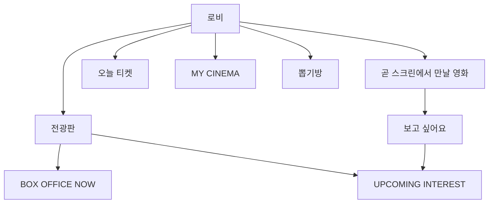

# 로비 전광판

로비에서 영화 관련 공개 정보를 보여주는 전광판.

- `BOX OFFICE NOW`: KOBIS 전날 일일 박스오피스 중 화면에 1~3위 표시
- `UPCOMING INTEREST`: 개봉 예정 영화 중 `보고 싶어요` 등록 수 상위 1~3위 표시
- `MOVIE CHART`: 현재 순위·관객 수·순위 변동을 탐색하는 별도 페이지
- 로비 방문 기록: 로그인 사용자의 하루 단위 방문 집계

로비 전광판은 박스오피스 상위 3개를 표시하고, `MOVIE CHART` 페이지는 별도 API로 전체 순위를 표시함.

## 전체 흐름



## 연결 파일

```txt
apps/web/app/page.tsx
apps/web/components/lobby/LobbyBoard.tsx
apps/web/components/lobby/LobbyBoardSkeleton.tsx
apps/web/lib/lobby-board-api.ts
apps/web/app/styles/lobby.css
apps/web/app/moviechart/page.tsx
apps/web/app/styles/moviechart.css
apps/api/src/lobby-board/lobby-board.controller.ts
apps/api/src/lobby-board/lobby-board.service.ts
packages/shared/src/lobby-board.ts
apps/api/prisma/schema.prisma         LobbyVisit
```

관련 문서:

- MOVIE CHART 제품 방향·기간별 Snapshot 계획: [moviechart.md](./moviechart.md)
- 개봉 예정·관심 등록·알림: [upcoming.md](./upcoming.md)
- KOBIS 연동: [external-api/kobis.md](../external-api/kobis.md)
- TMDB 연동: [external-api/tmdb.md](../external-api/tmdb.md)
- 로비 방문 모델: [prisma/lobby-visit.md](../prisma/lobby-visit.md)
- 공유 응답 타입: [shared.md](../shared.md)

## 전광판 탭

| 탭 | 데이터 원천 | 표시 항목 |
| --- | --- | --- |
| `BOX OFFICE NOW` | KOBIS 전날 일일 박스오피스 | 순위·영화명·누적 관객 수·순위 변동·포스터 |
| `UPCOMING INTEREST` | `UserMovie`의 `kind = wish` 집계 | 관심 순위·영화명·관심 수·개봉일·포스터 |
| `MOVIE CHART` | KOBIS 전날 일일 박스오피스 | 전체 순위·포스터·일일·누적 관객 수·순위 변동 |

탭 전환은 클라이언트 상태로 처리. 탭을 바꿔도 API를 다시 호출하지 않고 이미 받은 응답에서 표시 목록만 변경.

## 전광판 UI 기준

전광판의 목적은 영화 순위와 수치를 빠르게 읽는 것. 장식보다 포스터·제목·수치의 정렬과 고정된 높이를 우선함.

### 로딩 레이아웃

실제 차트와 Skeleton이 서로 다른 박스를 사용하면 `누적 관객수` 라벨과 목록 시작점이 달라져 로딩 완료 순간 화면이 움직임.

- 실제 차트와 Skeleton을 같은 `ChartShell` 내부에 렌더링함
- 라벨 영역을 로딩 전후 항상 유지함
- `LobbyBoardSkeleton`은 실제 포스터·제목·수치 행과 같은 구조를 사용함
- 탭 영역은 로딩 중에도 유지함
- `prefers-reduced-motion: reduce`에서는 shimmer를 중지함

### 순위 행 정렬

데스크톱:

```text
순위 + 순위 변동 | 포스터 | 영화 제목·관객 수
```

모바일:

```text
순위 | 포스터 | 영화 제목·관객 수
```

- 데스크톱은 1~3위를 3열로 표시함
- 모바일은 1~3위를 세로 목록으로 표시함
- 모바일에서도 순위·포스터·제목·수치는 같은 행에 배치함
- 순위 변동이 없는 `—`는 모바일에서 숨김
- 긴 영화 제목은 카드 영역 안에서 줄바꿈하며 잘라내지 않음
- 포스터 URL은 `tmdbPosterUrl()`로 TMDB 경로를 조합함
- 실제 첫 번째 포스터만 Next Image `priority`를 사용하고 나머지는 기본 지연 로딩을 사용함

### 시각 계층

- 탭: `BOX OFFICE NOW`, `UPCOMING INTEREST`
- 순위: 금색 강조
- 포스터: 영화 식별을 돕는 대표 이미지
- 영화 제목: 기본 정보
- 관객 수·관심 수: 금색 수치 강조
- 상승·하락 표시: 보조 정보
- 차트 라벨: `누적 관객수` 또는 `관심 등록수`

관련 스타일: `apps/web/app/styles/lobby.css`

## 박스오피스 조회

`LobbyBoardService.getBoard()`가 KOBIS와 개봉 예정 데이터를 병렬 조회.

```txt
KST 기준 전날 날짜 계산
  → KOBIS dailyBoxOfficeList 요청
  → KOBIS 응답 전체 유지
  → CINEMO MoviePool의 제목으로 포스터 우선 연결
  → MoviePool에서 못 찾은 영화만 TMDB 제목 검색으로 보완
  → BoardBoxOfficeMovie 변환
```

| 필드 | KOBIS 원본 | CINEMO 응답 |
| --- | --- | --- |
| 순위 | `rank` | `rank: number` |
| 영화명 | `movieNm` | `title` |
| 누적 관객 수 | `audiAcc` | `audienceCount` |
| 순위 변동 | `rankInten`, `rankOldAndNew` | `rankChange` |
| 포스터 | KOBIS에 없음 | `MoviePool.posterPath` 우선, 없으면 TMDB 검색 fallback |

### 캐시와 장애 대응

- 동일한 `targetDt`의 성공 응답을 10분간 메모리 캐시
- 외부 요청 실패 시 이전 캐시가 있으면 이전 목록 반환
- API 키가 없거나 KOBIS 응답이 정상이 아니면 빈 목록 반환
- 포스터는 KOBIS가 아닌 `MoviePool`의 영화명 매칭 결과를 우선 사용
- KOBIS 영화명과 `MoviePool.title`이 정확히 일치하지 않아 포스터가 빠질 수 있음
- 포스터가 없는 항목은 `TmdbService.searchMovies(movieNm)`로 보완
- 여러 누락 포스터 검색은 `Promise.all`로 병렬 처리하고, 개별 TMDB 실패는 해당 포스터만 `null` 처리

### 로비와 MOVIE CHART의 개수 차이

`getBoxOfficeMovies()`는 차트 페이지에서 사용할 수 있도록 KOBIS 목록 전체를 유지함.

```txt
getBoxOfficeMovies() → 전체 목록
  ├─ getBoard() → slice(0, 3) → 로비 전광판 TOP 3
  └─ getMovieChart() → 전체 목록 → /moviechart
```

공통 조회 함수 안에서 `list.slice(0, 3)` 또는 `list.slice(0, 5)`를 적용하면 안 됨. 화면별 제한은 각 화면의 service 메서드에서 적용함.

KOBIS 원본 필드와 API 키 설정은 [external-api/kobis.md](../external-api/kobis.md) 참고.

## UPCOMING INTEREST 조회

로비의 관심 순위와 `/upcoming` 목록은 같은 `LobbyBoardService.getUpcomingMovies()`를 사용.

```txt
TMDB Discover 1~3페이지
  → region=KR · 오늘~1년 이내 · 극장 개봉 타입 2|3
  → 한국어 제목·포스터·유효한 개봉일 필터

KOBIS 개봉 예정 목록
  → 한글·영문 제목 alias 매칭
  → 파트·Part·Chapter 표기 차이 보정
  → TMDB 후보를 제거하지 않고 같은 날짜 안에서 보조 정렬

TMDB 상세 검증
  → 제목·개봉일 확인
  → 잘못된 항목 제외

UserMovie(kind=wish)
  → 영화별 관심 수 집계
  → 관심 수 내림차순 · 제목순 정렬
  → API 응답에 상위 5개 포함
  → Web 전광판에서 1~3위 표시
```

`/upcoming`에서 `보고 싶어요`를 추가한 영화는 다음 로비 조회부터 `UPCOMING INTEREST`에 반영.

상세 목록의 필터·페이지네이션·한국 개봉일 기준은 [upcoming.md](./upcoming.md)에서 관리.

## API

```txt
GET  /v1/lobby/board
GET  /v1/lobby/movie-chart
GET  /v1/lobby/upcoming?month=&page=1&limit=10
POST /v1/lobby/visit
```

| API | 인증 | 용도 |
| --- | --- | --- |
| `GET /v1/lobby/board` | `@Public()` | 박스오피스·관심 순위 조회 |
| `GET /v1/lobby/movie-chart` | `@Public()` | KOBIS 박스오피스 전체 순위 조회 |
| `GET /v1/lobby/upcoming` | `@Public()` | 개봉 예정 목록·필터·페이지 조회 |
| `POST /v1/lobby/visit` | 로그인 필요 | 로비 방문 기록 |

## 로비 방문 기록



- `LobbyVisit`의 사용자·방문일 조합으로 하루 중복 방지
- 로그인하지 않은 사용자는 방문 저장 요청 미실행
- 관리자 계정은 방문 기록과 방문 통계에서 제외
- 방문 저장 실패가 전광판 조회와 화면 표시를 막지 않도록 백그라운드 처리

## 공유 타입

`packages/shared/src/lobby-board.ts`에서 API와 Web이 함께 사용하는 타입 정의.

```ts
type BoardBoxOfficeMovie = {
  rank: number;
  title: string;
  audienceCount: number;
  rankChange: number | null;
  posterPath: string | null;
};

type MovieChartMovie = {
  kobisMovieCd: string;
  rank: number;
  title: string;
  dailyAudienceCount: number;
  audienceCount: number;
  rankChange: number | null;
  posterPath: string | null;
};

type MovieChartResponse = {
  items: MovieChartMovie[];
  total: number;
};

type BoardUpcomingInterestMovie = {
  rank: number;
  tmdbId: number;
  title: string;
  releaseDate: string;
  interestCount: number;
  posterPath: string | null;
};

type LobbyBoardResponse = {
  boxOfficeMovies: BoardBoxOfficeMovie[];
  upcomingInterestMovies: BoardUpcomingInterestMovie[];
};
```

## 현재 로비 구성



로비 화면 구성은 [guide.md](../guide.md), 전체 구조는 [architecture.md](../architecture.md) 참고.
