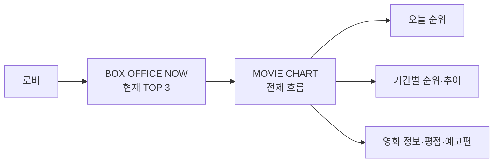
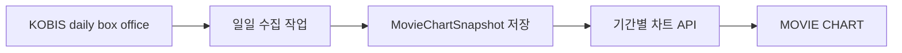

# MOVIE CHART · 영화 흐름을 읽는 차트

`MOVIE CHART`는 영화 데이터를 복잡한 관리자 대시보드처럼 보여주는 페이지가 아니라, 친근한 영화 탐색 화면.
영화를 보다가 다음 궁금증이 생겼을 때 빠르게 확인하는 용도.

- 지금 사람들이 극장에서 가장 많이 본 영화는 무엇인가
- 어제보다 순위가 올라갔거나 내려간 영화는 무엇인가
- 이번 달 영화 관객 흐름은 어땠는가
- 많이 본 영화의 평점과 기본 정보는 어떤가
- 지금 관심을 가질 만한 영화가 무엇인가

## 제품 방향

> [!note]
> `MOVIE CHART`의 핵심은 통계의 양이 아니라 영화 선택에 도움이 되는 흐름을 쉽게 보여주는 것.

### 지향하는 화면

```txt
친근한 영화 차트
  → 오늘의 순위
  → 순위 변동
  → 관객 수
  → 기간별 흐름
  → 평점·포스터·예고편
```

### 피해야 할 화면

- 의미가 불분명한 원형 그래프와 장식용 통계 카드의 과도한 배치
- 실제로 수집하지 않은 데이터를 추정해 표시하는 방식
- 현재 순위와 월간 누적 순위를 같은 숫자처럼 보여주는 방식
- 평점·관객 수·관심 수를 하나의 점수로 임의 합산하는 방식
- 차트를 먼저 만들고 데이터 출처를 나중에 정하는 방식


## 로비와 역할 분리




| 화면               | 역할                  | 기본 표시               |
| ---------------- | ------------------- | ------------------- |
| `BOX OFFICE NOW` | 로비에서 현재 분위기를 빠르게 전달 | KOBIS TOP 3         |
| `MOVIE CHART`    | 순위와 흐름을 자세히 탐색      | 전체 순위·변동·관객 수·기간 선택 |
| `/upcoming`      | 앞으로 개봉할 영화 탐색       | 개봉일·관심 수·상세 정보      |


로비는 요약, `MOVIE CHART`는 탐색으로 역할을 나눈다.
로비의 TOP 3를 그대로 확대하는 페이지가 아니라, 기간과 흐름을 추가로 확인하는 별도 화면.

## 1차 화면 구조

처음부터 여러 그래프를 배치하지 않고 다음 순서로 구성한다.

```txt
MOVIE CHART
├─ 기준일·데이터 출처
├─ 기간 선택
│  ├─ 오늘
│  ├─ 이번 주
│  └─ 월 선택(스냅샷 데이터 준비 후)
├─ 관객이 많이 본 영화 TOP 목록
│  ├─ 순위
│  ├─ 포스터
│  ├─ 제목
│  ├─ 누적 관객 수
│  ├─ 전일 대비 순위 변동
│  └─ 예고편·티저
├─ 기간별 흐름 차트(스냅샷 데이터 준비 후)
└─ 영화 상세 정보·TMDB 평점
```


### 추천 표시 순서

1. `오늘의 박스오피스` 제목과 기준일
2. 1~3위는 시각적으로 강조
3. 4위 이하 전체 목록
4. 기간을 선택하면 해당 기간의 순위·관객 흐름 표시
5. 평점과 예고편은 보조 정보로 표시

모바일에서는 순위 목록을 세로로 유지하고, 데스크톱에서만 넓은 차트 영역을 추가한다.

## 데이터 출처와 의미


### 현재 바로 사용할 수 있는 데이터

현재 `GET /v1/lobby/movie-chart`가 제공하는 값.


| 데이터     | 출처                    | 의미                                |
| ------- | --------------------- | --------------------------------- |
| 현재 순위   | KOBIS                 | 국내 극장 일일 박스오피스 순위                 |
| 일일 관객 수 | KOBIS `audiCnt`       | 기준일 하루 관객 수                       |
| 누적 관객 수 | KOBIS `audiAcc`       | 해당 영화의 누적 극장 관객 수                 |
| 순위 변동   | KOBIS `rankInten`     | 전일 대비 순위 변화                       |
| 신규 진입   | KOBIS `rankOldAndNew` | 신규 영화 여부                          |
| 포스터     | TMDB                  | `posterPath`를 이미지 URL로 변환         |
| 예고편·티저  | TMDB `videos`         | YouTube 공식 Trailer 우선, 없으면 Teaser |
| 평점      | TMDB `vote_average`   | TMDB 사용자 평점                       |


> [!warning]
> 극장 관객 수는 실제 전체 시청자 수가 아니다. OTT 시청자 수와 집에서 본 관객 수는 현재 데이터로 알 수 없다.


### 현재 알 수 없는 데이터

- 메가박스·롯데시네마·CGV별 실제 관객 수
- OTT 서비스별 실제 시청자 수
- CINEMO 사용자의 전체 관람 수를 기반으로 한 대중 순위
- 과거 특정 월의 일별 순위 변화

위 데이터를 표시하려면 별도 수집·저장 구조가 필요하다. 알 수 없는 값을 차트로 추정해 표시하지 않는다.

## 기간별 차트와 Snapshot

현재 KOBIS 응답은 요청 시점의 박스오피스 데이터다. 따라서 현재 응답만으로는 과거 `9월`의 일별 순위 변화를 복원할 수 없다.

월별·주별 상승과 하락을 제공하려면 매일 데이터를 저장해야 한다.




### `MovieChartSnapshot` 도입 기준

향후 다음 필드를 저장하는 방향을 고려한다.


| 필드              | 의미               |
| --------------- | ---------------- |
| `targetDate`    | KOBIS 기준일        |
| `kobisMovieCd`  | KOBIS 영화 식별자     |
| `rank`          | 해당 날짜의 순위        |
| `movieNm`       | 기준일 당시 KOBIS 영화명 |
| `audiCnt`       | 해당 날짜 관객 수       |
| `audiAcc`       | 해당 날짜 누적 관객 수    |
| `rankInten`     | 전일 대비 순위 변동      |
| `rankOldAndNew` | 신규 진입 여부         |


필요한 제약 조건:

```txt
unique(targetDate, kobisMovieCd)
index(targetDate)
index(kobisMovieCd, targetDate)
```


### Snapshot으로 만들 수 있는 기능

- 9월 일별 관객 수
- 특정 영화의 순위 이동선
- 이번 주 상승 영화
- 이번 달 누적 관객 상위 영화
- 순위가 가장 많이 오른 영화
- 특정 날짜의 당시 TOP 10 재현

`MovieChartSnapshot`은 현재 화면을 만들기 위한 필수 선행 작업이 아니다. 먼저 현재 KOBIS 응답을 안정적으로 보여준 뒤, GitHub Actions로 일일 수집을 시작할 때 도입한다.

## 차트 라이브러리 사용 기준

차트 라이브러리는 Snapshot API가 생긴 뒤 도입한다.
현재처럼 오늘 순위와 순위 변동만 보여주는 단계에서는 CSS와 간단한 목록이 더 적합하다.

도입 시 우선순위:

1. 순위 변동을 보여주는 가로 막대 또는 선형 차트
2. 날짜별 관객 수 추이
3. 영화 선택 시 한 영화의 순위 이동

차트 라이브러리 후보는 실제 데이터 구조가 확정된 뒤 비교한다.
라이브러리를 먼저 선택하고 데이터 구조를 맞추지 않는다.

## 평점 표시 기준

평점은 KOBIS 관객 수와 다른 지표이므로 별도로 표시한다.

```txt
관객 수  → 얼마나 많은 사람이 극장에서 봤는가
순위 변동 → 전날보다 관심·관람 흐름이 어떻게 바뀌었는가
TMDB 평점 → TMDB 사용자들이 남긴 평가
```

- 평점이 없으면 빈 값을 `0점`으로 표시하지 않는다
- `vote_count`가 너무 적은 영화는 평점 옆에 표본 수를 함께 고려한다
- KOBIS 관객 수와 TMDB 평점을 합쳐 CINEMO 자체 점수를 만들지 않는다
- 평점은 순위 정렬 기준이 아니라 영화 탐색 보조 정보로 사용한다


## 영상 표시 기준

- YouTube 영상만 사용한다
- 공식 `Trailer`를 먼저 선택한다
- 예고편이 없을 때만 `Teaser`를 선택한다
- 내부 값은 `trailer` 또는 `teaser`로 통일한다
- 영상 종류에 따라 버튼 문구를 `예고편 보기` 또는 `티저 보기`로 표시한다
- Movie Chart와 `/upcoming`, 내 시네마는 공통 `MovieVideoModal`을 사용한다

영상 모달의 자동재생 정책은 [common/dia](../common/dialog.md#영상-모달-재생-정책.md) 참고.

## 구현 연결 파일

```txt
apps/web/app/moviechart/page.tsx
apps/web/app/styles/moviechart.css
apps/web/app/styles/moviechart-modal.css
apps/web/components/moviechart/MovieChartTrailerModal.tsx
apps/web/components/common/MovieVideoModal.tsx
apps/web/lib/lobby-board-api.ts
apps/api/src/lobby-board/lobby-board.controller.ts
apps/api/src/lobby-board/lobby-board.service.ts
apps/api/src/tmdb/tmdb.service.ts
apps/api/src/lobby-board/dto/movie-chart.dto.ts
packages/api-contract/src/generated/api.d.ts
```


## 단계별 구현 순서


### 1단계 · 현재 데이터 안정화

- KOBIS 전체 순위 표시
- 순위·누적 관객 수·일일 관객 수·순위 변동 표시
- 포스터 URL 보정
- 예고편·티저 공통 모달 연결
- Skeleton과 모바일 목록 정렬 확인


### 2단계 · 영화 탐색 강화

- TMDB 평점·평점 참여 수 추가
- 영화 상세 정보 연결
- 기간 선택 UI의 기준일 명시
- 현재 순위와 누적 관객 수의 의미를 명확히 표시


### 3단계 · 기간별 차트

- `MovieChartSnapshot` 모델 추가
- GitHub Actions에서 일일 KOBIS 수집
- 기간별 API 추가
- 차트 라이브러리 도입
- 9월·이번 주·영화별 순위 이동 제공


## 완료 기준

- 숫자의 출처와 기준일을 화면에서 확인할 수 있음
- 순위 변동의 방향과 전일 대비 의미가 명확하다
- 평점과 관객 수를 혼동하지 않는다
- 데이터가 없는 기간을 임의의 0 또는 그래프로 표시하지 않는다
- 모바일에서는 복잡한 대시보드가 아닌 읽기 쉬운 세로 목록으로 표시한다
- 현재 데이터로 가능한 기능과 Snapshot 이후 가능한 기능이 문서와 코드에서 구분됨

