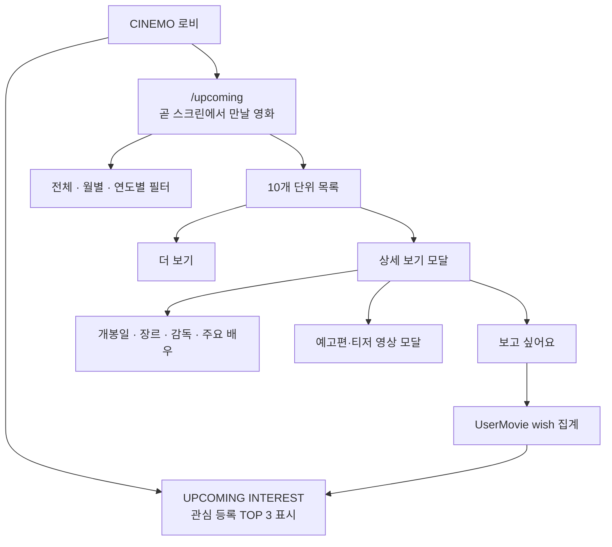
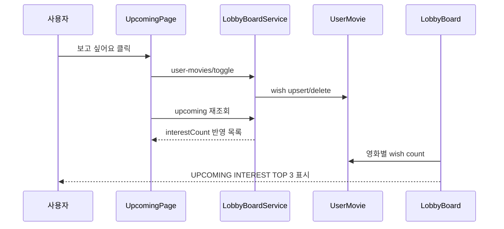
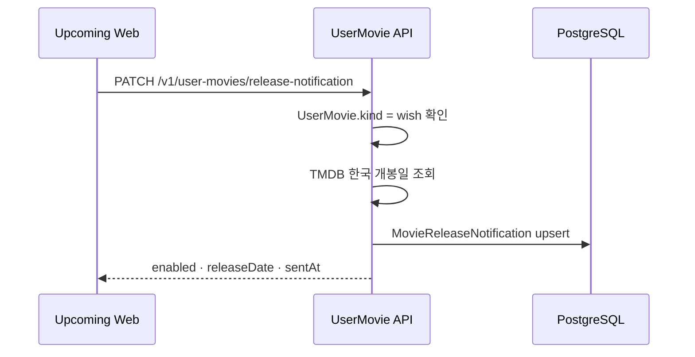
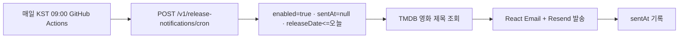

# UPCOMING · 곧 스크린에서 만날 영화

개봉 예정 영화 확인과 `보고 싶어요` 저장 기능.
저장 수는 로비의 `UPCOMING INTEREST` 순위와 연결.

현재 문서 기준: `/upcoming` 페이지와 `LobbyBoardService.getUpcomingMovies()` 구현.



## 연결 파일

```txt
apps/web/app/upcoming/page.tsx
apps/web/app/styles/upcoming.css
apps/web/app/styles/movie-detail-modal.css
apps/web/app/styles/moviechart-modal.css
apps/web/app/styles/confirm-modal.css
apps/web/lib/lobby-board-api.ts
apps/web/lib/tmdb-api.ts
apps/web/components/upcoming/UpcomingMovieListSkeleton.tsx
apps/web/components/my-cinema/MovieDetailModal.tsx
apps/web/components/common/MovieVideoModal.tsx
apps/web/components/my-cinema/MovieDetailModalSkeleton.tsx
apps/api/src/lobby-board/lobby-board.controller.ts
apps/api/src/lobby-board/lobby-board.service.ts
apps/api/src/tmdb/tmdb.controller.ts
apps/api/src/tmdb/tmdb.service.ts
apps/api/src/user-movie/user-movie.controller.ts
apps/api/src/user-movie/user-movie.service.ts
apps/api/src/user-movie/release-notification.service.ts
apps/api/src/user-movie/release-notification.controller.ts
apps/api/src/auth/mail.service.ts
apps/api/src/auth/emails/release-notification-email.tsx
packages/shared/src/lobby-board.ts
packages/shared/src/gacha.ts
```

`UpcomingMovie`와 `UpcomingMoviesResponse`: `apps/web/lib/lobby-board-api.ts`에서 정의.

외부 영화 API의 원본 호출은 [external-api/tmdb.md](../external-api/tmdb.md), 관련 Prisma 모델은 [prisma/movie/user-movie.md](../prisma/movie/user-movie.md)와 [prisma/movie/movie-release-notification.md](../prisma/movie/movie-release-notification.md) 참고.

## 영화 목록 조회

```txt
GET /v1/lobby/upcoming?month=2026-09&page=1&limit=10
```

```ts
type UpcomingMoviesResponse = {
  items: UpcomingMovie[];
  total: number;
  hasNext: boolean;
};
```

서버 필터 기준:

- 기준 날짜: `Asia/Seoul`의 오늘 날짜
- 오늘부터 최대 1년 이내의 개봉 예정작만 조회
- `region=KR`과 극장 개봉 타입 `2|3` 사용
- 제목에 한글이 포함된 영화만 노출
- 포스터가 없거나 제목이 비어 있는 영화 제외
- TMDB Discover 1~3페이지를 기본 후보로 사용하며 `MoviePool`을 목록 원본으로 합치지 않음
- KOBIS 개봉 예정 데이터가 있으면 TMDB의 한글 제목·영문 원제와 KOBIS 한글·영문 제목을 비교함
- `파트`, `Part`, `Chapter` 같은 속편 표기 차이와 같은 개봉일의 제목 prefix 차이를 보정함
- KOBIS 갱신이 늦어도 TMDB의 정상 영화 후보를 제거하지 않음
- TMDB 상세 조회에서 제목·개봉일이 확인되는 영화만 최종 노출
- 잘못 확인된 `클로저`는 별도 제외
- 개봉일 오름차순 정렬
- 관심 수는 `UserMovie.kind = wish`를 영화별로 집계

## 기간 필터와 더 보기

기간 탭은 현재 KST 기준 계산.

```txt
전체 → YYYY-MM 현재 월 → YYYY-MM 다음 달 → YYYY-MM 다다음 달 → YYYY+1년
```

선택한 기간은 URL의 `month` query에 반영.

```txt
/upcoming
/upcoming?month=2026-09
/upcoming?month=2027
```

처음에는 10개 표시. `더 보기` 클릭 시 다음 10개를 기존 목록 뒤에 추가. 월별 조회에서도 오늘보다 이전 날짜가 다시 노출되지 않도록 서버에서 `fromDate`를 오늘 이후로 보정.

## 목록 UI

- 페이지 헤더의 기대감 표현 아이콘: `lucide-react`의 `Sparkles`
- 로딩·오류·결과 없음 상태 분리
- 초기 목록 로딩 시 실제 카드 구조를 유지하는 `UpcomingMovieListSkeleton` 표시
- 초기 로딩은 Skeleton 카드 6개, `더 보기` 로딩은 Skeleton 카드 2개 표시
- 모바일 카드 2열 유지, 버튼은 하단 별도 행 배치
- 카드 표시 항목: 포스터·제목·개봉일·관심 등록 수·`보고 싶어요`·`상세 보기`
- KST 기준 개봉일이 오늘이면 `오늘 개봉` 표시
- `오늘 개봉`: 캡슐형 버튼이 아닌 왼쪽 금색 포인트의 메타 라벨
- `오늘 개봉`과 관심 등록 수는 서로 다른 줄에 배치
- 비로그인 상태에서 관심 등록 클릭 시 로그인 후 `/upcoming`으로 복귀
- 목록 스타일: `upcoming.css`
- 첫 번째 화면 포스터만 Next Image `priority`를 사용하고 나머지는 기본 지연 로딩
- 상세 모달 스타일: `movie-detail-modal.css`

### Skeleton 로딩

`loading`과 `loadingMore`를 구분함.

```txt
selectedPeriod 초기 조회
  → UpcomingMovieListSkeleton 6개

더 보기 요청
  → 기존 영화 목록 유지
  → UpcomingMovieListSkeleton 2개를 목록 뒤에 추가
```

Skeleton은 실제 카드와 같은 포스터·영화 정보·액션 버튼 영역을 사용해 조회 전후 카드 위치가 크게 변하지 않도록 함. 모바일에서는 실제 카드와 동일하게 포스터 왼쪽, 영화 정보와 버튼 오른쪽 구조를 유지함.

구현 위치:

- 구조: `apps/web/components/upcoming/UpcomingMovieListSkeleton.tsx`
- 스타일: `apps/web/app/styles/upcoming.css`
- 적용 화면: `apps/web/app/upcoming/page.tsx`

## 상세 모달 로딩·포커스 처리

상세 버튼과 상세 모달은 같은 `Dialog.Root` 안에서 관리함.

```txt
Dialog.Root
├─ Dialog.Trigger asChild
│  └─ 상세 보기 버튼
└─ MovieDetailModalSkeleton 또는 MovieDetailModal
   └─ Dialog.Portal · Overlay · Content
```

- `upcoming/page.tsx`에서 영화 카드별 `Dialog.Root`를 렌더링함
- 실제 상세 버튼을 `Dialog.Trigger asChild`로 감쌈
- `MovieDetailModal`은 자체 `Dialog.Root`를 만들지 않고 `Dialog.Portal`과 `Dialog.Content`만 렌더링함
- `detailMovieId`를 먼저 설정해 상세 API 응답 전에도 모달을 열 수 있게 함
- 상세 API 응답 전에는 `MovieDetailModalSkeleton`을 표시함
- Skeleton과 실제 모달은 `movie-detail-modal.css`의 같은 최소 높이·포스터 비율·본문 레이아웃을 사용해 전환 시 크기가 변하지 않게 함
- 모달이 닫히면 `detailMovieId`와 `detailMovie`를 함께 초기화함
- `Dialog.Trigger`가 실제 opener를 알고 있으므로 닫힌 뒤 원래 `상세 보기` 버튼으로 focus가 복원됨

상세 정보 요청과 개봉일 알림 상태 요청의 처리 기준:

- `getMovieDetailRequest()`는 모달 콘텐츠를 그리기 위해 기다림
- 개봉일 알림 요청은 동시에 시작하되 모달 표시를 막지 않음
- 알림 요청 실패는 `false`로 처리하고 상세 모달은 계속 표시함
- 상세 API 요청이 끝난 뒤에야 모달을 열던 기존 순차 구조를 사용하지 않음

관련 구현:

- 모달 연결: `apps/web/app/upcoming/page.tsx`
- 모달 내용: `apps/web/components/my-cinema/MovieDetailModal.tsx`
- 모달 Skeleton: `apps/web/components/my-cinema/MovieDetailModalSkeleton.tsx`
- 모달·Skeleton 스타일: `apps/web/app/styles/movie-detail-modal.css`

## 상세 보기 모달

`GET /v1/tmdb/movie/:movieId`는 `append_to_response=credits,videos`로 상세 정보를 조합.

- 포스터·제목·장르 태그
- 개봉일·감독·주요 배우 최대 5명
- 줄거리
- YouTube 예고편·티저 URL이 있을 때만 영상 버튼
- 하트 아이콘으로 `보고 싶어요` 상태 변경
- 캘린더 아이콘으로 개봉일 `.ics` 일정 열기

개봉 예정 영화 모달에서는 `봤어요`를 표시하지 않음. 관심 등록과 관람 기록 기능의 용도 분리.

### 예고편·티저 영상 모달

상세 모달의 `예고편 보기` 또는 `티저 보기` 버튼은 새 브라우저 탭으로 이동하지 않고, CINEMO 공통 영상 모달을 엶.

```txt
MovieDetailModal
└─ Dialog.Root
   ├─ Dialog.Trigger asChild
   │  └─ 예고편 보기 / 티저 보기 버튼
   └─ MovieVideoModal
      └─ Dialog.Portal · Overlay · Content · YouTube iframe
```

- Movie Chart와 `/upcoming`, 내 시네마가 같은 `MovieVideoModal`을 재사용함
- 영상 종류에 따라 제목과 버튼을 `예고편` 또는 `티저`로 표시함
- 영상이 로드되는 동안 `MovieChartTrailerSkeleton`을 표시함
- iframe이 차단되거나 일정 시간 안에 로드되지 않으면 YouTube 썸네일과 `YouTube에서 보기` fallback을 표시함
- 모달을 열 때 자동 재생하지 않음. 사용자가 영상 내부의 재생 버튼을 클릭해야 재생함
- 자동재생을 사용하지 않는 이유는 예기치 않은 소리, 모바일 브라우저 제한, 명확한 사용자 의도 때문임
- `loading="eager"`는 iframe 우선 로드 설정이며 자동 재생 설정이 아님

관련 구현:

- 공통 영상 모달: `apps/web/components/common/MovieVideoModal.tsx`
- 영화차트 연결: `apps/web/components/moviechart/MovieChartTrailerModal.tsx`
- 상세 모달 연결: `apps/web/components/my-cinema/MovieDetailModal.tsx`
- 영상 모달 스타일: `apps/web/app/styles/moviechart-modal.css`

### 개봉일 캘린더

상세 모달의 캘린더 아이콘은 현재 브라우저에서 `.ics` 파일을 열어보는 방식.

```txt
GET /api/calendar/movie?tmdbId=&title=&releaseDate=
```

- `releaseDate`가 있을 때만 캘린더 아이콘 표시
- 서버에서 `text/calendar` 형식의 iCalendar 생성
- `Content-Disposition: inline`으로 브라우저 열기
- 일정 제목: `개봉 예정 · {영화 제목}`
- 하루 전 `VALARM` 표시 알림 포함
- 캘린더 구독을 유발하는 `webcal://` 방식은 현재 미사용
- 상대 경로 사용으로 localhost와 Vercel 배포 환경에 대응
- Apple Calendar의 새 이벤트 화면 직접 열기는 미지원

브라우저에서 직접 `.ics`를 생성하는 [apps/web/lib/movie-calendar.ts](../../apps/web/lib/movie-calendar.ts)는 날짜 문서의 [영화 달력 구현 기준](../date/movie-calendar.md)에서 함께 관리한다. 현재 상세 모달은 서버의 `/api/calendar/movie` route 사용.

### 캘린더 아이콘 접근성

- 시각적으로 `CalendarPlus` 아이콘만 표시
- 링크에 영화 제목을 포함한 `aria-label` 지정
- `aria-describedby`로 툴팁 연결
- 툴팁은 `role="tooltip"`만 사용. `aria-hidden` 동시 사용 금지
- hover와 keyboard focus 모두에서 툴팁 표시
- 예고편·티저 모달 버튼과 캘린더 아이콘은 액션 그룹으로 묶고 충분한 간격 배치

접근성 속성의 상세 규칙은 [Web 접근성 문서](../web/aria.md)에 기록.

### 개봉일 불일치 오류 기록

증상:

```txt
목록 카드: 2026.09.XX 개봉 예정
상세 모달: 2026.04.30 개봉일
```

원인:

- 목록 API: `region=KR`인 TMDB Discover 응답의 한국 극장 개봉일 사용
- 상세 모달: `/v1/tmdb/movie/:movieId`의 기본 상세 응답 `release_date` 사용
- TMDB 기본 상세 응답과 한국 지역 개봉일이 다를 수 있음

해결 기준:

- UPCOMING 목록의 한국 지역 개봉일을 화면 기준값으로 사용
- `apps/web/app/upcoming/page.tsx`에서 상세 정보 조회 후 목록의 `UpcomingMovie.releaseDate`를 `movie.release_date`에 반영
- UPCOMING 카드와 상세 모달의 개봉일을 동일하게 표시
- `MovieDetailModal` 내부에서 개봉일을 임의로 재계산하지 않음

> [!warning] 날짜 기준
> UPCOMING 화면에서는 TMDB 상세 기본 날짜보다 `GET /v1/lobby/upcoming`의 한국 지역 개봉일을 우선. 국가별 개봉일이 다른 영화에서도 같은 오류가 생기지 않도록 이 기준 유지.

## 줄거리 보완 규칙

TMDB 한국어 줄거리가 비어 있거나 지나치게 짧은 경우에만 영어 원문을 다시 조회해 활성 AI Provider로 번역.

```txt
짧은 줄거리 판정
  · 빈 문자열
  · 80자 미만
  · 문장 수 2개 미만
```

AI에는 등장인물·관계·배경·사건·갈등·목표·위협의 유지와 임의 요약·사실 창작 방지를 요청. 보정 결과는 `MoviePool`에 저장해 같은 영화의 반복 호출을 줄임. AI 실패 시 원문 또는 영어 원문으로 fallback.

## UPCOMING INTEREST 연결



관심 등록 수는 개인의 찜 목록과 로비 공개 순위를 같은 `wish` 데이터로 연결.

## 검증 체크리스트

- 전체·월별·연도별 필터와 URL 쿼리 확인
- 초기 조회와 `더 보기` 요청 중 Skeleton 카드가 실제 카드 구조를 유지하는지 확인
- 10개 이후 `더 보기`가 중복 없이 동작하는지 확인
- 포스터 없는 영화·한글 제목 없는 영화가 제외되는지 확인
- 관심 등록 후 수치가 증가하고 새로고침 후 유지되는지 확인
- 상세 정보가 없는 항목은 해당 행·버튼을 숨기는지 확인
- 상세 모달의 캘린더 아이콘이 `.ics`를 브라우저에서 여는지 확인
- 캘린더 아이콘을 hover·keyboard focus했을 때 툴팁이 표시되는지 확인
- AI 프롬프트 변경 후 API 서버 재시작 및 상세 모달 재요청
- API/Web TypeScript 검증과 `git diff --check` 통과 확인

## 개봉일 알림

`보고 싶어요`로 저장한 영화에 개봉일 알림을 설정하고, 개봉일에 Resend 이메일 발송.

### 저장 흐름



알림이 `보고 싶어요` 영화에만 연결되는 이유: 관심 목록에서 삭제된 영화의 알림 대상 유지 방지.

### 발송 흐름



- 실행 주체: GitHub Actions `.github/workflows/release-notification.yml`
- 실행 시각: 매일 KST 오전 9시, workflow 기준 UTC 00:00
- `releaseDate`: KST 기준 `@db.Date` 저장
- 발송 대상: `enabled = true`, `sentAt = null`, 개봉일이 오늘 또는 이전인 row
- React Email의 `ReleaseNotificationEmail`: `@react-email/render`로 HTML 변환
- Resend 발송 성공 후 `sentAt` 기록
- 한 영화 발송 실패와 다른 사용자의 알림 처리 분리
- 발송 오류: `console.error`가 아닌 NestJS `Logger` 기록

### 오늘 개봉 영화의 알림 시점

오늘 개봉인 영화도 알림 대상에 포함.

```txt
releaseDate <= 오늘(KST)
```

- 오전 9시 Cron 실행 전에 알림을 켜면 당일 발송 대상
- 오전 9시 이후 알림을 켜면 즉시 발송하지 않고 다음 Cron 실행 때 발송
- 알림 설정 시 즉시 메일을 보내지 않고 정기 Cron 발송만 사용

### API

```txt
GET   /v1/user-movies/release-notification?tmdbId=
PATCH /v1/user-movies/release-notification
POST  /v1/release-notifications/cron
```

`POST /v1/release-notifications/cron`은 GitHub Actions가 정기 호출하며 Swagger에서도 수동 실행할 수 있는 endpoint.

- `x-cron-secret` 헤더 필요
- 값은 API의 `CRON_SECRET` 환경변수와 일치
- GitHub Actions에서는 `CINEMO_CRON_SECRET`을 사용하며 Railway의 `CRON_SECRET`과 같은 값을 등록
- Swagger: `http://localhost:3050/api`
- Swagger에서 `Try it out` → `x-cron-secret` 입력 → `Execute` 순서로 실행

### 상태 의미

```txt
enabled = 사용자가 현재 알림을 켰는지
sentAt  = 실제 이메일 발송이 끝난 시각
```

`sentAt`은 발송 예정 시각이 아닌 실제 발송 완료 시각. 성공 이후에만 기록하며, `sentAt != null`인 row는 다음 Cron에서 제외해 중복 발송 방지.

### UI 안내 모달

보고 싶은 영화로 저장하지 않은 상태에서 벨을 누르면 `ConfirmModal` 표시.

- 아이콘·`개봉일 알림`·제목 중앙 정렬
- `보고 싶어요 추가`를 우선 버튼으로 표시
- `취소`를 보조 버튼으로 표시
- 모바일에서는 제목 줄바꿈과 아이콘 간격을 별도 조정

### 최근 UI 확인 항목

- 오늘 개봉 영화에서 `오늘 개봉` 라벨이 제목 아래에 자연스럽게 배치되는지 확인
- 라벨이 관심 등록 버튼처럼 보이지 않고 카드의 보조 메타 정보로 보이는지 확인
- 금색 배경·테두리가 과하게 강조되지 않는지 확인
- 모바일에서 제목·오늘 개봉 라벨·관심 등록 수가 겹치지 않는지 확인
