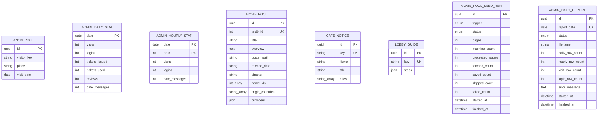
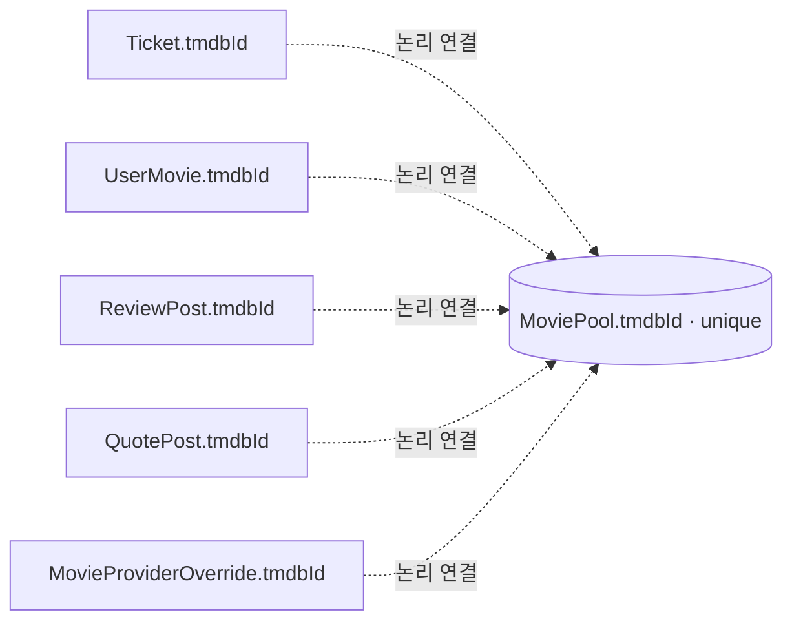
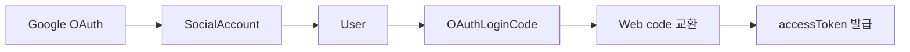
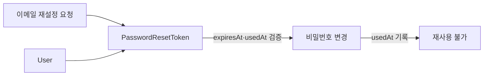

# Prisma · ER · 데이터 모델

현재 CINEMO 데이터 구조를 설명하는 기준 문서임.

> [!important] 단일 기준
> 실제 DB 모델의 기준은 [`apps/api/prisma/schema.prisma`](../../apps/api/prisma/schema.prisma)임. 이 문서의 ER과 설명이 다르면 `schema.prisma`와 migration을 먼저 확인함.

## 읽는 순서

1. 아래 ER — 실제 FK 관계와 도메인 경계 파악
2. [current-model.md](./current-model.md) — 사용자 행동이 어떤 테이블에 기록되는지 확인
3. [../web/admin.md](../web/admin.md) · [../web/tmdb.md](../web/tmdb.md) — 운영 데이터와 시드 흐름 확인
4. [future-model.md](./future-model.md) — 아직 구현하지 않은 미래 설계 확인

## 현재 ER

아래 다이어그램은 **실제 Prisma relation이 있는 FK**만 관계선으로 표시함. `tmdbId`로 연결되는 영화 콘텐츠 관계는 FK가 아니므로 별도 다이어그램으로 분리함.

```mermaid
erDiagram
  USER ||--o{ TICKET : owns
  USER ||--o{ USER_MOVIE : marks
  USER ||--o{ REVIEW_POST : writes
  USER ||--o{ REVIEW_POST_LIKE : likes
  USER ||--o{ QUOTE_POST : writes
  USER ||--o{ QUOTE_POST_BOOKMARK : saves
  USER ||--o{ LOBBY_VISIT : visits
  USER ||--o{ CAFE_TABLE_SEAT : sits
  USER ||--o{ CAFE_MESSAGE : sends
  USER ||--o{ ADMIN_LOGIN_LOG : creates
  USER ||--o{ MOVIE_PROVIDER_OVERRIDE : creates
  USER ||--o{ SOCIAL_ACCOUNT : connects
  USER ||--o{ OAUTH_LOGIN_CODE : receives
  USER ||--o{ PASSWORD_RESET_TOKEN : requests
  REVIEW_POST ||--o{ REVIEW_POST_LIKE : receives
  QUOTE_POST ||--o{ QUOTE_POST_BOOKMARK : receives
 CAFE_TABLE_SESSION ||--o{ CAFE_TABLE_SEAT : contains
  CAFE_TABLE_SESSION ||--o{ CAFE_MESSAGE : contains

  USER {
    uuid id PK
    string email UK
    string nickname UK
    enum role
    json avatar_config
    string bio
    boolean profile_public
    string_array tags
    enum last_login_provider
  }
  SOCIAL_ACCOUNT {
    uuid id PK
    uuid user_id FK
    enum provider
    string provider_account_id UK_with_provider
    datetime created_at
    datetime updated_at
  }
  OAUTH_LOGIN_CODE {
    uuid id PK
    uuid user_id FK
    string code_hash UK
    datetime expires_at
    datetime consumed_at
    datetime created_at
  }
  PASSWORD_RESET_TOKEN {
    uuid id PK
    uuid user_id FK
    string token_hash UK
    datetime expires_at
    datetime used_at
    datetime created_at
  }
  TICKET {
    uuid id PK
    uuid user_id FK
    date ticket_date UK_with_user
    enum status
    string machine_id
    int tmdb_id
  }
  USER_MOVIE {
    uuid id PK
    uuid user_id FK
    int tmdb_id
    enum kind
    datetime watched_at
    boolean is_displayed
    int display_order
    int wall_slot
  }
  REVIEW_POST {
    uuid id PK
    uuid user_id FK
    int tmdb_id
    float rating
    text body
  }
  REVIEW_POST_LIKE {
    uuid id PK
    uuid post_id FK
    uuid user_id FK
    datetime created_at
  }
  QUOTE_POST {
    uuid id PK
    uuid user_id FK
    int tmdb_id
    string movie_title
    text text
    boolean use_poster_background
    datetime created_at
    datetime updated_at
  }
 QUOTE_POST_BOOKMARK {
   uuid id PK
   uuid quote_post_id FK
   uuid user_id FK
    datetime create_at
 }
  LOBBY_VISIT {
    uuid id PK
    uuid user_id FK
    date visit_date UK_with_user
  }
  CAFE_TABLE_SESSION {
    string table_id PK
    string label
    enum access
  }
  CAFE_TABLE_SEAT {
    string table_id PK_FK
    uuid user_id PK_FK
    datetime joined_at
  }
  CAFE_MESSAGE {
    uuid id PK
    string table_id FK
    uuid user_id FK
    text body
  }
  ADMIN_LOGIN_LOG {
    uuid id PK
    uuid user_id FK
    datetime logged_at
  }
  MOVIE_PROVIDER_OVERRIDE {
    uuid id PK
    int tmdb_id
    int provider_id
    enum action
    uuid created_by FK
  }
```

## User FK가 없는 모델

운영·콘텐츠·비로그인 데이터를 User 원장과 분리함.



## `tmdbId` 논리 연결

`MoviePool`은 영화 메타데이터 저장소임. `Ticket`, `UserMovie`, `ReviewPost`, `QuotePost`, `MovieProviderOverride`가 가진 `tmdbId`는 애플리케이션 규칙으로 연결되며, Prisma FK는 아님.



이 구조를 사용하는 이유:

- 영화 메타데이터 동기화와 사용자 활동 원장을 독립적으로 운영
- MoviePool 영화가 삭제·재수집되어도 티켓·후기 원장 보존
- TMDB API 장애가 사용자 활동 데이터의 FK 무결성을 막지 않음
- 대신 조회 시 MoviePool 누락을 `없음/동기화 필요` 상태로 처리해야 함

## 모델 역할

| 영역 | 모델 | 역할 | User FK |
|---|---|---|---|
| 회원 원장 | `User` | 로그인·권한·닉네임·프로필 | - |
| 회원 활동 | `Ticket` | KST 하루 티켓 1장·뽑기 결과 | 있음 |
| 회원 활동 | `UserMovie` | 찜·봤어요·선반·MY CINEMA 포스터 전시 | 있음 |
| 콘텐츠 활동 | `ReviewPost`·`ReviewPostLike` | 영화 후기·좋아요 | 있음 |
| 콘텐츠 활동 | `QuotePost`·`QuotePostBookmark` | 명대사 작성·저장 | 있음 |
| 로비 통계 | `LobbyVisit` | 로그인 회원의 하루 로비 입장 | 있음 |
| 비로그인 통계 | `AnonVisit` | 후기방 구경 방문자 | 없음 |
| 영화 저장소 | `MoviePool` | TMDB 영화 메타데이터·가챠 후보 | 없음 |
| 카페 | `CafeTableSession`·`CafeTableSeat`·`CafeMessage` | 테이블·착석·메시지 | Seat/Message에 있음 |
| 카페 콘텐츠 | `CafeNotice` | 카페 공지 싱글톤, `key=cafe` | 없음 |
| 로비 콘텐츠 | `LobbyGuide` | 회원가입 직후 온보딩 싱글톤, `key=guide` | 없음 |
| 관리자 원장 | `AdminLoginLog` | 로그인 이력 | 있음 |
| 관리자 통계 | `AdminDailyStat`·`AdminHourlyStat` | 날짜·시간대 카운터 스냅샷 | 없음 |
| 리포트 실행 | `AdminDailyReport` | 어제 Excel 생성 상태·시트별 건수·오류 | 없음 |
| 영화 운영 | `MovieProviderOverride` | 영화별 제공처 add/remove 덮어쓰기 | 생성자 있음 |
| 시드 운영 | `MoviePoolSeedRun` | cron·수동 시드 실행 결과와 진행 상태 | 없음 |
| 계정 복구 | `PasswordResetToken` | 이메일 비밀번호 재설정용 일회성 토큰 | 있음 |

## Unique·복합키·주요 Index

| 모델 | 제약 | 의미 |
|---|---|---|
| `User` | `email`, `nickname` | 로그인 식별자·닉네임 중복 방지 |
| `SocialAccount` | `(provider, providerAccountId)` | 외부 provider 계정 1개를 CINEMO User에 연결 |
| `OAuthLoginCode` | `codeHash` | Google callback과 Web token 교환 사이의 일회용 code |
| `PasswordResetToken` | `tokenHash` | 이메일 재설정 링크의 원문 대신 저장하는 해시 |
| `Ticket` | `(userId, ticketDate)` | 회원별 KST 하루 1장 |
| `UserMovie` | `(userId, tmdbId, kind)` | 같은 영화·같은 목록 중복 방지 |
| `ReviewPostLike` | `(postId, userId)` | 회원별 후기 좋아요 1개 |
| `QuotePost` | `(userId, tmdbId, text)` | 같은 영화·문구 중복 방지 |
| `QuotePostBookmark` | `(userId, quotePostId)` | 회원별 명대사 저장 1개 |
| `LobbyVisit` | `(userId, visitDate)` | 회원별 하루 로비 방문 1개 |
| `AnonVisit` | `(visitorKey, place, visitDate)` | 브라우저·장소별 하루 방문 1개 |
| `CafeTableSeat` | `(tableId, userId)` | 한 테이블의 회원 착석 1개 |
| `CafeNotice` | `key` | 카페 공지 싱글톤 |
| `LobbyGuide` | `key` | 로비 가이드 싱글톤 |
| `MoviePool` | `tmdbId` | 영화 콘텐츠 식별자 |
| `MovieProviderOverride` | `(tmdbId, providerId, action)` | 같은 제공처 규칙 중복 방지 |
| `AdminHourlyStat` | `(date, hour)` | 날짜·시간대 카운터 1개 |
| `AdminDailyReport` | `reportDate` | 날짜별 Excel 실행 결과 1개 |

### 인증 관련 모델

소셜 계정 연결과 OAuth callback용 일회성 교환 code는 `User`와 직접 연결된 현재 모델임. 비밀번호나 access token을 이 모델에 저장하지 않음.



| 모델 | 핵심 필드 | 용도 |
|---|---|---|
| `User` | `lastLoginProvider` | 최근 로그인 provider 기록: `email`, `google`, `naver`, `kakao`, `apple` |
| `SocialAccount` | `provider`, `providerAccountId` | 이메일이 아닌 provider의 고유 계정 식별자 저장 |
| `OAuthLoginCode` | `codeHash`, `expiresAt`, `consumedAt` | callback에서 Web로 전달할 짧은 수명의 일회용 code 관리 |

`OAuthLoginCode`는 원문 code를 저장하지 않고 hash만 저장함. `consumedAt IS NULL`과 만료 시간 조건을 함께 검사한 뒤 원자적으로 소비하여 새로고침·중복 요청·React Strict Mode 중복 교환을 막음.

### 비밀번호 재설정 모델

`PasswordResetToken`은 이메일 재설정 링크의 원문 토큰을 저장하지 않고 SHA-256 해시만 저장함.



| 필드 | 역할 |
|---|---|
| `userId` | 재설정 대상 User 연결 |
| `tokenHash` | 링크 원문 대신 저장하는 SHA-256 해시·unique |
| `expiresAt` | 토큰 만료 시각 |
| `usedAt` | 성공적으로 사용된 시각·`null`이면 미사용 |
| `createdAt` | 토큰 발급 시각 |

재설정 요청이 새로 들어오면 해당 User의 미사용 토큰을 먼저 삭제함. 비밀번호 변경은 토큰 검증과 `User.passwordHash` 갱신을 하나의 transaction으로 처리하고, 성공 후 `usedAt`을 기록함. `tokenHash`는 `tokenHash` unique와 `userId`, `expiresAt` index를 사용함.

`UserMovie` 포스터 전시:

```txt
is_displayed = true  → MY CINEMA 포스터 벽에 표시
wall_slot             → 1~3번 포스터 칸
display_order         → 현재는 wall_slot과 같은 값으로 저장

별도 Poster 테이블 없음
  · 이미지·제목은 저장하지 않음
  · tmdbId로 MoviePool/TMDB 메타데이터를 조회해 조합
```

`UserMovie` 관람일:

```txt
kind = watched  → watched_at에 관람일 저장
kind = wish     → watched_at = null
영화 1편당 관람일 1개만 저장
  · @@unique([userId, tmdbId, kind]) 유지
  · 반복 관람 이력은 별도 movieViewingHistory 모델이 필요함
```

주요 조회 최적화:

- `ReviewPost.createdAt DESC` — 최신 후기 조회
- `LobbyVisit.visitDate`, `visitedAt` — 로비 방문 통계
- `CafeMessage(tableId, createdAt DESC)` — 테이블별 최신 메시지
- `AdminLoginLog.loggedAt DESC`, `(userId, loggedAt DESC)` — 관리자 이력 조회
- `MovieProviderOverride.tmdbId` — 영화별 제공처 덮어쓰기 조회
- `MoviePoolSeedRun.startedAt` — 최근 시드 실행 결과 조회
- `AdminDailyReport.startedAt DESC` — 최근 Excel 실행 결과 조회

## 현재 enum

```txt
UserRole                     user | admin
LoginProvider                email | google | naver | kakao | apple
AuthProvider                 google | naver | apple | kakao
UserMovieKind                wish | watched
TicketStatus                 issued | used
CafeTableAccess              open | locked
MovieProviderOverrideAction  add | remove
MoviePoolSeedRunStatus       running | succeeded | partial | failed | cancelled
MoviePoolSeedTrigger         cron | manual
AdminDailyReportStatus       running | succeeded | failed
```

`Ticket`에 `none` row를 만들지 않음. 당일 row 없음이 `none`이며, 발급 시 `issued`, 뽑기 완료 시 `used`로 변경됨.

## 마이그레이션 규칙

```bash
# 로컬 개발: schema 변경 + migration 생성 + 적용
pnpm --filter api exec prisma migrate dev --name 변경_이름

# Prisma Client 생성
pnpm --filter api exec prisma generate

# Railway 배포: 이미 생성된 migration만 적용
pnpm --filter api exec prisma migrate deploy
```

변경 순서:

1. `schema.prisma` 모델·enum·relation 수정
2. 로컬 DB에서 migration 생성
3. 생성된 SQL과 ER 문서 확인
4. API build로 Prisma Client 타입 확인
5. 배포 환경에서는 `migrate deploy` 실행

> [!warning] 금지
> DB에 직접 컬럼을 추가하고 migration 파일을 생략하지 않음. 나중에 Railway·Neon·로컬의 스키마가 갈라지는 원인이 됨.

## 미래 설계

실제 DB에 없는 모델은 [future-model.md](./future-model.md)에서만 관리함.

- `Draw` — 티켓과 뽑기 결과를 별도 원장으로 분리
- `NoteReply` — 뽑기 쪽지 답장
- `Inquiry` — 고객센터
- `Currency` — 방별 유료 재화
- 하루 엑셀 — `AdminDailyStat` 기반 운영 리포트
