# CINEMO Prisma 구조

현재 기준: `apps/api/prisma/schema.prisma`

## 전체 관계

```mermaid
erDiagram
  USER ||--o{ SOCIAL_ACCOUNT : has
  USER ||--o{ OAUTH_LOGIN_CODE : creates
  USER ||--o{ PASSWORD_RESET_TOKEN : receives
  USER ||--o{ USER_MOVIE : records
  USER ||--o{ TICKET : receives
  USER ||--o{ LOBBY_VISIT : visits
  USER ||--o{ ADMIN_LOGIN_LOG : logs
  USER ||--o{ MOVIE_PROVIDER_OVERRIDE : creates
  USER ||--o{ MOVIE_RELEASE_NOTIFICATION : configures
  USER ||--o{ POSTCARD : creates
  USER ||--o{ POSTCARD_BOOKMARK : saves
  USER ||--o{ POSTCARD_REACTION : reacts
  USER ||--o{ POSTCARD_COMMENT : writes
  USER ||--o{ POSTCARD_COMMENT_REACTION : reacts
  POSTCARD ||--o{ POSTCARD_BOOKMARK : saved_by
  POSTCARD ||--o{ POSTCARD_REACTION : receives
  POSTCARD ||--o{ POSTCARD_COMMENT : has
  POSTCARD_COMMENT ||--o{ POSTCARD_COMMENT : replies
  POSTCARD_COMMENT ||--o{ POSTCARD_COMMENT_REACTION : receives

  USER {
    uuid id PK
    string email UK
    string nickname UK
    UserRole role
  }
  SOCIAL_ACCOUNT {
    uuid id PK
    uuid user_id FK
    AuthProvider provider
    string provider_account_id
  }
  OAUTH_LOGIN_CODE {
    uuid id PK
    uuid user_id FK
    string code_hash UK
    datetime expires_at
    datetime consumed_at
  }
  PASSWORD_RESET_TOKEN {
    uuid id PK
    uuid user_id FK
    string token_hash UK
    datetime expires_at
    datetime used_at
  }
  USER_MOVIE {
    uuid id PK
    uuid user_id FK
    int tmdb_id
    UserMovieKind kind
  }
  TICKET {
    uuid id PK
    uuid user_id FK
    date ticket_date
    TicketStatus status
    int tmdb_id
  }
  MOVIE_POOL {
    uuid id PK
    int tmdb_id UK
    string title
    string release_date
  }
  LOBBY_VISIT {
    uuid id PK
    uuid user_id FK
    date visit_date
  }
  ADMIN_LOGIN_LOG {
    uuid id PK
    uuid user_id FK
    datetime logged_at
  }
  ADMIN_DAILY_STAT {
    date date PK
    int visits
    int logins
  }
  ADMIN_HOURLY_STAT {
    date date PK
    int hour PK
    int visits
    int logins
  }
  MOVIE_PROVIDER_OVERRIDE {
    uuid id PK
    int tmdb_id
    int provider_id
    MovieProviderOverrideAction action
    uuid created_by FK
  }
  LOBBY_GUIDE {
    uuid id PK
    string key UK
    json steps
  }
  MOVIE_POOL_SEED_RUN {
    uuid id PK
    MoviePoolSeedTrigger trigger
    MoviePoolSeedRunStatus status
    datetime started_at
  }
  ADMIN_DAILY_REPORT {
    uuid id PK
    date report_date UK
    AdminDailyReportStatus status
    int daily_row_count
  }
  MOVIE_RELEASE_NOTIFICATION {
    uuid id PK
    uuid user_id FK
    int tmdb_id
    date release_date
    boolean enabled
    datetime sent_at
  }
  POSTCARD {
    uuid id PK
    uuid user_id FK
    int tmdb_id
    string movie_title
    text original_text
    string text
    string poster_path
    boolean is_public
    boolean is_pinned
  }
  POSTCARD_BOOKMARK {
    uuid id PK
    uuid postcard_id FK
    uuid user_id FK
  }
  POSTCARD_REACTION {
    uuid id PK
    uuid postcard_id FK
    uuid user_id FK
    string emoji
  }
  POSTCARD_COMMENT {
    uuid id PK
    uuid postcard_id FK
    uuid user_id FK
    uuid parent_id FK
    string text
  }
  POSTCARD_COMMENT_REACTION {
    uuid id PK
    uuid comment_id FK
    uuid user_id FK
    string emoji
  }
```



## 구조 읽는 순서

1. `User`: 사용자와 인증 기준
2. `UserMovie`, `Ticket`: 사용자 영화 활동
3. `MoviePool`: 뽑기·개봉 예정의 영화 원천 데이터
4. `MovieReleaseNotification`: 개봉일 알림 상태
5. `Postcard`와 보관·반응·댓글 모델: 공개 영화 문구와 커뮤니티 콘텐츠
6. `LobbyVisit`, `AdminLoginLog`, `AdminDailyStat`, `AdminHourlyStat`: 관리자 지표
7. `MovieProviderOverride`, `LobbyGuide`, `MoviePoolSeedRun`, `AdminDailyReport`: 운영 지원 데이터

## 모델 문서

### 사용자·인증

- [User](./user.md)
- [SocialAccount](./auth/social-account.md)
- [OAuthLoginCode](./auth/oauth-login-code.md)
- [PasswordResetToken](./auth/password-reset-token.md)

### 영화 활동

- [UserMovie](./movie/user-movie.md)
- [Ticket](./movie/ticket.md)
- [MoviePool](./movie/movie-pool.md)
- [MovieReleaseNotification](./movie/movie-release-notification.md)

### 영화·사용자 콘텐츠

- [Postcard](./movie-user-content/postcard.md)
- [PostcardBookmark](./movie-user-content/postcard-bookmark.md)
- [PostcardReaction](./movie-user-content/postcard-reaction.md)
- [PostcardComment](./movie-user-content/postcard-comment.md)
- [PostcardCommentReaction](./movie-user-content/postcard-comment-reaction.md)

### 로비

- [LobbyVisit](./lobby-visit.md)

### 관리자 운영 모델

- [AdminLoginLog](./admin/admin-login-log.md)
- [AdminDailyStat](./admin/admin-daily-stat.md)
- [AdminHourlyStat](./admin/admin-hourly-stat.md)
- [MovieProviderOverride](./admin/movie-provider-override.md)
- [MovieMediaOverride](./admin/movie-media-override.md) — 관리자 페이지 재작성 시 추가 예정
- [LobbyGuide](./admin/lobby-guide.md)
- [MoviePoolSeedRun](./admin/movie-pool-seed-run.md)
- [AdminDailyReport](./admin/admin-daily-report.md)

## 명명 규칙

- Prisma 모델: `PascalCase`
- Prisma 필드: `camelCase`
- PostgreSQL 테이블·컬럼: `snake_case`
- 모델의 실제 테이블명: `@@map("...")`
- 필드의 실제 컬럼명: `@map("...")`
- 사용자와 연결되는 테이블은 `userId` 외래 키와 `onDelete: Cascade` 정책 사용
- `tmdbId`는 외부 TMDB 식별자. DB 외래 키가 아닌 논리적 연결 기준

## 변경 절차

```txt
schema.prisma 수정
  → prisma format
  → prisma validate
  → prisma migrate dev --name 변경내용
  → Prisma Client generate
  → API·Web 타입 검사
```

운영 DB 적용은 Railway Pre-deploy 단계에서 `prisma migrate deploy` 실행.
