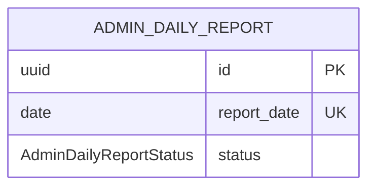

# AdminDailyReport

- 테이블: `admin_daily_reports`
- 목적: 관리자 일일 Excel 리포트 생성 이력

## 관계 요약

다른 모델과 외래 키 관계가 없는 일일 리포트 생성 이력.

## 주요 필드

| 필드 | 설명 |
|---|---|
| `id` | UUID 기본 키 |
| `reportDate` | 리포트 기준 날짜, unique |
| `status` | `running`, `succeeded`, `failed` |
| `filename` | 생성 파일명 |
| `dailyRowCount`, `hourlyRowCount`, `visitRowCount`, `loginRowCount` | 시트별 행 수 |
| `errorMessage` | 실패 내용 |
| `startedAt`, `finishedAt` | 생성 시간 |
