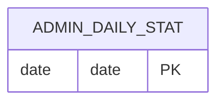

# AdminDailyStat

- 테이블: `admin_daily_stats`
- 목적: 날짜별 로비 운영 지표 저장

## 관계 요약

다른 모델과 외래 키 관계가 없는 집계 스냅샷.

## 주요 필드

| 필드 | 설명 |
|---|---|
| `date` | 날짜 기본 키 |
| `visits` | 방문 수 |
| `logins` | 로그인 수 |
| `ticketsIssued` | 발급 티켓 수 |
| `ticketsUsed` | 사용 티켓 수 |
| `updatedAt` | 마지막 집계 수정 시각 |
