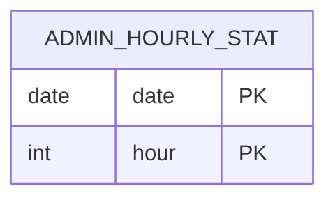

# AdminHourlyStat

- 테이블: `admin_hourly_stats`
- 목적: 날짜·시간대별 운영 지표 저장

## 관계 요약

다른 모델과 외래 키 관계가 없는 시간대별 집계 스냅샷.

## 주요 필드

| 필드 | 설명 |
|---|---|
| `date`, `hour` | 복합 기본 키 |
| `visits` | 방문 수 |
| `logins` | 로그인 수 |
| `updatedAt` | 마지막 집계 수정 시각 |
