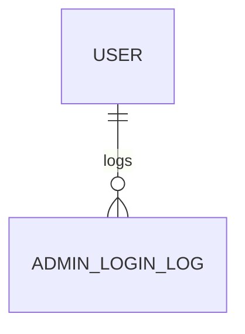

# AdminLoginLog

- 테이블: `admin_login_logs`
- 목적: 관리자 화면에서 로그인 활동을 집계하기 위한 로그

## 관계 요약

## 주요 필드

| 필드 | 설명 |
|---|---|
| `id` | UUID 기본 키 |
| `userId` | 로그인 사용자 외래 키 |
| `loggedAt` | 로그인 시각 |

## 인덱스

최근 로그인 조회와 사용자별 기간 조회를 위한 `loggedAt`, `(userId, loggedAt)` 인덱스.
