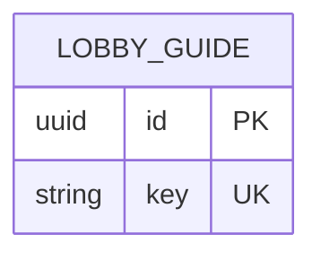

# LobbyGuide

- 테이블: `lobby_guides`
- 목적: 가입 직후 표시할 로비 가이드 단계 저장

## 관계 요약

다른 모델과 외래 키 관계가 없는 전역 가이드 설정.

## 주요 필드

| 필드 | 설명 |
|---|---|
| `id` | UUID 기본 키 |
| `key` | 가이드 식별 키, 기본값 `guide`, unique |
| `steps` | 단계 ID·Kicker·제목·본문을 담은 JSON |
| `createdAt`, `updatedAt` | 생성·수정 시각 |

## 처리 기준

현재 가이드 하나를 `key="guide"`로 관리. 단계 구조는 Shared의 `LobbyGuideStep`과 연결.
