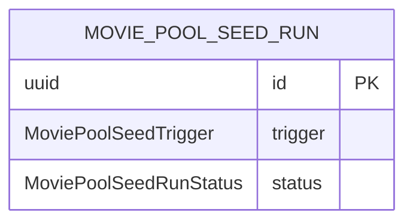

# MoviePoolSeedRun

- 테이블: `movie_pool_seed_runs`
- 목적: MoviePool 시드 작업의 실행 상태와 결과 요약

## 관계 요약

다른 모델과 외래 키 관계가 없는 MoviePool 시드 실행 로그.

## 주요 필드

| 필드 | 설명 |
|---|---|
| `id` | UUID 기본 키 |
| `trigger` | `cron` 또는 `manual` |
| `status` | `running`, `succeeded`, `partial`, `failed`, `cancelled` |
| `pages`, `machineCount` | 작업 범위 |
| `processedPages`, `fetchedCount`, `savedCount`, `skippedCount`, `failedCount` | 처리 집계 |
| `errorMessage` | 실패 내용 |
| `startedAt`, `finishedAt` | 실행 시간 |
