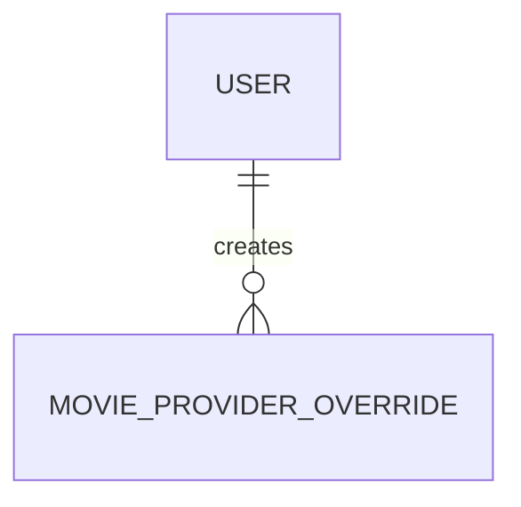

# MovieProviderOverride

- 테이블: `movie_provider_overrides`
- 목적: TMDB OTT 제공 정보에 대한 관리자 보정 기록

## 관계 요약

`tmdbId`로 `MoviePool`과 논리적으로 연결되며 DB 외래 키는 아님.

## 주요 필드

| 필드 | 설명 |
|---|---|
| `id` | UUID 기본 키 |
| `tmdbId` | 대상 영화 |
| `providerId`, `providerName`, `logoPath` | OTT provider 정보 |
| `action` | `add` 또는 `remove` |
| `note` | 보정 사유 |
| `createdBy` | 보정 작업을 수행한 사용자 |

## 제약

- `(tmdbId, providerId, action)` unique
- `createdBy`는 `User` 외래 키
