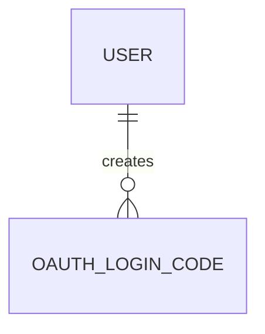

# OAuthLoginCode

- 테이블: `oauth_login_codes`
- 목적: OAuth callback 이후 Web이 access token을 교환하는 일회용 코드

## 관계 요약

## 주요 필드

| 필드 | 설명 |
|---|---|
| `id` | UUID 기본 키 |
| `userId` | 로그인 사용자 외래 키 |
| `codeHash` | 원문 대신 저장하는 코드 해시, unique |
| `expiresAt` | 만료 시각 |
| `consumedAt` | 사용 완료 시각 |
| `createdAt` | 생성 시각 |

## 처리 기준

`expiresAt` 이전이고 `consumedAt`이 비어 있는 코드만 교환 가능. 교환 완료 후 `consumedAt` 기록.
