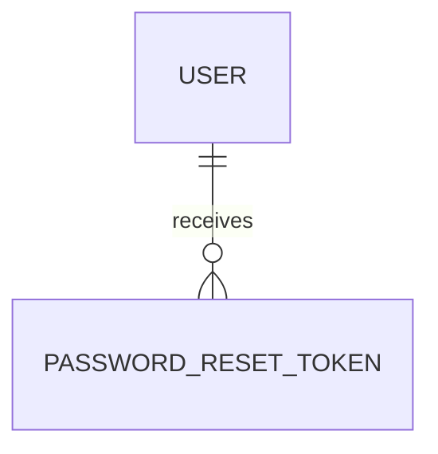

# PasswordResetToken

- 테이블: `password_reset_tokens`
- 목적: 비밀번호 재설정 이메일의 일회용 토큰

## 관계 요약

## 주요 필드

| 필드 | 설명 |
|---|---|
| `id` | UUID 기본 키 |
| `userId` | 대상 사용자 외래 키 |
| `tokenHash` | 원문 대신 저장하는 토큰 해시, unique |
| `expiresAt` | 토큰 만료 시각 |
| `usedAt` | 사용 완료 시각 |
| `createdAt` | 생성 시각 |

## 처리 기준

만료되지 않고 사용되지 않은 토큰만 비밀번호 변경에 사용. 성공 후 `usedAt` 기록.
