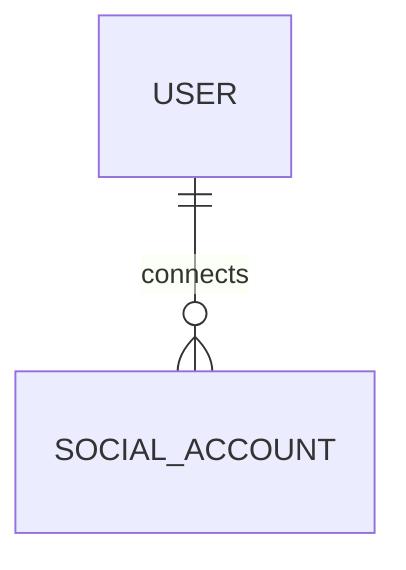

# SocialAccount

- 테이블: `social_accounts`
- 목적: Google·Naver·Kakao 등 외부 로그인 계정 연결

## 관계 요약

## 주요 필드

| 필드 | 설명 |
|---|---|
| `id` | UUID 기본 키 |
| `userId` | `User` 외래 키 |
| `provider` | OAuth provider |
| `providerAccountId` | provider가 발급한 사용자 식별자 |
| `createdAt`, `updatedAt` | 생성·수정 시각 |

## 제약

- `(provider, providerAccountId)` unique
- 사용자 삭제 시 연결 계정 cascade 삭제
