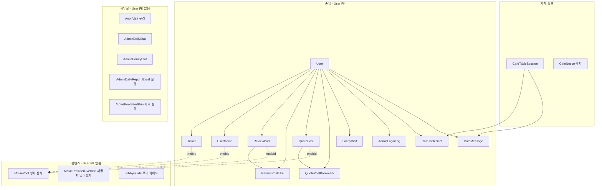
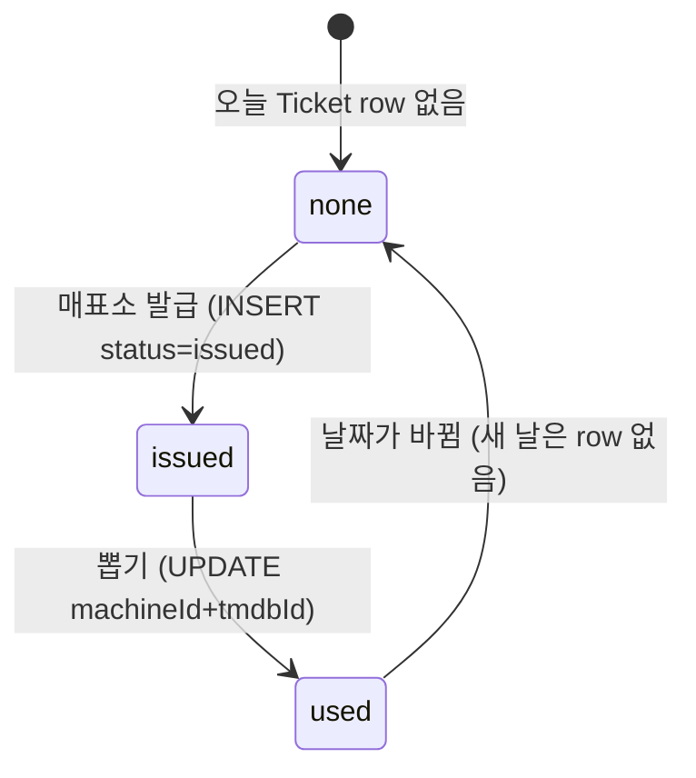

# 현재 데이터 모델과 MVP 루프

현재 구현된 도메인별 데이터 흐름을 설명하는 문서임. 전체 ER·FK·unique·index의 기준은 [prisma README](./README.md)임.

---

## 한 줄 루프 ↔ 테이블

손님이 User에 묶인 것 / 카페 / 사무실 / 콘텐츠를 나눔. 실제 FK와 `tmdbId` 논리 연결을 구분함.




```txt
매표소 발급     Ticket (issued)
뽑기방 사용     Ticket (used) + machineId/tmdbId · MoviePool
찜·봤어요·관람일·포스터 전시  UserMovie (watchedAt · isDisplayed · wallSlot)
영화 상자       MoviePool
후기방          ReviewPost · ReviewPostLike
명대사방        QuotePost · QuotePostBookmark
로비 입장       LobbyVisit          로그인 손님 · 유저×KST하루 1
로그인 기록     AdminLoginLog       손님 login() · 닉 원장
구경            AnonVisit           비로그인 후기방 · visitorKey×place×하루 1 · User ❌
카페            CafeTableSession · CafeTableSeat · CafeMessage · CafeNotice
로비 가이드     LobbyGuide · 회원가입 직후 온보딩 · 관리자 편집
사무실 카운터   AdminDailyStat · AdminHourlyStat  (원장 스캔 대신 +1)
Excel 리포트    AdminDailyReport · 어제 통계 사본 · User FK 없음
CafeMenuItem    스키마 없음 · 예정
Draw            추후
```

상세 UI: 후기 [web/review.md](../web/review.md) · 전광판 [web/board.md](../web/board.md) · 사무실 [web/admin.md](../web/admin.md) · 카페 [web/cafe.md](../web/cafe.md)

---

## ER은 어디서 보는가

전체 ER은 [prisma/README.md](./README.md)에 현재 스키마 기준으로 정리함.

- 실제 FK 관계와 User FK 없음 영역을 분리
- `MoviePoolSeedRun`까지 포함한 운영 모델 표시
- `Ticket`, `UserMovie`, `ReviewPost`, `QuotePost`, `MovieProviderOverride`와 `MoviePool`의 `tmdbId`는 FK가 아닌 논리 연결로 별도 표시
- `CafeNotice`와 `LobbyGuide`는 서로 다른 singleton 콘텐츠 모델로 표시

이 문서는 ER 필드 덤프보다 “사용자 행동 → 데이터 기록”을 이해하는 용도로 사용함.

스키마와 같은 unique:

```txt
Ticket            (userId, ticketDate)
UserMovie         (userId, tmdbId, kind)
ReviewPostLike    (postId, userId)
QuotePost        (userId, tmdbId, text)
QuotePostBookmark (userId, quotePostId)
LobbyVisit        (userId, visitDate)
AnonVisit         (visitorKey, place, visitDate)
CafeTableSeat     (tableId, userId)
CafeNotice        (key)
LobbyGuide        (key)
AdminHourlyStat   (date, hour)
```

---

## 이미 있는 것 (schema.prisma)

```txt
Ticket.machine_id · Ticket.tmdb_id
UserMovie · MoviePool 태그
User.avatarConfig Json? · PATCH /auth/avatar
User.bio · User.tags · User.profilePublic · PATCH /auth/profile
ReviewPost · ReviewPostLike
QuotePost · QuotePostBookmark
LobbyVisit · POST /lobby/visit · admin skip
AnonVisit · POST /anon/visit · place=review
AdminLoginLog · 손님 login
AdminDailyStat · AdminHourlyStat · logins 포함
CafeTableSession · Seat · Message · CafeNotice
LobbyGuide · MovieProviderOverride · MoviePoolSeedRun
```

미구현: Draw · CafeMenuItem

---

## LobbyGuide — 로비 온보딩

회원가입 직후 로비에 표시되는 안내 단계 저장. 카페 공지와 별도 모델이다.

steps의 한 항목:

관리자 화면은 전체 steps 배열을 교체하며, 1~20개 단계와 중복 없는 id를 허용한다. 공개 조회는 GET /v1/guide, 수정은 PATCH /v1/guide이고 수정에는 관리자 권한이 필요하다.

## Ticket 상태

DB에 `none` row를 미리 만들 필요는 없음.  
**그날 row가 없으면 = none**, 발급 시 row 생성(`issued`), 뽑기 시 `used` + `machine_id`/`tmdb_id`.




유니크: `(user_id, ticket_date)` — 하루 1장.

---

## 왜 이렇게 쪼개나


| 모델                   | 역할                                                     |
| -------------------- | ------------------------------------------------------ |
| **User**             | 로그인·권한·닉네임·avatarConfig · bio·tags·profilePublic · isTestAccount       |
| **Ticket**           | 오늘 1회권 · `machine_id`/`tmdb_id`로 뽑기 결과도 보관             |
| **Draw**             | 뽑기 결과(영화+쪽지). Ticket 1:1 · **추후 분리**                   |
| **UserMovie**        | ♥ 찜 · 봤어요 · 관람일 · 가챠 watched 제외 · 선반 목록 · MY ROOM 포스터 전시 |
| **MoviePool**        | TMDB 영화 메타·후보 **상자** · `genreIds`/`originCountries` 태그 |
| **ReviewPost**       | 후기방 볼 · rating · CRUD · KST 하루 1장(앱 규칙)                |
| **ReviewPostLike**   | 후기 ♥ · 유저×포스트 1회 · 토글                                  |
| **QuotePost**        | 명대사 · 영화 제목 · 포스터 배경 여부 · 본인 CRUD                |
| **QuotePostBookmark** | 명대사 저장 · 유저×명대사 1회 · 토글                           |
| **LobbyVisit**       | 로그인 손님 로비 입장 · 유저×KST하루 1 · admin skip                 |
| **AnonVisit**        | 비로그인 후기방 구경 · User FK 없음 · visitorKey×place×하루 1       |
| **AdminLoginLog**    | 손님 `login()` 원장 · 닉 복구용                                |
| **AdminDailyStat**   | KST 하루 카운터 · 원장 스캔 대신 +1                               |
| **AdminHourlyStat**  | KST 시 카운터 · visits/logins/cafeMessages                 |
| **AdminDailyReport** | 어제 Excel 생성 상태·건수·오류 · reportDate별 1개               |
| **CafeTableSession** | 테이블 1·2·3 · label · access                             |
| **CafeTableSeat**    | 앉은 사람 · (tableId, userId)                              |
| **CafeMessage**      | 테이블 수다 · cafeDayKey 오늘만                                |
| **CafeNotice**       | 스낵바 주의사항 · key=cafe 싱글톤 · User FK ❌                    |
| **LobbyGuide**       | 로비 온보딩 단계 · key=guide 싱글톤 · User FK ❌                  |
| **MovieProviderOverride** | 영화별 제공처 add/remove 덮어쓰기 · 생성자 User FK           |
| **MoviePoolSeedRun** | cron·수동 MoviePool 시드 결과 · User FK ❌                         |


`status: none`을 User 컬럼 하나로만 두면 이력·통계가 약해져서, **날짜별 Ticket**이 낫다.

---

## ReviewPost — 후기방 볼

테이블 `review_posts`. UI → [web/review.md](../web/review.md)

### 필드 (schema.prisma와 동일)

```txt
id
userId      FK → users
tmdbId      논리 참조 MoviePool
body        Text
rating      Float   ← 0.5~5 · 0.5 step (앱/DTO 검증)
createdAt   Timestamptz · @@index(createdAt desc)
updatedAt   Timestamptz · @updatedAt (PATCH 시 자동)
```

- `wall_date` 컬럼 **없음** — 하루 한도는 `createdAt`의 KST 날짜로 앱에서 판단
- 포스터·제목 저장 안 함 — 응답 시 `getMovieCached(tmdbId)` → `movie`
- 좋아요 → **ReviewPostLike** (아래)

### 규칙 (DB가 아니라 서비스)

```txt
create: tmdbId → getMovieCached (TMDB 존재 확인) · watched/티켓 제한 ❌
KST 오늘 이미 내 ReviewPost 있으면 거절
rating 0.5 step 아니면 거절
patch/delete = 본인만
삭제하면 그날 슬롯 다시 열림
```

영화 선택 UI: `GET /tmdb/search` · `normalizeSearchQuery` · fallback → [web/review.md](../web/review.md)

### 코드 연결

```txt
Prisma     model ReviewPost · User.reviewPosts · reviewPostLikes
API        apps/api/src/review-post/ · /v1/review-posts
           apps/api/src/tmdb/ · GET /tmdb/search
shared     ReviewPostItem (+ likeCount · likedByMe)
Web        /review · review-api.ts · tmdb-api.ts · search-query.ts
```

---

## QuotePost — 명대사방

테이블 `quote_posts`. UI → [web/quote.md](../web/quote.md)

### 필드

```txt
id
userId                 FK → users
tmdbId                 논리 참조 MoviePool
movieTitle             생성 당시 영화 제목 스냅샷 · 검색용
text                   Text
usePosterBackground    포스터 배경 사용 여부
createdAt              Timestamptz
updaatedAt             Timestamptz · `updated_at` 매핑 (현재 Prisma 필드명 오타)
```

- 포스터 이미지는 저장하지 않음 — `tmdbId`로 TMDB 캐시를 조합
- `movieTitle`은 제목 검색과 기존 영화 제목 표시를 위한 nullable 스냅샷
- `(userId, tmdbId, text)` unique로 같은 작성자의 중복 문구 방지
- 공개 목록은 누구나 조회 가능하고 저장·수정·삭제는 로그인 권한 필요
- Bookmark의 Prisma `createdAt`은 migration의 DB 컬럼 `create_at`에 매핑됨

### 코드 연결

```txt
Prisma     model QuotePost · User.quotePosts · quotePostBookmarks
API        apps/api/src/quote-post/ · /v1/quote-posts
shared     QuotePostItem · QuotePostPage · CreateQuotePostInput
Web        /quote · /room/quotes · quote-api.ts · components/quote/
```

---

## ReviewPostLike — 좋아요

테이블 `review_post_likes`.

### 필드

```txt
id
postId      FK → review_posts · onDelete Cascade
userId      FK → users · onDelete Cascade
createdAt
@@unique([postId, userId])   ← 유저당 포스트 1회
```

- `updatedAt` **없음** — 수정이 아니라 insert/delete 토글만
- 응답 집계: `likeCount` = `_count.reviewPostLikes`
- `likedByMe` = 로그인 유저가 해당 포스트 like row 있는지
- **내 후기 좋아요 금지** — `post.userId === userId`면 BadRequest · 웹은 disabled

### API

```txt
POST /v1/review-posts/:id/like   JWT 필수 · 토글 · 본인 글 불가
GET  /v1/review-posts            공개 · Bearer 있으면 likedByMe 채움
```

공개 list + 내 채움 상태 → [web/auth.md](../web/auth.md) `OptionalUserId` · JwtAuthGuard(public도 JWT 시도)

---

## LobbyVisit — 로비 입장 (로그인)

테이블 `lobby_visits`. UI → [web/board.md](../web/board.md)

```txt
id
userId      FK → users · onDelete Cascade
visitDate   @db.Date · KST 달력
visitedAt   Timestamptz · 그날 첫 입장 시각
@@unique([userId, visitDate])
@@index(visitDate) · @@index(visitedAt)
```

- 전광판 「오늘 입장」 = 이 row COUNT (`role=user`)
- 사무실 카드 「로비」도 원장 COUNT (집계 `visits`와 맞추려면 그날 첫 입장만 +1)
- `POST /v1/lobby/visit` · `createMany skipDuplicates` · **admin skip**
- 비로그인 후기방과는 별개 → **AnonVisit**

---

## AnonVisit — 구경 (비로그인)

테이블 `anon_visits`. **User FK 없음.** UI → [web/admin.md](../web/admin.md) · [web/review.md](../web/review.md)

```txt
id
visitorKey  VarChar(36) · localStorage cinemo_visitor uuid
place       VarChar(16) · 지금 'review'만
visitDate   @db.Date · KST
visitedAt   Timestamptz
@@unique([visitorKey, place, visitDate])
@@index([visitDate, place])
```

- JWT 있으면 API no-op (로그인 손님은 LobbyVisit)
- `POST /v1/anon/visit` `{ visitorKey, place: 'review' }`
- 전광판에 안 넣음 · 사무실 「구경」만

---

## AdminLoginLog — 손님 로그인 원장

테이블 `admin_login_logs`.

```txt
id
userId      FK → users · onDelete Cascade
loggedAt    Timestamptz
@@index(loggedAt desc) · @@index([userId, loggedAt desc])
```

- `auth.service` 손님 `login()`만 insert · register ❌ · admin skip
- 사무실 `/admin/users` 기록·횟수에 닉 붙이려면 이 원장
- 카운터는 아래 Stat `logins` (+1)

---

## AdminDailyStat · AdminHourlyStat — 사무실 카운터

원장 스캔 대신 이벤트 때 +1. **User FK 없음.** UI → [web/admin.md](../web/admin.md)

```txt
AdminDailyStat   @@map admin_daily_stats
  date PK @db.Date
  visits · logins · ticketsIssued · ticketsUsed · reviews · cafeMessages
  updatedAt

AdminHourlyStat  @@map admin_hourly_stats
  @@id([date, hour])  hour 0..23
  visits · logins · cafeMessages
  updatedAt
```

언제 +1:

```txt
로비 첫 입장(그날)   daily.visits · hourly.visits     LobbyVisit skipDuplicates
손님 login()         daily.logins · hourly.logins     + AdminLoginLog
티켓 발급/사용       daily만
후기 create          daily.reviews
카페 say             daily.cafeMessages · hourly.cafeMessages
```

카페 메시지 DELETE(02:00·전원 퇴장)해도 Stat은 남음.

---

## MoviePool — “풀”이 뭐냐

**풀(pool)** = 수영장이 아니라, 우리 DB에 모아 둔 **영화 후보·메타 상자**.

```txt
UserMovie / Ticket
  → “이 유저가 이 tmdbId를 찜했다 / 오늘 뽑았다” 같은 **관계·이벤트**
MoviePool
  → “tmdbId 550번은 제목·포스터·장르·국적이 뭐다” 같은 **영화 정보 재고**
```

### 필드 (schema.prisma와 동일)

```txt
id
tmdbId            UK · TMDB movie id
title
overview
posterPath        nullable
releaseDate       기본 ""
director          nullable
genreIds          Int[]     ← TMDB genres[].id (예: 53=스릴러)
originCountries   String[]  ← production_countries[].iso_3166_1 (예: KR)
syncedAt
```

태그 용도:

```txt
스릴러 머신  with_genres=53           → genreIds has 53
한국 머신    with_origin_country=KR   → originCountries has "KR"
랜덤 머신    필터 없음                 → 태그 조건 없이 풀 랜덤
```

`machine_tags: "thriller,kr"` 같은 문자열은 **안 씀**.  
머신 id가 아니라 **TMDB 장르 id·국가 코드**를 저장해 `GACHA_TMDB_FILTERS`와 맞춤.

### 코드 연결

```txt
getMovieCached  hit = row + 태그 하나라도 있음
                태그 둘 다 [] 또는 miss → TMDB → upsert (태그 포함)
seedPool        POST /tmdb/seed-pool?machineId=&pages=
pickRandomMovie 풀에서 watched 제외 + 태그 필터 · miss면 Discover
fromPool        MoviePool row → GachaMovie (태그 제외 · 카드용)
MovieWithTags   getMovie 전용 (genre_ids · origin_countries · API 카드엔 안 냄)
```

빈 태그·빈 overview 등은 TMDB 원본 구멍.  
상세·hit/miss → [web/tmdb.md](../web/tmdb.md) MoviePool 절

FK 필수는 아님. `tmdb_id` **논리 참조**면 됨  
(UserMovie.tmdbId ↔ MoviePool.tmdbId).

---

## Cafe — 카페 (테이블 · 수다)

UI → [web/cafe.md](../web/cafe.md)

```txt
CafeTableSession   tableId PK ("1"|"2"|"3") · label · access(open|locked)
CafeTableSeat      @@id([tableId, userId]) · joinedAt · seatedCount = seats 수
CafeMessage        tableId · userId · body · createdAt · updatedAt
CafeNotice         id uuid · key UK "cafe" · kicker · title · rules String[] · createdAt · updatedAt
CafeMenuItem       스키마 없음 · 예정 · name · price(원) · sortOrder · visible
```

사무실 카운터(AdminDailyStat 등)는 위 절. 카페 say 때 `cafeMessages` +1.

규칙:

```txt
· 메시지 = cafeDayKey 오늘만 (KST 02:00 마감 · 티켓 0시와 다름)
· 02:00 cron: cafe_messages DELETE · cafe_table_seats DELETE · session label/access null/open
· CafeNotice는 purge ❌ (공지 영구 · ensureCafeNotice upsert)
· 전원 퇴장: seats DELETE · session 리셋 · **그 테이블 오늘 메시지 DELETE**
· join/leave/say = Prisma · CafeService async
· PATCH 본인 CafeMessage · body · cafeDayKey 오늘만 · updatedAt
· sit label 중복 거부 (다른 tableId와 insensitive equal → 400)
· GET /cafe/hall + JWT → myTableId
· GET /cafe/notice @Public · PATCH /cafe/notice @Roles('admin')
· GET /cafe/menu (쓰기는 /admin만) ← 예정
· admin closeTable = 전원 퇴장과 같은 purge (그 tableId)  ← 예정
· 차트 집계: AdminDailyStat · AdminHourlyStat (say/visit/login 때 +1 · 메시지 DELETE와 별개)
· WS = 연결·push만
```

마이그레이션 시 `cafe_table_sessions` 3행 seed (1, 2, 3).  
`CafeNotice` row는 첫 `getNotice`/`updateNotice` 때 `ensureCafeNotice`로 생성.

---

## 시각 · 날짜 규칙

```txt
시각(언제)  = Timestamptz   ← issued_at, used_at, created_at …
하루(무슨 날) = Date (KST)  ← ticket_date
후기 하루 한도 = created_at을 KST 날짜로 자름 (별도 date 컬럼 없음)
```

- DB/서버 로컬 TZ에 의존하지 않음. 앱에서 `Asia/Seoul`로 **날짜만** 계산해 넣음
- “오늘 티켓?” = `ticket_date === todayKst()`
- “오늘 후기?” = `createdAt` ∈ KST 오늘 구간 (`kstTodayRange`)
- “오늘 입장?” = `LobbyVisit.visit_date === todayKstDate()` · 시간대 = `visited_at`
- **일별 로비** = `LobbyVisit` COUNT (role=user) · 사무실 카드 「로비」 → [web/admin.md](../web/admin.md)
- **구경** = `AnonVisit` place=review · 비로그인 후기방
- “오늘 카페?” = `createdAt` ∈ **cafeDayKey** 구간 (`cafeDayKey()` · 02:00 마감)
- 다음날 = 새 KST 날짜에 Ticket row 없음 → none
- `CURRENT_DATE`만 믿거나 UTC `toDateString()`으로 하루 자르지 않음

---

## 포스터 (TMDB)

**유저가 path를 다루는 게 아님.** 서버/웹이 URL을 만들어 ``에 넣음.

```txt
DB:     poster_path = "/abc123.jpg"   (TMDB가 주는 상대 경로)
표시:   https://image.tmdb.org/t/p/w500/abc123.jpg
```


| 방식                | 장단                                              |
| ----------------- | ----------------------------------------------- |
| **path만 저장 (추천)** | 용량·업로드 없음. TMDB CDN이 이미지 담당. attribution만 지키면 됨 |
| 우리가 파일 호스팅        | 스토리지·백업·삭제·약관. 귀찮고 MVP에 이득 거의 없음                |


귀찮은 쪽은 path가 아니라 **직접 저장**임.  
Ticket/UserMovie는 `tmdb_id` 위주.  
카드 메타는 **MoviePool**에 쟁여 두고 읽는다 (위 절 · [web/tmdb.md](../web/tmdb.md)).  
Pool miss·태그 빈 row일 때만 TMDB `getMovie` → upsert.

---

## Prisma로 옮길 때 메모

- TS 카멜 + DB snake (`@map` / `@@map`) + `uuid(7)` + `@db.Timestamptz(3)`
- `User.nickname` — **unique 필수**
- `User.isTestAccount` — QA 반복 테스트 계정 표시 · 기본값 `false` · 운영 관리자 집계에서 제외
- `User.avatarConfig` — [web/avatar.md](../web/avatar.md)
- `User.bio` · `User.tags` · `User.profilePublic` — [web/profile.md](../web/profile.md)
- `TicketStatus` DB enum = `issued`  `used` (shared의 `none`은 row 없음)
- `UserMovieKind` = `wish`  `watched` · `@@unique([userId, tmdbId, kind])`
- `UserMovie.watchedAt` — `watched` 영화의 관람일, `@db.Timestamptz(3)` · 화면·범위 계산은 KST 기준
- `UserMovie.isDisplayed` · `displayOrder` · `wallSlot` — 봤어요 영화의 MY ROOM 포스터 전시 상태·순서·위치(1~3)
- 포스터 전시는 별도 `Poster` 테이블을 만들지 않고 `UserMovie`에 `tmdbId`와 전시 정보만 저장
- `ticket_date` = `@db.Date`, 값은 `todayKstDate()` 등 KST 헬퍼
- ReviewPost: `rating Float` · `updatedAt` · `@@index([createdAt(sort: Desc)])` · `@@map("review_posts")`
- ReviewPostLike: `@@unique([postId, userId])` · Cascade · `@@map("review_post_likes")`
- LobbyVisit: `@@unique([userId, visitDate])` · `visit_date` `@db.Date` · `visited_at` · `@@map("lobby_visits")`
- AnonVisit: `@@unique([visitorKey, place, visitDate])` · User FK 없음 · `@@map("anon_visits")`
- AdminLoginLog: `user_id` FK Cascade · `@@map("admin_login_logs")`
- AdminDailyStat: `date` PK `@db.Date` · visits/logins/ticketsIssued/ticketsUsed/reviews/cafeMessages
- AdminHourlyStat: `@@id([date, hour])` · visits/logins/cafeMessages · `@@map("admin_hourly_stats")`
- CafeTableSession · CafeTableSeat · CafeMessage · `CafeTableAccess` enum → [web/cafe.md](../web/cafe.md)
- TMDB: `tmdb_id` (+ 필요 시 `poster_path`/`title`). 이미지 바이너리는 저장·호스팅 안 함
- MoviePool: `genre_ids Int[]` · `origin_countries String[]` · `synced_at` (fetched_at 아님)
- Ticket API → [web/ticket.md](../web/ticket.md)
- UserMovie API → [web/user-movie.md](../web/user-movie.md)
- ReviewPost API · UI → [web/review.md](../web/review.md)
- LobbyVisit · 전광판 → [web/board.md](../web/board.md)
- Cafe · Prisma → [web/cafe.md](../web/cafe.md)
- Avatar · 옷방 → [web/avatar.md](../web/avatar.md)
- MoviePool · 태그 · hit/miss → [web/tmdb.md](../web/tmdb.md)

---

## 다음에 그릴 것

- 확정 후 → `future-model.md` (보너스 티켓 등)
