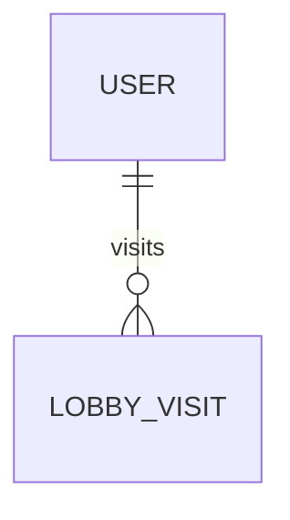

# LobbyVisit

- 테이블: `lobby_visits`
- 목적: 사용자의 로비 방문 기록과 방문 지표 집계 기준

## 관계 요약

## 주요 필드

| 필드 | 설명 |
|---|---|
| `id` | UUID 기본 키 |
| `userId` | 사용자 외래 키 |
| `visitDate` | 방문 기준 날짜 |
| `visitedAt` | 실제 방문 시각 |

## 제약

- `(userId, visitDate)` unique
- 사용자 삭제 시 방문 기록 cascade 삭제
