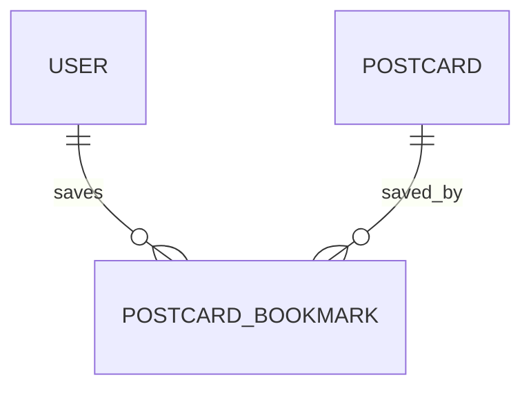

# PostcardBookmark

## 역할

사용자가 다른 사용자의 공개 엽서를 보관한 기록.

## 관계

## 주요 필드

| 필드 | 타입 | 설명 |
| --- | --- | --- |
| `id` | `UUID` | 보관 기록 식별자 |
| `postcardId` | `UUID` | 보관한 엽서 식별자 |
| `userId` | `UUID` | 보관한 사용자 식별자 |
| `createdAt` | `DateTime` | 보관 시각 |

## 중복 방지

`postcardId`와 `userId`를 함께 unique로 설정하여 같은 사용자가 같은 엽서를 여러 번 보관하지 않도록 처리.

엽서는 복사하지 않고 원본을 참조함. 작성자가 엽서를 삭제하면 `onDelete: Cascade`에 따라 보관 기록도 삭제됨.
