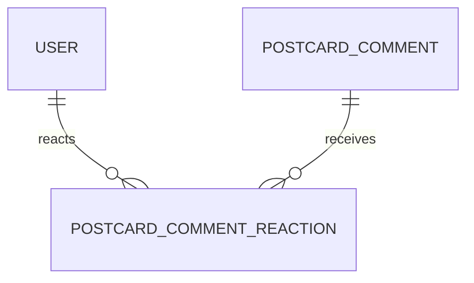

# PostcardCommentReaction

## 역할

댓글에 남긴 하트·이모지 반응 저장 모델.

엽서 반응과 댓글 반응은 대상이 다르므로 `PostcardReaction`과 별도 모델로 분리.

## 관계

## 주요 필드

| 필드 | 타입 | 설명 |
| --- | --- | --- |
| `id` | `UUID` | 반응 식별자 |
| `commentId` | `UUID` | 대상 댓글 식별자 |
| `userId` | `UUID` | 반응을 남긴 사용자 식별자 |
| `emoji` | `String` | 하트 또는 이모지 값 |
| `createdAt` | `DateTime` | 반응 시각 |

## 중복 방지

`commentId`, `userId`, `emoji` 조합을 unique로 설정하여 같은 사용자가 같은 댓글에 같은 이모지를 중복 등록하지 않도록 처리.
